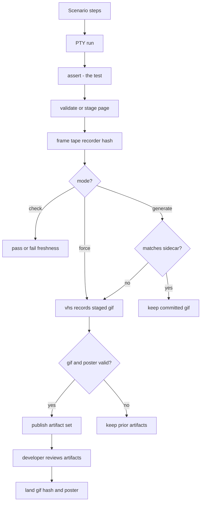

# Feature GIF workflow

Record a demo GIF for every feature test, and keep it in sync with the UI automatically.

A feature test always runs its scenario through the PTY first. That is the test: it
captures text frames into a `ProofReport`, and every assertion reads those frames.
Recording cannot start until those assertions pass. `generate` and `force` then prepare
pristine fixtures for the recording proof and VHS replay, so prior semantic execution
cannot leak state into the demo. The same steps are compiled into a `.tape` and replayed
to record the GIF.



## Freshness

`FeatureDemo` hashes the PTY frames together with the VHS rendering settings, a
canonical compiled tape, and the pinned recorder/poster identity. It compares that value
to a committed `.{name}.hash` sidecar next to the GIF. A mismatch means the UI, scenario
timing, tape compiler, recording preset, or recorder changed since the GIF was recorded.

In generate mode the portable FNV-1a hash is a staleness signal, not a gate: it decides
whether `vhs` needs to run. In check mode the same hash becomes a read-only freshness
gate, so callers can fail CI when the committed GIF sidecar is missing, stale, or
invalid, or when the GIF is empty, without launching `vhs`.

## Modes

Recording is off unless `TESTTY_GIF_MODE` asks for it, so an ordinary test run never
shells out to `vhs` and never touches the docs tree:

- **unset** — no recording. The scenario still runs and still asserts.
- **`generate`** — record only when the hash moved. Without `vhs` installed, skip
  silently.
- **`check` / `check-only`** — compare the current hash with the committed sidecar and
  require a nonempty GIF and poster without invoking `vhs` or touching the output
  directory. The workspace artifact gate additionally decodes both images completely.
- **`force`** — always record. Missing `vhs` is an error.

## Determinism

The hash is only meaningful if the same UI produces the same frames under the same
rendering settings. Anything volatile in a captured frame — wall-clock timers, rotating
status-bar messages, temp paths — makes every run look stale and re-records the GIF for
no reason.

Temp paths are normalized during hashing. Time is the application's job: inject a fixed
clock and pin time-derived UI to a constant.

Identifiers the application generates — a session hash, a worktree name, a short commit
id — cannot be frozen without changing what the UI is. Declare them instead, and they
stop counting as drift:

```rust
FeatureDemo::new("session_creation")
    // `wt/4175e5af` and `wt/9c0b17ff` now hash the same.
    .redact(Redaction::hex_after("wt/", 8, "<hash>"))
```

`Redaction::hex_after(prefix, max_len, placeholder)` rewrites a run of up to `max_len`
hex digits following `prefix`. Shorter runs match too, because a TUI truncates: a hash
printed near the right edge shows only the digits that fit, and that count shifts with
everything printed before it. Longer runs are left alone, so a rule for a short hash
never clips a full-length one.

`Redaction::literal(needle, placeholder)` replaces one exact string. Use it for volatile
text the caller can spell out ahead of time — typically the version the application
paints in its header, built from the caller's own compile-time version so the rule
tracks releases automatically. Without it, every release bump changes every captured
frame and stales every committed GIF hash at once.

Redaction applies to the hash only — captured frames, assertions, and the recorded GIF
still show the real value.

## Canonical container workflow

Agentty checks feature GIF freshness in the pinned `linux/amd64` variant of the image
defined by `container/e2e.Containerfile`. Presubmit, postsubmit, and release workflows
use Podman to pull the same GHCR image by digest, mount the checkout read-only, and run
the suite in `check` mode. CI never records, rewrites, or commits feature artifacts. The
Containerfile also supports native `linux/arm64` recording, but a digest is eligible for
that workflow only after its published image index is verified to contain both
architectures.

Feature recordings use an 80×24 terminal on a 1600×800 canvas with an 18-point font.
Padding, letter spacing, and line height calibrate VHS's xterm grid to the PTY proof
geometry. Canvas and font metrics, theme, framerate, padding, compiled scenario
commands, and the recorder identity participate in the freshness hash, so changing any
of them invalidates older recordings even when the captured terminal frames are
unchanged. Keep the recorder fingerprint in `vhs.rs` aligned with the VHS version pinned
by `container/e2e.Containerfile`.

The manually dispatched **Publish E2E Image** workflow builds both variants on native
GitHub-hosted runners, runs the E2E suite and a real VHS/Chromium/FFmpeg generation
smoke on each, publishes their shared image index, verifies anonymous platform pulls,
and reports the digest used to update the pinned references. The existing GHCR package
must grant this repository Actions write access before the workflow's first run.

When an intentional UI change makes a sidecar stale, a developer runs the affected test
in that container with a writable checkout and `generate` mode. Only missing or stale
GIFs are recorded. Testty writes VHS output to a hidden staging file and replaces the
committed set only after the recording is nonempty and its final frame decodes into a
PNG poster. The owning Zola page is validated or published first under a rollback guard;
artifact publication then uses rollback protection across the GIF, hash sidecar, and
poster. A failed recording preserves the previous set and removes a newly published
page. The developer reviews all generated artifacts with the UI change.

Do not run generation modes directly on a macOS host. VHS launches a local Chromium
process, which can abort during AppKit registration and show a **Chromium quit
unexpectedly** dialog. Host-side validation should use `check` mode; intentional
recording should use the canonical container. Do not suppress macOS crash reporting to
hide the browser failure.

Use the exact platform-explicit, digest-pinned Podman recording command in
`skills/feature-test/SKILL.md`. It runs the local container as the host UID and GID so
Linux bind mounts remain writable, while CI keeps the image's fixed non-root user and
read-only checkout. Recording in the same container that performs the freshness check
prevents host-specific output from churning committed artifacts.
