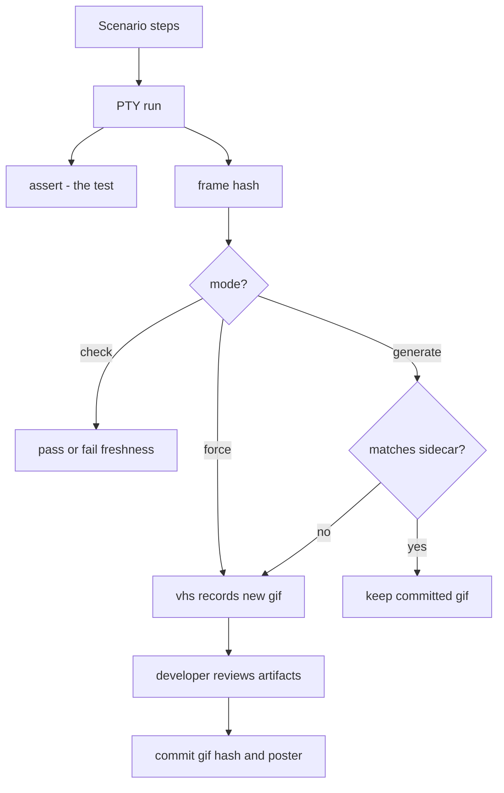

# Feature GIF workflow

Record a demo GIF for every feature test, and keep it in sync with the UI automatically.

A feature test always runs its scenario through the PTY. That is the test: it captures
text frames into a `ProofReport`, and every assertion reads those frames. `generate`
mode also runs a stale scenario through VHS, while `force` mode always does so: the same
steps are compiled into a `.tape` and replayed to record the GIF. Nothing is ever
asserted about the GIF.



## Freshness

`FeatureDemo` hashes the PTY frames and compares them to a committed `.{name}.hash`
sidecar next to the GIF. A mismatch means the UI moved since the GIF was recorded.

In generate mode the portable FNV-1a hash is a staleness signal, not a gate: it decides
whether `vhs` needs to run. In check mode the same hash becomes a read-only freshness
gate, so callers can fail CI when the committed GIF sidecar is missing, stale, or
invalid without launching `vhs`.

## Modes

Recording is off unless `TESTTY_GIF_MODE` asks for it, so an ordinary test run never
shells out to `vhs` and never touches the docs tree:

- **unset** — no recording. The scenario still runs and still asserts.
- **`generate`** — record only when the hash moved. Without `vhs` installed, skip
  silently.
- **`check` / `check-only`** — compare the current hash with the committed sidecar
  without invoking `vhs` or touching the GIF output directory.
- **`force`** — always record. Missing `vhs` is an error.

## Determinism

The hash is only meaningful if the same UI produces the same frames. Anything volatile
in a captured frame — wall-clock timers, rotating status-bar messages, temp paths —
makes every run look stale and re-records the GIF for no reason.

Temp paths are normalized during hashing. Time is the application's job: inject a fixed
clock and pin time-derived UI to a constant.

Identifiers the application generates — a session hash, a worktree name, a short commit
id — cannot be frozen without changing what the UI is. Declare them instead, and they
stop counting as drift:

```rust
FeatureDemo::new("session_creation")
    // `wt/4175e5af` and `wt/9c0b17ff` now hash the same.
    .redact(Redaction::hex_after("wt/", 8, "<hash>"))
```

`Redaction::hex_after(prefix, max_len, placeholder)` rewrites a run of up to `max_len`
hex digits following `prefix`. Shorter runs match too, because a TUI truncates: a hash
printed near the right edge shows only the digits that fit, and that count shifts with
everything printed before it. Longer runs are left alone, so a rule for a short hash
never clips a full-length one.

`Redaction::literal(needle, placeholder)` replaces one exact string. Use it for volatile
text the caller can spell out ahead of time — typically the version the application
paints in its header, built from the caller's own compile-time version so the rule
tracks releases automatically. Without it, every release bump changes every captured
frame and stales every committed GIF hash at once.

Redaction applies to the hash only — captured frames, assertions, and the recorded GIF
still show the real value.

## Canonical container workflow

Agentty checks feature GIF freshness in one pinned `linux/amd64` container defined by
`container/e2e.Containerfile`. Presubmit, postsubmit, and release workflows use Podman
to pull the same GHCR image by digest, mount the checkout read-only, and run the suite
in `check` mode. CI never records, rewrites, or commits feature artifacts.

When an intentional UI change makes a sidecar stale, a developer runs the affected test
in that container with a writable checkout and `generate` mode. Only missing or stale
GIFs are recorded. The developer reviews the changed GIF and hash sidecar, refreshes the
matching PNG poster, and commits the three artifacts with the UI change.

Use the exact digest-pinned Podman recording command in `skills/feature-test/SKILL.md`.
It runs the local container as the host UID and GID so Linux bind mounts remain
writable, while CI keeps the image's fixed non-root user and read-only checkout.
Recording in the same container that performs the freshness check prevents host-specific
output from churning committed artifacts.
