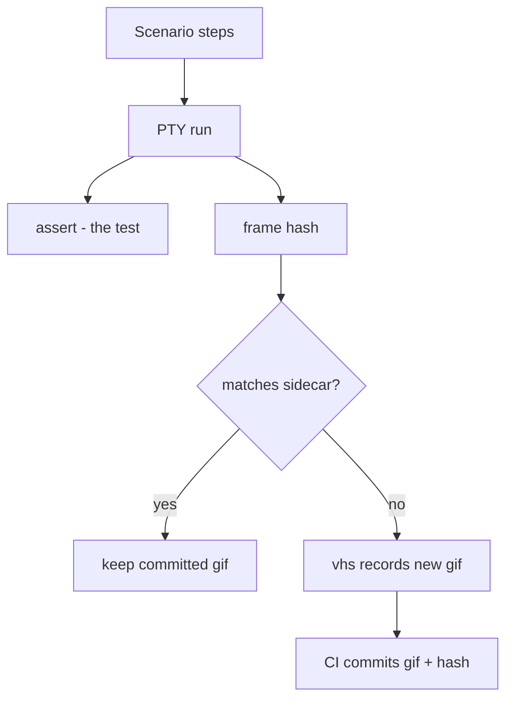

# Feature GIF workflow

Record a demo GIF for every feature test, and keep it in sync with the UI automatically.

A feature test runs its scenario twice. The PTY run is the test: it captures text frames
into a `ProofReport`, and every assertion reads those frames. The VHS run is the
picture: the same scenario is compiled into a `.tape` and replayed by `vhs` to record
the GIF. Nothing is ever asserted about the GIF.

## Freshness

`FeatureDemo` hashes the PTY frames and compares them to a committed `.{name}.hash`
sidecar next to the GIF. A mismatch means the UI moved since the GIF was recorded.

The hash is a staleness signal, not a gate. It never fails a test — it decides whether
`vhs` needs to run.

## Modes

Recording is off unless `TESTTY_GIF_MODE` asks for it, so an ordinary test run never
shells out to `vhs` and never touches the docs tree:

- **unset** — no recording. The scenario still runs and still asserts.
- **`generate`** — record only when the hash moved. Without `vhs` installed, skip
  silently.
- **`force`** — always record. Missing `vhs` is an error.

## Determinism

The hash is only meaningful if the same UI produces the same frames. Anything volatile
in a captured frame — wall-clock timers, rotating status-bar messages, temp paths —
makes every run look stale and re-records the GIF for no reason.

Temp paths are normalized during hashing. Everything else must be frozen by the
application under test, by injecting a fixed clock and pinning time-derived UI to a
constant.

## Recording in CI (planned)

No workflow installs `vhs` yet, so today a GIF is only ever recorded when someone opts
in locally.

The intended end state is that presubmit installs `vhs`, runs the suite with `generate`,
and commits the re-recorded GIFs alongside the change that moved the UI. Fork pull
requests cannot be pushed to, so they would upload the GIFs as an artifact instead.

CI is then the only committer of GIFs. VHS output is not byte-identical across
platforms, so recording locally and committing would churn every GIF.
