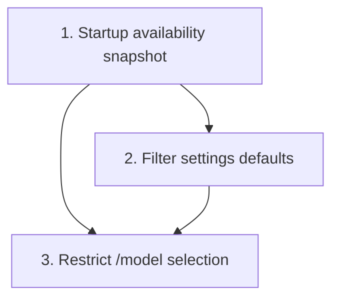

# Local Agent Availability Filtering

Limit startup-resolved agent and model choices to the CLIs available on the current machine, with the first pass focused on `crates/agentty/src/app/setting.rs`, `crates/agentty/src/ui/page/session_chat.rs`, and the `/model` prompt flow.

## Steps

## 1) Add a startup availability snapshot for local agent CLIs

### Why now

Every later change depends on one shared source of truth for which backends are actually usable on this machine. The app cannot filter settings or `/model` options until startup resolves that snapshot.

### Usable outcome

`App` owns a testable availability snapshot for `gemini`, `claude`, and `codex`, and startup succeeds even when none of those CLIs are installed.

### Substeps

- [ ] **Introduce an injectable availability boundary.** Add a small `#[cfg_attr(test, mockall::automock)]` probe in `crates/agentty/src/infra/agent/` that resolves whether each backend command is present on `PATH`, returns a stable availability snapshot keyed by `AgentKind`, and avoids blocking the Tokio core threads during startup.
- [ ] **Expose filtered agent/model helpers from the domain layer.** Extend `crates/agentty/src/domain/agent.rs` with helper APIs that derive the available `AgentKind` list, the available `AgentModel` list for one kind, and the first fallback model from the startup snapshot instead of hard-coding `AgentKind::ALL` everywhere.
- [ ] **Wire the snapshot through app startup.** Update `crates/agentty/src/main.rs` and `crates/agentty/src/app/core.rs` so `App::new()` resolves availability once during startup, stores it on `App`, and passes it into the settings/session codepaths that currently assume all providers exist.
- [ ] **Define the empty-install behavior explicitly.** Add one shared fallback path so startup does not fail when no local agent CLI is found; downstream UI code should receive an empty snapshot instead of panicking or silently pretending Gemini exists.

### Tests

- [ ] Add probe tests that cover all three backend commands plus the no-agents-installed case without shelling out to real binaries.
- [ ] Add `App::new_with_clients(...)` coverage in `crates/agentty/src/app/core.rs` proving startup stores the injected availability snapshot and preserves the empty-snapshot path.

### Docs

- [ ] Update `docs/site/content/docs/architecture/testability-boundaries.md` for the new availability probe boundary.
- [ ] Update `docs/site/content/docs/architecture/runtime-flow.md` or `docs/site/content/docs/architecture/module-map.md` so startup wiring documents where agent availability is discovered and stored.

## 2) Filter settings defaults and fallback model resolution to available agents

### Why now

Once startup can describe the installed backends, the next smallest usable slice is the Settings tab. That is where new-session defaults currently expose every model regardless of what is actually installed locally.

### Usable outcome

The Settings tab cycles only through locally available models, hides or disables Codex-only controls when Codex is unavailable, and normalizes persisted defaults that point to unavailable agents.

### Substeps

- [ ] **Make `SettingsManager` availability-aware.** Update `crates/agentty/src/app/setting.rs` so selector rows derive from the startup snapshot instead of `AgentKind::ALL`, and so `settings_rows()` reflects only the models the user can really choose on this machine.
- [ ] **Handle unavailable persisted defaults safely.** Adjust `load_default_smart_model_setting(...)`, `load_default_fast_model_setting(...)`, and related fallback code in `crates/agentty/src/app/setting.rs` plus `crates/agentty/src/app/session/workflow/lifecycle.rs` so stale settings for missing backends fall back to the first available model instead of surviving as unusable state.
- [ ] **Define the Codex-only reasoning row behavior.** Update the settings row logic in `crates/agentty/src/app/setting.rs` and rendering expectations in `crates/agentty/src/ui/page/setting.rs` so `Reasoning Level` is hidden or otherwise made unavailable when no Codex backend is installed.
- [ ] **Keep new-session defaults aligned with filtered settings.** Update the default-session-model wiring in `crates/agentty/src/app/core.rs` and `crates/agentty/src/app/session/core.rs` so newly created sessions cannot inherit a model from a backend that is missing at startup.

### Tests

- [ ] Extend `crates/agentty/src/app/setting.rs` tests to cover filtered selector order, unavailable persisted defaults, the no-Codex settings layout, and the no-agents-installed fallback.
- [ ] Add or update `crates/agentty/src/ui/page/setting.rs` tests for any row-count or footer behavior that changes when settings are filtered by availability.

### Docs

- [ ] Update `docs/site/content/docs/usage/workflow.md` so the Settings tab description states that default model choices are limited to locally available backends.
- [ ] Update `docs/site/content/docs/usage/keybindings.md` so the Settings section reflects the conditional `Reasoning Level` row and filtered model selectors.

## 3) Restrict `/model` selection and session model changes to available agents

### Why now

After Settings uses the startup snapshot, the next user-visible inconsistency is the prompt-side `/model` flow. It still offers every provider via `AgentKind::ALL`, even if the backend is missing locally.

### Usable outcome

The prompt slash menu, session model updates, and existing-session guardrails all use the same startup availability snapshot, so users can only switch to installed backends and get a clear fallback when a session still points at a missing one.

### Substeps

- [ ] **Filter the slash-menu agent stage.** Update `crates/agentty/src/ui/page/session_chat.rs` so the `/model` agent picker renders only available `AgentKind` entries and suppresses the command cleanly when no agent backends are available.
- [ ] **Filter the slash-menu model stage and navigation counts.** Update `crates/agentty/src/runtime/mode/prompt.rs` so stage transitions, option counts, and final model selection all use the same filtered agent/model lists as `SessionChatPage::build_slash_menu(...)`.
- [ ] **Validate session model writes centrally.** Add one app/session-layer validation path in `crates/agentty/src/app/core.rs` or `crates/agentty/src/app/session/workflow/lifecycle.rs` so unavailable models cannot be selected through any future call site, not just the current UI.
- [ ] **Handle existing sessions that reference missing backends.** Decide one consistent behavior for sessions loaded from disk with unavailable models: either block prompt submission with a clear switch-model message or coerce them to an available model during load, and implement that rule in `crates/agentty/src/app/session/workflow/lifecycle.rs` plus the prompt/view state that surfaces it.

### Tests

- [ ] Extend `crates/agentty/src/ui/page/session_chat.rs` tests to cover filtered `/model` menus, empty-agent menus, and model descriptions after availability filtering.
- [ ] Extend `crates/agentty/src/runtime/mode/prompt.rs` tests to cover filtered agent counts, filtered model counts, and slash-submit behavior when the selected session model backend is unavailable.
- [ ] Add app/session tests proving unavailable session model updates are rejected or normalized consistently.

### Docs

- [ ] Update `docs/site/content/docs/agents/backends.md` so the backend picker and default-model guidance explain that Agentty only offers locally detected backends at startup.
- [ ] Update `docs/site/content/docs/usage/workflow.md` slash-command section so `/model` is documented as a filtered picker rather than a static list of all providers.

## Cross-Plan Notes

- No active overlaps with the current `docs/plan/` files were found for backend availability or model-picker filtering.

## Status Maintenance Rule

- After implementing any step in this plan, immediately update its status in this document.
- When a step changes behavior, complete its `### Tests` and `### Docs` work in that same step before marking it complete.
- When the full plan is complete, remove the implemented plan file; if more work remains, move that work into a new follow-up plan file before deleting the completed one.

## Current State Snapshot

| Area | Current state in codebase | Status |
|------|---------------------------|--------|
| Startup availability | `App::new()` does not check whether `gemini`, `claude`, or `codex` exist locally | Not started |
| Settings defaults | `crates/agentty/src/app/setting.rs` cycles across `AgentKind::ALL` and all provider models | Not started |
| Prompt `/model` picker | `crates/agentty/src/ui/page/session_chat.rs` and `crates/agentty/src/runtime/mode/prompt.rs` always expose every provider | Not started |
| Session fallback behavior | Persisted or loaded session models are not validated against local backend availability | Not started |
| Documentation | User docs describe supported backends and selectors, but not startup-based filtering | Not started |

## Implementation Approach

- Start with one startup availability snapshot and keep every later filter derived from that same state rather than scattering command checks across UI handlers.
- Make the Settings tab the first user-visible slice so new-session defaults become trustworthy before the prompt-side `/model` picker is tightened.
- Reuse the same filtered helper APIs in the settings manager, slash menu, and session validation path so the model catalog cannot drift between screens.
- Keep the no-agents-installed case explicit from the first step; the app should still launch and explain why no backend choices are available.

## Suggested Execution Order

1. Start with step 1 because every later filter depends on one shared availability snapshot.
1. Step 2 can begin as soon as step 1 lands because the Settings tab only needs startup state and default-resolution wiring.
1. Step 3 depends on step 1 for the filtered catalog and on step 2 for the chosen fallback behavior for unavailable persisted models.

## Out of Scope for This Pass

- Detecting deeper backend readiness such as authentication state, quota, or remote account entitlements.
- Dynamically re-scanning `PATH` after startup; this pass uses one startup snapshot.
- Changing the curated model lists themselves beyond filtering them by local backend availability.
