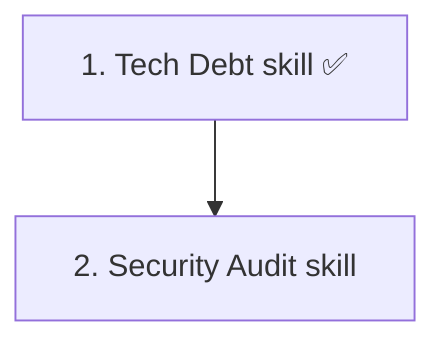

# Meta-Agent Skills

Add analysis-focused skills that guide session agents to review a codebase and return formatted task lists using the existing `answer` protocol field, with organic discovery via `AGENTS.md`.

## Steps

## 1) Create Tech Debt skill

### Why now

First concrete analysis skill, validating that an interactive session agent can organically discover a skill via `AGENTS.md`, follow its instructions, and return a formatted task list in its `answer` markdown. Covers a scavenger-style sweep (TODOs, stale patterns, missing docstrings) distinct from the existing `review` skill's targeted code review.

### Usable outcome

`skills/tech-debt/SKILL.md` exists. When a user asks the session agent to find tech debt, the agent reads the skill and returns a prioritized markdown task list.

### Substeps

- [x] **Create Tech Debt skill file.** Write `skills/tech-debt/SKILL.md` with frontmatter instructing the agent to: (1) read root `AGENTS.md`, (2) traverse directories reading their `AGENTS.md` files, (3) find TODOs, outdated patterns, inconsistent error handling, missing docstrings, and stale dependencies, (4) return findings as a prioritized markdown task list in the answer with priority (`Critical`/`High`/`Medium`/`Low`).
- [x] **Create symlinks.** Create `CLAUDE.md` and `GEMINI.md` symlinks pointing to `AGENTS.md` in `skills/tech-debt/`.
- [x] **Register in `skills/AGENTS.md`.** Add a directory index entry for `tech-debt/` in `skills/AGENTS.md`.

### Tests

- [x] No automated tests — pure markdown. Manual verification of file structure and symlinks.

### Docs

- [x] Add Tech Debt to the Meta-Agent Inventory table in root `AGENTS.md`.

## 2) Create Security Audit skill

### Why now

Covers a distinct analysis domain (auth flows, injection vulnerabilities, panic conditions) that the Tech Debt skill does not address. Validates that the skill pattern works for security-focused analysis.

### Usable outcome

`skills/security-audit/SKILL.md` exists. When a user asks the session agent to audit security, the agent reads the skill and returns security findings as a prioritized markdown task list.

### Substeps

- [x] **Create Security Audit skill file.** Write `skills/security-audit/SKILL.md` with frontmatter instructing the agent to: (1) read root `AGENTS.md`, (2) traverse target directories reading their `AGENTS.md` files, (3) review auth flows, data parsing, edge cases, panic conditions, and injection vulnerabilities, (4) return findings as a prioritized markdown task list in the answer with priority (`Critical`/`High`/`Medium`/`Low`).
- [x] **Create symlinks.** Create `CLAUDE.md` and `GEMINI.md` symlinks pointing to `SKILL.md` in `skills/security-audit/`.
- [x] **Register in `skills/AGENTS.md`.** Add a directory index entry for `security-audit/` in `skills/AGENTS.md`.

### Tests

- [x] No automated tests — pure markdown. Manual verification of file structure and symlinks.

### Docs

- [x] Add Security Audit to the Meta-Agent Inventory table in root `AGENTS.md`.

## Cross-Plan Notes

- No active plans in `docs/plan/` conflict with this work. The meta-agent skills are a new feature area that does not overlap with existing session lifecycle, forge, or testing plans.

## Status Maintenance Rule

- After implementing any step in this plan, immediately update its status in this document.
- When a step changes behavior, complete its `### Tests` and `### Docs` work in that same step before marking it complete.
- When the full plan is complete, remove the implemented plan file; if more work remains, move that work into a new follow-up plan file before deleting the completed one.

## Current State Snapshot

| Area | Current state in codebase | Status |
|------|---------------------------|--------|
| Skills | 4 interactive skills (`git-commit`, `implementation-plan`, `release`, `review`) + 1 analysis skill (`tech-debt`) | `security-audit` remaining |
| `AGENTS.md` inventory | Lists interactive skills, analysis skills, and runtime prompt templates | Done |
| `AgentResponse` protocol | Supports `answer`, `questions`, and `summary` fields | Unchanged — skills use existing `answer` markdown |

## Implementation Approach

- Each step creates one skill file with symlinks and registration.
- Skills instruct agents to return findings as formatted markdown task lists in the existing `answer` field — no protocol or UI changes needed.
- Agents discover skills organically by reading `AGENTS.md` files, which already list available skills.

## Suggested Execution Order

Step 1 establishes the analysis skill pattern. Step 2 follows it with a security-focused domain.

## Out of Scope for This Pass

- Custom task list rendering widgets in the TUI.
- Session spawning from task list items.
- Agent-to-agent orchestration (meta-agent automatically dispatching to workers without user approval).
- Persistent task storage in the database.
- Scheduling or recurring meta-agent runs.
- Custom user-defined meta-agent skills.
- Integration with external issue trackers (GitHub Issues, Linear).
- Structured `tasks` rendering or persistence beyond `answer` markdown.
