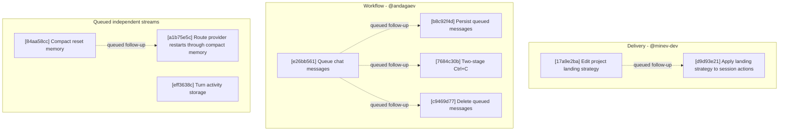

# Agentty Roadmap

Single-file roadmap for the active user-facing project backlog. Humans keep priorities and guardrails here, while only `Ready Now` work carries full execution detail and everything else stays intentionally lighter.

## Current State Snapshot

| Area | Current state in codebase | Status |
|------|---------------------------|--------|
| Review request publish flow | Session chat keeps `p` for generic branch publishing, and `Shift+P` now creates or refreshes the linked GitHub pull request or GitLab merge request while preserving the same publish popup flow. | Landed |
| Published branch sync | Sessions now auto-push already-published remote branches after later completed turns and surface sync progress or failure in session output. | Landed |
| Model availability scoping | Agentty now requires at least one locally runnable backend CLI at startup, `/model` and Settings filter model choices to runnable backends, and unavailable stored defaults fall back to the first available backend default. | Landed |
| Draft session workflow | `Shift+A` now creates explicit draft sessions that persist ordered staged draft messages, while `a` keeps the immediate-start first-prompt flow. | Landed |
| Session activity timing | `session` persists cumulative `InProgress` timing fields, and both chat and the grouped session list now show the same cumulative active-work timer. | Landed |
| Header guidance FYIs | The top status bar now rotates page-specific `FYI:` guidance for the sessions list and session chat once per minute while keeping version and update-state text visible. | Landed |
| Project delivery strategy | Review-ready sessions can already merge into the base branch or publish a session branch, but projects configured in Agentty still cannot declare whether their normal landing path should be direct merge to `main` or a pull-request flow. | Missing |
| Chained session workflow | Follow-up tasks can already launch sibling sessions, but each new session still starts from the active project base branch and published review requests always target that same base branch instead of another session branch. | Missing |
| Terminal session continuation | `Done` and `Canceled` sessions now expose a `c` continuation shortcut that opens a fresh draft session whose first staged message is seeded from the source session's persisted summary or transcript context. | Landed |
| Queued chat messages | Session chat blocks the composer while a turn is `InProgress`, so users cannot stage follow-up prompts before the agent returns to `Review`. | Missing |
| Session resume efficiency | Codex and Gemini app-server turns already reuse a compact reminder after the first bootstrap, but Claude sessions still resend the full wrapper because session identity is not yet explicit. | Partial |
| Turn activity summaries | Session output stores the assistant answer, questions, and summary, but it does not append a normalized per-turn digest of used skills, executed commands, or changed-file CRUD after each turn. | Missing |

## Active Streams

- `Delivery`: project-level landing strategy, forge-aware review-request publishing, and chained-session delivery for review-ready sessions, including direct-merge vs. review-request expectations.
- `Protocol`: provider session continuity and compact context replay so resumed chats stay responsive without losing guidance.
- `Workflow`: session chat input flow including queueing follow-up messages while the agent is running, dispatching them between turns, and clearing them on cancel or interrupted-run recovery.
- `Session Output`: per-turn execution digests that summarize the commands, changed files, and skill activity users need to review directly in the chat transcript.

## Planning Model

- Keep `Ready Now` to `2..=5` fully expanded steps for an agent-backed two- or three-person team.
- Keep `Queued Next` as the compact promotion queue for the next few outcomes, not as a second fully detailed backlog.
- Keep `Parked` for strategic work that matters, but should not consume active planning attention yet.
- Treat `500` changed lines as the hard implementation ceiling and keep `Ready Now` slices estimated at `350` changed lines or less so normal implementation drift still stays reviewable.
- Run `cargo run -q -p ag-xtask -- roadmap context-digest` before promoting queued or parked work so the decision uses fresh repository context.
- When a `Ready Now` step lands and queued work remains, promote the next queued card into `Ready Now` instead of leaving the execution window short.
- Until lease automation exists, only `Ready Now` items can carry an assignee, and every promoted `Ready Now` step must set that assignee in the promotion edit.
- When promoting queued or parked work into `Ready Now`, either name an explicit `@username` or default to the current authenticated forge user only after confirming the forge account that owns the project.
- Keep roadmap items focused on user-facing outcomes; validation and documentation stay in the same roadmap item through its `#### Tests` and `#### Docs` sections instead of becoming standalone cards.
- Keep `Ready Now` implementation scopes to `1..=3` bullets under `#### Substeps`; when a step needs broader adoption, copy polish, or a second peer surface, queue the follow-up instead of widening the current slice.
- Treat internal-only quality migrations as opportunistic follow-through inside the user-facing slice that touches the same files, not as standalone roadmap cards.

## Ready Now

### [17a9e2ba-0b7d-407d-9cd4-72807ef7bc1f] Delivery: Edit project landing strategy in settings

#### Assignee

`@minev-dev`

#### Why now

The review-request publish shortcut has landed, so the smallest useful delivery-policy step is letting users store the expected landing path for each project before session actions start consuming that policy.

#### Usable outcome

Users can view and change a project's landing strategy in Agentty settings, and the choice persists across app restarts.

#### Substeps

- [ ] **Persist the per-project landing strategy setting.** Update the project and settings domain models plus backing persistence in `crates/agentty/src/domain/project.rs`, `crates/agentty/src/domain/setting.rs`, `crates/agentty/src/infra/db.rs`, and `crates/agentty/src/app/setting.rs` so each project stores a canonical delivery strategy such as direct merge versus pull request.
- [ ] **Expose the landing strategy in project settings UI.** Update the settings runtime and UI flow in `crates/agentty/src/runtime/mode/list.rs`, `crates/agentty/src/ui/page/setting.rs`, and related settings state/helpers so users can view and change the active project's landing strategy without leaving Agentty.

#### Tests

- [ ] Add or extend coverage in `crates/agentty/src/app/setting.rs`, `crates/agentty/src/infra/db.rs`, `crates/agentty/src/runtime/mode/list.rs`, and `crates/agentty/src/ui/page/setting.rs` for persisted strategy round-trips and settings editing.

#### Docs

- [ ] Update `docs/site/content/docs/usage/workflow.md` and `docs/site/content/docs/getting-started/overview.md` to explain the new per-project delivery strategy setting without claiming session actions consume it yet.

### [e26bb561-acd2-46e7-898a-3324711686f4] Workflow: Queue messages while a turn runs

#### Assignee

`@andagaev`

#### Why now

Session chat blocks the composer while a turn is `InProgress`, so users have to wait for `Review` before they can stage the next instruction; allowing typed messages to queue and dispatch automatically removes that wait without changing the worker's serial execution model.

#### Usable outcome

While a session is `InProgress`, users can press `Enter` to open the composer, submit additional messages that render inline in the transcript as `queued` entries, and have them dispatched one-by-one as new turns once the running turn finishes; queued messages pause while the session is in `Question` state and resume only after the clarification path returns to a runnable state, and canceling the running turn (`Ctrl+C`) clears the queue. Queued messages live in memory for the active app session, so they are discarded on app restart.

#### Substeps

- [ ] **Maintain an in-memory queue and dispatch between turns with a `Question`-aware pause.** Add a runtime `queued_messages` field to the session worker state in `crates/agentty/src/app/session/workflow/worker.rs`, drain the queue between turns so each pop becomes the next `SessionCommand::Run` while status stays `InProgress`, hold draining while the session is in `Question` state and resume dispatch only after status returns to a runnable state, and clear the queue on `Ctrl+C` cancellation.
- [ ] **Allow Enter-to-queue and render queued chat messages inline.** Relax the `is_view_action_allowed()` gate in `crates/agentty/src/runtime/mode/session_view.rs` so `Enter` (but not `/`) opens the composer during `InProgress`, route the submission in `crates/agentty/src/runtime/mode/prompt.rs` through a new `SessionManager::enqueue_message()` orchestrator on `crates/agentty/src/app/session/workflow/lifecycle.rs` that pushes onto the in-memory queue and emits `AppEvent::RefreshSessions`, and render queued rows inline in the session transcript with a `queued` style so they appear in submission order beneath the running turn.

#### Tests

- [ ] Add unit coverage in `crates/agentty/src/app/session/workflow/worker.rs` and `crates/agentty/src/app/session/workflow/lifecycle.rs` for in-memory queueing, between-turn dispatch, the `Question`-state pause and resume, and cancel-clears-queue; add an E2E `FeatureTest` in `crates/agentty/tests/e2e/session.rs` covering enqueue-while-running → inline pending render → dispatch-after-turn → cancel-clears-queue.

#### Docs

- [ ] Update `docs/site/content/docs/usage/workflow.md` and `docs/site/content/docs/usage/keybindings.md` to document message queueing during `InProgress`, the `Enter`-only composer entry, the `Question`-state pause behavior, cancel-clears-queue, and that queued messages are session-local and discarded on app restart.

## Ready Now Execution Order

## Queued Next

### [b8c92f4d-3a1e-4d7c-9f2a-5b6e8c1d2a3f] Workflow: Persist queued chat messages across restarts

#### Outcome

Queued chat messages survive `agentty` restart by persisting in the database, and an app restart that interrupts a running turn discards the queue with a one-line operation-log note explaining that the queued messages were dropped because the previous turn was interrupted.

#### Promote when

Promote when `[e26bb561-acd2-46e7-898a-3324711686f4] Workflow: Queue messages while a turn runs`, `[84aa58cc-8cd0-41cb-a6fc-a97016e85f0d] Protocol: Define compact restart session memory`, and `[eff3638c-359c-4374-9388-d3e9e4c2f26c] Session Output: Define turn activity storage contract` all land, and the shared `crates/agentty/src/infra/db.rs` and `crates/agentty/migrations/` surfaces are no longer in active flight.

#### Depends on

- `[e26bb561-acd2-46e7-898a-3324711686f4] Workflow: Queue messages while a turn runs`
- `[84aa58cc-8cd0-41cb-a6fc-a97016e85f0d] Protocol: Define compact restart session memory`
- `[eff3638c-359c-4374-9388-d3e9e4c2f26c] Session Output: Define turn activity storage contract`

### [7684c30b-2884-49ef-9cba-2a8f6aa1211d] Workflow: Cancel queued chat messages with two-stage Ctrl+C

#### Outcome

While a turn is running with a non-empty queue, the first `Ctrl+C` press clears only the queued messages and lets the running turn finish, while a second `Ctrl+C` cancels the running turn as today.

#### Promote when

Promote when `[e26bb561-acd2-46e7-898a-3324711686f4] Workflow: Queue messages while a turn runs` lands and the Workflow stream is ready for the next chat-input refinement.

#### Depends on

`[e26bb561-acd2-46e7-898a-3324711686f4] Workflow: Queue messages while a turn runs`

### [c9469d77-97c3-4d5b-a035-497a83752bd1] Workflow: Delete individual queued chat messages

#### Outcome

Users can focus a queued chat entry in the transcript and remove it with a dedicated shortcut without clearing the rest of the queue or canceling the running turn.

#### Promote when

Promote when `[e26bb561-acd2-46e7-898a-3324711686f4] Workflow: Queue messages while a turn runs` lands and the team is ready for per-item queue editing affordances.

#### Depends on

`[e26bb561-acd2-46e7-898a-3324711686f4] Workflow: Queue messages while a turn runs`

### [d9d93e21-2d9a-45af-9d44-61eb68e64ea7] Delivery: Apply landing strategy to session actions

#### Outcome

Review-ready session actions, help copy, and end-user docs use the active project's stored landing strategy to present the right default delivery path.

#### Promote when

Promote when `[17a9e2ba-0b7d-407d-9cd4-72807ef7bc1f] Delivery: Edit project landing strategy in settings` lands and the Delivery stream is ready for the session-action adoption slice.

#### Depends on

`[17a9e2ba-0b7d-407d-9cd4-72807ef7bc1f] Delivery: Edit project landing strategy in settings`

### [8e074c6d-64ad-427f-9262-0769e68a8a2b] Delivery: Chain sessions for stacked review requests

#### Outcome

Review-ready sessions can launch a child session from the current session branch, keep the parent-child relationship visible in Agentty, and publish the child review request against the parent branch so stacked pull requests or merge requests stay ordered.

#### Promote when

Promote when `[d9d93e21-2d9a-45af-9d44-61eb68e64ea7] Delivery: Apply landing strategy to session actions` lands and the Delivery stream is ready for the next review-workflow outcome.

#### Depends on

`[d9d93e21-2d9a-45af-9d44-61eb68e64ea7] Delivery: Apply landing strategy to session actions`

### [84aa58cc-8cd0-41cb-a6fc-a97016e85f0d] Protocol: Define compact restart session memory

#### Outcome

Restarted provider sessions can serialize one compact structured memory summary of constraints, open questions, and touched files without changing first-turn bootstrap behavior.

#### Promote when

Promote when `[17a9e2ba-0b7d-407d-9cd4-72807ef7bc1f] Delivery: Edit project landing strategy in settings` lands so the shared `crates/agentty/src/infra/db.rs` and `crates/agentty/migrations/` surfaces are no longer in active flight.

#### Depends on

`None`

### [a1b75e5c-9ec6-4f5b-8f4b-f18b762e7fc6] Protocol: Route provider restarts through compact memory

#### Outcome

Codex, Gemini, and Claude restart or resume plumbing reuse the shared compact session-memory summary instead of replaying the full transcript after runtime context loss.

#### Promote when

Promote when `[84aa58cc-8cd0-41cb-a6fc-a97016e85f0d] Protocol: Define compact restart session memory` lands and provider wiring is the next Protocol priority.

#### Depends on

`[84aa58cc-8cd0-41cb-a6fc-a97016e85f0d] Protocol: Define compact restart session memory`

### [eff3638c-359c-4374-9388-d3e9e4c2f26c] Session Output: Define turn activity storage contract

#### Outcome

Completed turns persist one shared activity-summary record for used skills, executed commands, and changed-file CRUD so later provider integrations all target the same stored contract.

#### Promote when

Promote when the team has capacity for transcript-review improvements and can keep the first Session Output slice limited to protocol and persistence shape.

#### Depends on

`None`

### [29d3d82d-d1e5-452b-a93c-e873f89a8bba] Session Output: Render git-derived changed-file summaries

#### Outcome

Completed turns compute create, update, and delete file sets from the session worktree and render that changed-file summary once in session output and replay paths.

#### Promote when

Promote when `[eff3638c-359c-4374-9388-d3e9e4c2f26c] Session Output: Define turn activity storage contract` lands and the team is ready for the first visible activity-summary slice.

#### Depends on

`[eff3638c-359c-4374-9388-d3e9e4c2f26c] Session Output: Define turn activity storage contract`

### [b5ff4c83-3af4-4df4-905f-80fd7e8f9d49] Session Output: Capture Claude turn activity

#### Outcome

Claude-backed turns populate the shared activity model with executed commands, skill usage, and file-change hints sourced from Claude stream or hook surfaces so Claude sessions can contribute to the per-turn execution summary.

#### Promote when

Promote when `[29d3d82d-d1e5-452b-a93c-e873f89a8bba] Session Output: Render git-derived changed-file summaries` is in place and Claude is the next provider chosen for activity-summary rollout.

#### Depends on

`[29d3d82d-d1e5-452b-a93c-e873f89a8bba] Session Output: Render git-derived changed-file summaries`

### [55c3f18d-7185-41de-8d2b-c109fdb9d3ca] Session Output: Capture Gemini turn activity

#### Outcome

Gemini-backed turns populate the shared activity model with executed commands, skill or tool usage, and file-change hints sourced from Gemini ACP or CLI activity surfaces so Gemini sessions can contribute to the per-turn execution summary.

#### Promote when

Promote when `[29d3d82d-d1e5-452b-a93c-e873f89a8bba] Session Output: Render git-derived changed-file summaries` is in place and Gemini is the next provider chosen for activity-summary rollout.

#### Depends on

`[29d3d82d-d1e5-452b-a93c-e873f89a8bba] Session Output: Render git-derived changed-file summaries`

### [593a1d75-5790-4904-a69c-b31eb9b1af2e] Session Output: Capture Codex turn activity

#### Outcome

Codex-backed turns populate the shared activity model with executed commands, used skills, and file-change data sourced from Codex app-server turn events so Codex sessions can contribute to the per-turn execution summary.

#### Promote when

Promote when `[29d3d82d-d1e5-452b-a93c-e873f89a8bba] Session Output: Render git-derived changed-file summaries` is in place and Codex is the next provider chosen for activity-summary rollout.

#### Depends on

`[29d3d82d-d1e5-452b-a93c-e873f89a8bba] Session Output: Render git-derived changed-file summaries`

## Parked

No parked user-facing cards right now.

## Context Notes

- `Workflow: Queue messages while a turn runs` should keep the queue in memory only so the first slice does not touch `crates/agentty/src/infra/db.rs` while Delivery is in active flight there, pause dispatch while the session is in `Question` state so the existing clarification flow is preserved, and keep `Ctrl+C` as a one-shot that cancels the running turn and clears the queue together; persistence with interrupted-run recovery, two-stage cancellation, and per-item delete affordances live in the queued follow-ups.
- `Workflow: Persist queued chat messages across restarts` spans runtime, persistence, and transcript surfaces, so its interrupted-run recovery messaging should reuse the restart-detection contract from `[84aa58cc-8cd0-41cb-a6fc-a97016e85f0d] Protocol: Define compact restart session memory` for "previous turn was interrupted" detection and target the shared transcript/operation-log shape from `[eff3638c-359c-4374-9388-d3e9e4c2f26c] Session Output: Define turn activity storage contract` for the one-line drop note instead of inventing a parallel restart signal or transcript entry format.
- `Delivery: Edit project landing strategy in settings` should stop at persisted settings UI; the session-action behavior belongs to the queued follow-up so the first Delivery slice remains reviewable.
- `Delivery: Chain sessions for stacked review requests` should build on the existing follow-up-task sibling-session flow, persist session lineage, and let review-request publishing target the parent session branch instead of always targeting the project base branch.
- `Protocol: Define compact restart session memory` should stay restart-specific, preserve the first-turn bootstrap prompt, and reuse the already-compact steady-state follow-up path instead of inventing another session-memory format.
- `Session Output: Define turn activity storage contract` should introduce the shared DB and protocol shape once; git-derived rendering and provider capture cards should land as follow-up slices that target the same stored summary contract.
- Internal `FeatureTest` migration work should be folded into future user-facing E2E changes that touch the same files instead of occupying a standalone roadmap card.
- Roadmap entries stay user-facing; implementation validation and documentation belong in each step's `#### Tests` and `#### Docs` sections instead of as standalone backlog cards.
- Run `cargo run -q -p ag-xtask -- roadmap context-digest` before promoting queued or parked work to `Ready Now`.

## Status Maintenance Rule

- Keep `2..=5` items in `## Ready Now` for agent-backed two- or three-person development.
- Keep only `Ready Now` items fully expanded with `#### Assignee`, `#### Why now`, `#### Usable outcome`, `#### Substeps`, `#### Tests`, and `#### Docs`.
- Keep `## Queued Next` and `## Parked` as compact promotion cards with `#### Outcome`, `#### Promote when`, and `#### Depends on`.
- Promote queued or parked work into `## Ready Now` by assigning that step in the same roadmap edit, either to an explicit `@username` or to the current authenticated forge user after confirming which forge account owns the active project.
- Keep each `Ready Now` step estimated at `350` changed lines or less so implementation remains below the `500`-line hard ceiling, and split any wider follow-up into `## Queued Next`.
- Keep the roadmap focused on user-facing outcomes; do not add standalone test-only, docs-only, cleanup-only, or other internal-only cards.
- After a `Ready Now` step lands, remove it from `## Ready Now`, refresh any changed snapshot rows, and promote the next queued card whenever `## Queued Next` still has work.
- If follow-up work remains after a step lands, add or update a compact queued or parked card instead of preserving the completed step.
