# Agentty Roadmap

Single-file roadmap for the active user-facing project backlog. Humans keep priorities
and guardrails here, while only `Ready Now` work carries full execution detail and
everything else stays intentionally lighter.

## Current State Snapshot

| Area | Current state in codebase | Status |
|------|---------------------------|--------| | Review request publish flow | Session
chat keeps `p` for generic branch publishing, and `Shift+P` now creates or refreshes the
linked GitHub pull request or GitLab merge request while preserving the same publish
popup flow. | Landed | | Published branch sync | Sessions now auto-push
already-published remote branches after later completed turns and surface sync progress
or failure in session output. | Landed | | Model availability scoping | Agentty now
requires at least one locally runnable backend CLI at startup, `/model` and Settings
filter model choices to runnable backends, and unavailable stored defaults fall back to
the first available backend default. | Landed | | Draft session workflow | `Shift+A` now
creates explicit draft sessions that persist ordered staged draft messages, while `a`
keeps the immediate-start first-prompt flow. | Landed | | Session activity timing |
`session` persists cumulative `InProgress` timing fields, and both chat and the grouped
session list now show the same cumulative active-work timer. | Landed | | Header
guidance FYIs | The top status bar now rotates page-specific `FYI:` guidance for the
sessions list and session chat once per minute while keeping version and update-state
text visible. | Landed | | Project delivery strategy | Review-ready sessions can already
merge into the base branch or publish a session branch, but projects configured in
Agentty still cannot declare whether their normal landing path should be direct merge to
`main` or a pull-request flow. | Missing | | Chained session workflow | Follow-up tasks
can already launch sibling sessions, but each new session still starts from the active
project base branch and published review requests always target that same base branch
instead of another session branch. | Missing | | Terminal session continuation | `Done`
and `Canceled` sessions now expose a `c` continuation shortcut that opens a fresh draft
session whose first staged message is seeded from the source session's persisted summary
or transcript context. | Landed | | Queued chat messages | Session chat now keeps the
composer open while a turn is `InProgress` and renders submitted messages inline as
`queued ›` rows that the worker dispatches one-by-one between turns; queue dispatch
pauses while the session sits in `Question`. `Ctrl+C` during `InProgress` retracts the
most recently queued chat message (LIFO) one press at a time without interrupting the
running turn, and once the queue is empty a further press cancels the running turn. The
queue is in-memory only and discarded on app restart. | Landed | | Session resume
efficiency | Codex and Gemini app-server turns already reuse a compact reminder after
the first bootstrap, but Claude sessions still resend the full wrapper because session
identity is not yet explicit. | Partial | | Turn activity summaries | Session output
stores the assistant answer, questions, and summary, but it does not append a normalized
per-turn digest of used skills, executed commands, or changed-file CRUD after each turn.
| Missing | | testty published surface | The in-tree source exposes the Result-returning
`match_*` matcher core, `AssertionFailure`, `MatchResult`, blank-column-preserving
`Frame::all_text()` with wide-character continuation cells skipped,
`PtySessionBuilder::args` for non-interactive subcommand flows, the predicate-driven
`Step::Eventually` waiter that surfaces structured failures through
`PtySessionError::Assertion`, the named `StartupWait` presets plus
`Journey::wait_for_startup_preset` / `Journey::wait_for_startup_default` constructors
that replace hand-tuned `(stable_ms, timeout_ms)` numbers, the `SoftAssertions`
accumulator that batches `match_*` failures into one end-of-scope panic and routes them
through `ProofCapture::assertions`, `match_*` siblings for every `recipe::expect_*`
helper, and the HTML proof report rendering structured `AssertionFailure` data as a
side-by-side context-and-frame block with column rulers and per-row gutters. The agentty
E2E session-creation journeys now wait on those predicates instead of fixed
`Step::sleep` durations. | Landed |

## Active Streams

- `Delivery`: project-level landing strategy, forge-aware review-request publishing, and
  chained-session delivery for review-ready sessions, including direct-merge vs.
  review-request expectations.
- `Protocol`: provider session continuity and compact context replay so resumed chats
  stay responsive without losing guidance.
- `Workflow`: session chat input flow including queueing follow-up messages while the
  agent is running, dispatching them between turns, and clearing them on cancel or
  interrupted-run recovery.
- `Session Output`: per-turn execution digests that summarize the commands, changed
  files, and skill activity users need to review directly in the chat transcript.
- `Testty`: parked future work for the published `testty` crate, covering an optional
  `SnapshotConfig` frame normalizer for non-deterministic UIs, splitting recipe helpers
  by framework so non-ratatui adopters do not inherit tabbed-header assumptions, and an
  async session API for `tokio::test`-friendly harnesses.
- `Auto-Review`: agentic orchestrator-driven loop that iteratively refines session
  changes through author, reviewer, and orchestrator agents, where the orchestrator
  decides each round whether to continue, switch the reviewer backend, escalate to the
  user, or finish and squash the result; loop termination is driven by orchestrator
  judgment plus user interrupt, not a static iteration cap.

## Planning Model

- Keep `Ready Now` to `2..=5` fully expanded steps for an agent-backed two- or
  three-person team.
- Keep `Queued Next` as the compact promotion queue for the next few outcomes, not as a
  second fully detailed backlog.
- Keep `Parked` for strategic work that matters, but should not consume active planning
  attention yet.
- Treat `500` changed lines as the hard implementation ceiling and keep `Ready Now`
  slices estimated at `350` changed lines or less so normal implementation drift still
  stays reviewable.
- Run `cargo run -q -p ag-xtask -- roadmap context-digest` before promoting queued or
  parked work so the decision uses fresh repository context.
- When a `Ready Now` step lands and queued work remains, promote the next queued card
  into `Ready Now` instead of leaving the execution window short.
- Until lease automation exists, only `Ready Now` items can carry an assignee, and every
  promoted `Ready Now` step must set that assignee in the promotion edit.
- When promoting queued or parked work into `Ready Now`, either name an explicit
  `@username` or default to the current authenticated forge user only after confirming
  the forge account that owns the project.
- Keep roadmap items focused on user-facing outcomes; validation and documentation stay
  in the same roadmap item through its `#### Tests` and `#### Docs` sections instead of
  becoming standalone cards.
- Keep `Ready Now` implementation scopes to `1..=3` bullets under `#### Substeps`; when
  a step needs broader adoption, copy polish, or a second peer surface, queue the
  follow-up instead of widening the current slice.
- Treat internal-only quality migrations as opportunistic follow-through inside the
  user-facing slice that touches the same files, not as standalone roadmap cards.

## Ready Now

### [17a9e2ba-0b7d-407d-9cd4-72807ef7bc1f] Delivery: Edit project landing strategy in settings

#### Assignee

`@minev-dev`

#### Why now

The review-request publish shortcut has landed, so the smallest useful delivery-policy
step is letting users store the expected landing path for each project before session
actions start consuming that policy.

#### Usable outcome

Users can view and change a project's landing strategy in Agentty settings, and the
choice persists across app restarts.

#### Substeps

- [ ] **Persist the per-project landing strategy setting.** Update the project and
  settings domain models plus backing persistence in
  `crates/agentty/src/domain/project.rs`, `crates/agentty/src/domain/setting.rs`,
  `crates/agentty/src/infra/db.rs`, and `crates/agentty/src/app/setting.rs` so each
  project stores a canonical delivery strategy such as direct merge versus pull request.
- [ ] **Expose the landing strategy in project settings UI.** Update the settings
  runtime and UI flow in `crates/agentty/src/runtime/mode/list.rs`,
  `crates/agentty/src/ui/page/setting.rs`, and related settings state/helpers so users
  can view and change the active project's landing strategy without leaving Agentty.

#### Tests

- [ ] Add or extend coverage in `crates/agentty/src/app/setting.rs`,
  `crates/agentty/src/infra/db.rs`, `crates/agentty/src/runtime/mode/list.rs`, and
  `crates/agentty/src/ui/page/setting.rs` for persisted strategy round-trips and
  settings editing.

#### Docs

- [ ] Update `docs/site/content/docs/usage/workflow.md` and
  `docs/site/content/docs/getting-started/overview.md` to explain the new per-project
  delivery strategy setting without claiming session actions consume it yet.

### [eff3638c-359c-4374-9388-d3e9e4c2f26c] Session Output: Define turn activity storage contract

#### Assignee

`@minev-dev`

#### Why now

The Session Output stream has no slices in flight and the queued provider-capture and
git-derived rendering follow-ups all depend on a shared per-turn activity record. Laying
down the storage contract first lets later slices target one stable persistence shape
instead of inventing parallel formats per provider.

#### Usable outcome

Completed turns persist one shared activity-summary record covering used skills,
executed commands, and changed-file CRUD in a stable schema, so later provider capture
and rendering slices reuse the same stored contract without changing user-facing chat
output yet.

#### Substeps

- [ ] **Persist the per-turn activity summary record.** Add the activity-summary domain
  type, migration, and persistence wiring in `crates/agentty/src/domain/session.rs`,
  `crates/agentty/migrations/`, and `crates/agentty/src/infra/db.rs` so each completed
  turn stores one record covering used skills, executed commands, and changed-file CRUD.
- [ ] **Expose the activity contract through the session worker.** Update
  `crates/agentty/src/app/session/workflow/worker.rs` and adjacent app-layer helpers so
  the worker emits the new activity record on turn completion through a stable shape
  later provider capture slices can target without changing rendered chat output.

#### Tests

- [ ] Add coverage in `crates/agentty/src/infra/db.rs` and
  `crates/agentty/src/app/session/workflow/worker.rs` for activity-summary round-trips
  and worker-emitted records on turn completion.

#### Docs

- [ ] Refresh `///` doc comments on the new activity-summary domain type and persistence
  helpers, and note the per-turn activity contract in
  `docs/site/content/docs/architecture/runtime-flow.md` without claiming user-facing
  rendering exists yet.

### [8e3ba5c4-9442-4248-a6bf-dd78c1951659] Auto-Review: Surface orchestrator verdict on /auto-review one-shot

#### Assignee

`@andagaev`

#### Why now

The Auto-Review stream has no slices in flight and its highest-leverage design artifact
is the orchestrator decision schema and prompt. Validating both against real session
diffs in a one-shot `/auto-review` invocation now keeps the first slice reviewable while
unblocking the queued auto-loop, escalation, and reviewer-switch follow-ups that all
build on the same orchestrator contract.

#### Usable outcome

Users can invoke `/auto-review` in a session to run one extra reviewer pass plus a
separate orchestrator agent invocation that inspects the current diff and reviewer
suggestions, and the resulting structured verdict (`Continue` or `Done` with one-line
reasoning) renders inline in the session transcript without yet auto-looping.

#### Substeps

- [ ] **Define the `/auto-review` slash command and orchestrator decision schema.** Add
  the slash-command parser entry plus a typed orchestrator decision shape covering
  `Continue` and `Done` with one-line reasoning in
  `crates/agentty/src/runtime/mode/prompt.rs`,
  `crates/agentty/src/ui/state/help_action.rs`, and
  `crates/agentty/src/domain/agent.rs`, and add the orchestrator prompt template under
  `crates/agentty/src/infra/agent/template/` so the schema and prompt are the artifact
  validated by the one-shot run.
- [ ] **Run the one-shot reviewer plus orchestrator pass and render the verdict
  inline.** Wire one extra reviewer turn followed by a separate orchestrator
  `AgentChannel` invocation through `crates/agentty/src/app/review.rs`,
  `crates/agentty/src/app/session/workflow/worker.rs`, and
  `crates/agentty/src/infra/channel/factory.rs`, requiring the orchestrator backend to
  differ from the author backend and surfacing the structured verdict as a session
  transcript entry without yet auto-looping.

#### Tests

- [ ] Add coverage in `crates/agentty/src/runtime/mode/prompt.rs`,
  `crates/agentty/src/app/review.rs`, and
  `crates/agentty/src/app/session/workflow/worker.rs` for `/auto-review` slash-command
  parsing, orchestrator decision schema deserialization, the
  different-backend-from-author guard, and inline verdict rendering on the session
  transcript.

#### Docs

- [ ] Update `docs/site/content/docs/usage/workflow.md` and
  `docs/site/content/docs/usage/keybindings.md` to describe the `/auto-review` one-shot
  invocation, the structured `Continue`/`Done` verdict, and the orchestrator-backend
  separation requirement without claiming auto-looping exists yet.

## Ready Now Execution Order

```mermaid
flowchart TD
    subgraph DeliveryLane["Delivery - @minev-dev"]
        D1["[17a9e2ba] Edit project landing strategy"]
        D2["[d9d93e21] Apply landing strategy to session actions"]
        D1 -. queued follow-up .-> D2
    end

    subgraph SessionOutputLane["Session Output - @minev-dev"]
        S1["[eff3638c] Turn activity storage"]
    end

    subgraph AutoReviewLane["Auto-Review - @andagaev"]
        AR1["[8e3ba5c4] One-shot orchestrator verdict"]
        AR2["[999fa2d1] Auto-loop with squash on Done"]
        AR3["[2fd4754b] Escalation pause and resume"]
        AR4["[e59c83f7] Switch reviewer backend mid-loop"]
        AR1 -. queued follow-up .-> AR2
        AR2 -. queued follow-up .-> AR3
        AR3 -. queued follow-up .-> AR4
    end

    subgraph LaterLanes["Queued independent streams"]
        P1["[84aa58cc] Compact reset memory"]
        P2["[a1b75e5c] Route provider restarts through compact memory"]
        P1 -. queued follow-up .-> P2
    end
```

## Queued Next

### [b8c92f4d-3a1e-4d7c-9f2a-5b6e8c1d2a3f] Workflow: Persist queued chat messages across restarts

#### Outcome

Queued chat messages survive `agentty` restart by persisting in the database, and an app
restart that interrupts a running turn discards the queue with a one-line operation-log
note explaining that the queued messages were dropped because the previous turn was
interrupted.

#### Promote when

Promote when
`[84aa58cc-8cd0-41cb-a6fc-a97016e85f0d] Protocol: Define compact restart session memory`
and
`[eff3638c-359c-4374-9388-d3e9e4c2f26c] Session Output: Define turn activity storage contract`
both land, and the shared `crates/agentty/src/infra/db.rs` and
`crates/agentty/migrations/` surfaces are no longer in active flight.

#### Depends on

- `[84aa58cc-8cd0-41cb-a6fc-a97016e85f0d] Protocol: Define compact restart session memory`
- `[eff3638c-359c-4374-9388-d3e9e4c2f26c] Session Output: Define turn activity storage contract`

### [d9d93e21-2d9a-45af-9d44-61eb68e64ea7] Delivery: Apply landing strategy to session actions

#### Outcome

Review-ready session actions, help copy, and end-user docs use the active project's
stored landing strategy to present the right default delivery path.

#### Promote when

Promote when
`[17a9e2ba-0b7d-407d-9cd4-72807ef7bc1f] Delivery: Edit project landing strategy in settings`
lands and the Delivery stream is ready for the session-action adoption slice.

#### Depends on

`[17a9e2ba-0b7d-407d-9cd4-72807ef7bc1f] Delivery: Edit project landing strategy in settings`

### [f4095dc8-54fb-47fc-8e5e-33ad9173ba60] Delivery: Add mock-forge review-request feature coverage

#### Outcome

The E2E feature-test harness can exercise review-request publishing and post-turn
metadata sync through deterministic mock `gh` and `glab` commands, covering PR/MR title
and description updates without requiring live forge authentication.

#### Promote when

Promote when the Delivery stream next touches review-request publishing or post-turn
review-request behavior, so the harness work lands with a user-facing review workflow
slice instead of as standalone test plumbing.

#### Depends on

`[d9d93e21-2d9a-45af-9d44-61eb68e64ea7] Delivery: Apply landing strategy to session actions`

### [8e074c6d-64ad-427f-9262-0769e68a8a2b] Delivery: Chain sessions for stacked review requests

#### Outcome

Review-ready sessions can launch a child session from the current session branch, keep
the parent-child relationship visible in Agentty, and publish the child review request
against the parent branch so stacked pull requests or merge requests stay ordered.

#### Promote when

Promote when
`[d9d93e21-2d9a-45af-9d44-61eb68e64ea7] Delivery: Apply landing strategy to session actions`
lands and the Delivery stream is ready for the next review-workflow outcome.

#### Depends on

`[d9d93e21-2d9a-45af-9d44-61eb68e64ea7] Delivery: Apply landing strategy to session actions`

### [84aa58cc-8cd0-41cb-a6fc-a97016e85f0d] Protocol: Define compact restart session memory

#### Outcome

Restarted provider sessions can serialize one compact structured memory summary of
constraints, open questions, and touched files without changing first-turn bootstrap
behavior.

#### Promote when

Promote when
`[17a9e2ba-0b7d-407d-9cd4-72807ef7bc1f] Delivery: Edit project landing strategy in settings`
lands so the shared `crates/agentty/src/infra/db.rs` and `crates/agentty/migrations/`
surfaces are no longer in active flight.

#### Depends on

`None`

### [a1b75e5c-9ec6-4f5b-8f4b-f18b762e7fc6] Protocol: Route provider restarts through compact memory

#### Outcome

Codex, Gemini, and Claude restart or resume plumbing reuse the shared compact
session-memory summary instead of replaying the full transcript after runtime context
loss.

#### Promote when

Promote when
`[84aa58cc-8cd0-41cb-a6fc-a97016e85f0d] Protocol: Define compact restart session memory`
lands and provider wiring is the next Protocol priority.

#### Depends on

`[84aa58cc-8cd0-41cb-a6fc-a97016e85f0d] Protocol: Define compact restart session memory`

### [29d3d82d-d1e5-452b-a93c-e873f89a8bba] Session Output: Render git-derived changed-file summaries

#### Outcome

Completed turns compute create, update, and delete file sets from the session worktree
and render that changed-file summary once in session output and replay paths.

#### Promote when

Promote when
`[eff3638c-359c-4374-9388-d3e9e4c2f26c] Session Output: Define turn activity storage contract`
lands and the team is ready for the first visible activity-summary slice.

#### Depends on

`[eff3638c-359c-4374-9388-d3e9e4c2f26c] Session Output: Define turn activity storage contract`

### [b5ff4c83-3af4-4df4-905f-80fd7e8f9d49] Session Output: Capture Claude turn activity

#### Outcome

Claude-backed turns populate the shared activity model with executed commands, skill
usage, and file-change hints sourced from Claude stream or hook surfaces so Claude
sessions can contribute to the per-turn execution summary.

#### Promote when

Promote when
`[29d3d82d-d1e5-452b-a93c-e873f89a8bba] Session Output: Render git-derived changed-file summaries`
is in place and Claude is the next provider chosen for activity-summary rollout.

#### Depends on

`[29d3d82d-d1e5-452b-a93c-e873f89a8bba] Session Output: Render git-derived changed-file summaries`

### [55c3f18d-7185-41de-8d2b-c109fdb9d3ca] Session Output: Capture Gemini turn activity

#### Outcome

Gemini-backed turns populate the shared activity model with executed commands, skill or
tool usage, and file-change hints sourced from Gemini ACP or CLI activity surfaces so
Gemini sessions can contribute to the per-turn execution summary.

#### Promote when

Promote when
`[29d3d82d-d1e5-452b-a93c-e873f89a8bba] Session Output: Render git-derived changed-file summaries`
is in place and Gemini is the next provider chosen for activity-summary rollout.

#### Depends on

`[29d3d82d-d1e5-452b-a93c-e873f89a8bba] Session Output: Render git-derived changed-file summaries`

### [593a1d75-5790-4904-a69c-b31eb9b1af2e] Session Output: Capture Codex turn activity

#### Outcome

Codex-backed turns populate the shared activity model with executed commands, used
skills, and file-change data sourced from Codex app-server turn events so Codex sessions
can contribute to the per-turn execution summary.

#### Promote when

Promote when
`[29d3d82d-d1e5-452b-a93c-e873f89a8bba] Session Output: Render git-derived changed-file summaries`
is in place and Codex is the next provider chosen for activity-summary rollout.

#### Depends on

`[29d3d82d-d1e5-452b-a93c-e873f89a8bba] Session Output: Render git-derived changed-file summaries`

### [999fa2d1-e6bc-4526-a1f9-a2e151d593d3] Auto-Review: Drive iterative loop until orchestrator declares done

#### Outcome

`/auto-review` runs author, reviewer, and orchestrator rounds in a loop until the
orchestrator emits a `Done` decision; the session shows an in-loop indicator with the
current round, all in-loop edits squash into one commit on `Done`, and `Ctrl+C` aborts
the loop without disturbing the existing per-turn cancel semantics.

#### Promote when

Promote when
`[8e3ba5c4-9442-4248-a6bf-dd78c1951659] Auto-Review: Surface orchestrator verdict on /auto-review one-shot`
lands and the orchestrator prompt has been validated against real diffs.

#### Depends on

`[8e3ba5c4-9442-4248-a6bf-dd78c1951659] Auto-Review: Surface orchestrator verdict on /auto-review one-shot`

### [2fd4754b-21fc-4a65-a046-1922c2d01968] Auto-Review: Pause loop on orchestrator escalation and resume on user input

#### Outcome

When the orchestrator emits an `Escalate` decision the loop pauses, the question renders
inline in session chat, and the user's reply resumes the loop with the new framing,
including allowing the user to authorize the orchestrator to redirect the implementation
approach for subsequent rounds.

#### Promote when

Promote when
`[999fa2d1-e6bc-4526-a1f9-a2e151d593d3] Auto-Review: Drive iterative loop until orchestrator declares done`
lands and the loop has a stable `Continue`/`Done` flow against real diffs.

#### Depends on

`[999fa2d1-e6bc-4526-a1f9-a2e151d593d3] Auto-Review: Drive iterative loop until orchestrator declares done`

### [e59c83f7-f46f-4af4-8dc0-d6cac70816b1] Auto-Review: Switch reviewer backend mid-loop on orchestrator request

#### Outcome

The orchestrator can emit a `SwitchReviewer` decision that selects a different installed
backend as the reviewer for subsequent rounds when echo-chamber agreement is detected,
and the auto-review session indicator shows which backend reviewed each round.

#### Promote when

Promote when
`[2fd4754b-21fc-4a65-a046-1922c2d01968] Auto-Review: Pause loop on orchestrator escalation and resume on user input`
lands and convergence behavior is stable enough that orchestrator switch decisions are
observable without competing with escalation.

#### Depends on

`[2fd4754b-21fc-4a65-a046-1922c2d01968] Auto-Review: Pause loop on orchestrator escalation and resume on user input`

## Parked

### [af7b1d24-6e5a-4b8c-8dbe-4f5a6b7c8d9e] Testty: Frame normalizer hook for snapshot tests

#### Outcome

`SnapshotConfig` accepts a normalizer closure that scrubs timestamps, UUIDs, PIDs, or
other volatile substrings from frame text before comparison, so testty snapshot testing
becomes viable against real apps with non-deterministic output.

#### Promote when

Promote when external adopters request snapshot support for non-deterministic UIs and a
named user-facing testty release commits to snapshot-mode stability.

#### Depends on

`None`

### [b08c2e35-7f6b-4c9d-9eaf-5a6b7c8d9e0f] Testty: Split recipe module by framework

#### Outcome

`crates/testty/src/recipe.rs` is split into a generic `recipe` core and a
`recipe::ratatui` module for ratatui-shaped header/footer affordances, so non-ratatui
TUIs can adopt testty recipes without inheriting tabbed-header assumptions.

#### Promote when

Promote when a second non-ratatui TUI integration validates testty externally and the
recipe surface needs framework segmentation to avoid misleading new adopters.

#### Depends on

`None`

### [c19d3f46-8a7c-4dae-afb0-6b7c8d9e0f1a] Testty: Async session API

#### Outcome

testty exposes `tokio::test`-friendly async session and journey APIs alongside the
existing blocking surface, so external adopters can drive PTY scenarios from async test
harnesses.

#### Promote when

Promote when testty's external user base requests async-first ergonomics and the project
explicitly commits to becoming the standard Rust TUI test framework.

#### Depends on

`None`

## Context Notes

- `Workflow: Queue messages while a turn runs` should keep the queue in memory only so
  the first slice does not touch `crates/agentty/src/infra/db.rs` while Delivery is in
  active flight there, pause dispatch while the session is in `Question` state so the
  existing clarification flow is preserved, and use `Ctrl+C` to retract the most
  recently queued chat message (LIFO) one press at a time without interrupting the
  running turn before falling through to cancel once the queue is empty; persistence
  with interrupted-run recovery and per-item delete affordances live in the queued
  follow-ups.
- `Workflow: Persist queued chat messages across restarts` spans runtime, persistence,
  and transcript surfaces, so its interrupted-run recovery messaging should reuse the
  restart-detection contract from
  `[84aa58cc-8cd0-41cb-a6fc-a97016e85f0d] Protocol: Define compact restart session memory`
  for "previous turn was interrupted" detection and target the shared
  transcript/operation-log shape from
  `[eff3638c-359c-4374-9388-d3e9e4c2f26c] Session Output: Define turn activity storage contract`
  for the one-line drop note instead of inventing a parallel restart signal or
  transcript entry format.
- `Delivery: Edit project landing strategy in settings` should stop at persisted
  settings UI; the session-action behavior belongs to the queued follow-up so the first
  Delivery slice remains reviewable.
- `Delivery: Chain sessions for stacked review requests` should build on the existing
  follow-up-task sibling-session flow, persist session lineage, and let review-request
  publishing target the parent session branch instead of always targeting the project
  base branch.
- `Protocol: Define compact restart session memory` should stay restart-specific,
  preserve the first-turn bootstrap prompt, and reuse the already-compact steady-state
  follow-up path instead of inventing another session-memory format.
- `Session Output: Define turn activity storage contract` should introduce the shared DB
  and protocol shape once; git-derived rendering and provider capture cards should land
  as follow-up slices that target the same stored summary contract.
- Internal `FeatureTest` migration work should be folded into future user-facing E2E
  changes that touch the same files instead of occupying a standalone roadmap card.
- `Auto-Review` is an opt-in per-session workflow triggered by `/auto-review`, not the
  default behavior of any session. The orchestrator runs as a separate `AgentChannel`
  invocation per round (clean role separation, extra cost per round) rather than being
  multiplexed into the reviewer's response, and it must be a *different* backend from
  the author to avoid echo-chamber convergence. All loop termination is
  orchestrator-driven (`Done` or `Escalate`) plus the existing user interrupt path; no
  static iteration cap exists, so the orchestrator's decision schema and prompt are the
  highest-leverage design artifact in the stream and should be validated in slice 1
  before the loop driver is built. The orchestrator is a coordinator by default
  (`Continue`, `SwitchReviewer`, `Escalate`, `Done`) and can only request approach
  redirection after escalating to the user first; this constraint must be preserved as
  the slices land. Cost transparency is a known risk without a hard cap — slice 2 should
  surface a per-round indicator in the auto-review session UI rather than retrofitting
  telemetry later.
- Roadmap entries stay user-facing; implementation validation and documentation belong
  in each step's `#### Tests` and `#### Docs` sections instead of as standalone backlog
  cards.
- Run `cargo run -q -p ag-xtask -- roadmap context-digest` before promoting queued or
  parked work to `Ready Now`.

## Status Maintenance Rule

- Keep `2..=5` items in `## Ready Now` for agent-backed two- or three-person
  development.
- Keep only `Ready Now` items fully expanded with `#### Assignee`, `#### Why now`,
  `#### Usable outcome`, `#### Substeps`, `#### Tests`, and `#### Docs`.
- Keep `## Queued Next` and `## Parked` as compact promotion cards with `#### Outcome`,
  `#### Promote when`, and `#### Depends on`.
- Promote queued or parked work into `## Ready Now` by assigning that step in the same
  roadmap edit, either to an explicit `@username` or to the current authenticated forge
  user after confirming which forge account owns the active project.
- Keep each `Ready Now` step estimated at `350` changed lines or less so implementation
  remains below the `500`-line hard ceiling, and split any wider follow-up into
  `## Queued Next`.
- Keep the roadmap focused on user-facing outcomes; do not add standalone test-only,
  docs-only, cleanup-only, or other internal-only cards.
- After a `Ready Now` step lands, remove it from `## Ready Now`, refresh any changed
  snapshot rows, and promote the next queued card whenever `## Queued Next` still has
  work.
- If follow-up work remains after a step lands, add or update a compact queued or parked
  card instead of preserving the completed step.
