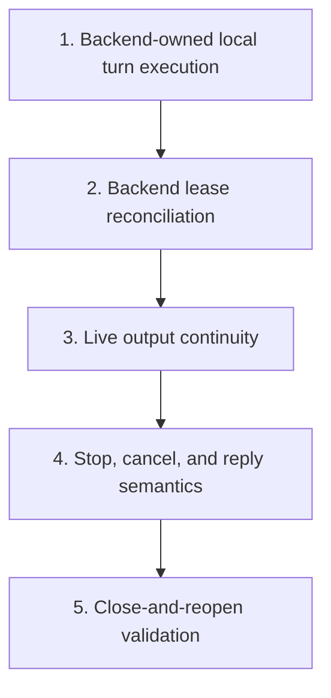

# Session Execution Backends Plan

Plan for changing `crates/agentty/src/app`, `crates/agentty/src/infra`, and `crates/agentty/src/main.rs` so session turns execute as backend-owned units that survive TUI shutdown and restart, with `in-process` and `LocalProcess` as the initial concrete backends and `oci-local` plus `oci-remote` reserved as future backend kinds under the same execution contract.

## Steps

## 1) Ship backend-owned local turn execution that survives TUI exit

### Why now

The first slice must prove the core product goal end to end: a session turn becomes a durable execution unit owned by a backend instead of by the TUI process.

### Usable outcome

A user can start a turn, Agentty can hand the persisted operation to the `LocalProcess` backend, the TUI can exit, and reopening Agentty after the turn finishes shows the final `Review` or `Question` state without replaying the turn.

### Substeps

- [ ] **Persist backend-ready turn requests on `session_operation`.** Add a new migration in `crates/agentty/migrations/` that extends `session_operation` with the immutable detached-turn request fields needed to run without TUI memory (`prompt`, `model`, `turn_mode`, `resume_output`, `backend_kind`) plus backend-owned lease fields that are generic enough for future runners (`backend_owner`, reuse `heartbeat_at`, and `backend_state` for opaque backend-specific state such as a local PID or later container/job identifiers).
- [ ] **Add one backend-agnostic execution boundary.** Add a new execution backend trait in `crates/agentty/src/infra/` and keep the first production implementation focused on `LocalProcess`, so the app enqueues a persisted operation through one contract instead of hard-coding subprocess assumptions into session workflow code.
- [ ] **Use `agentty run-turn <operation-id>` as the `LocalProcess` backend entrypoint.** Extend `crates/agentty/src/main.rs` with a subcommand dispatcher that can run the existing binary as a detached local worker while keeping the turn-execution logic in shared app/session workflow code rather than in CLI-only glue.
- [ ] **Move turn execution and final persistence behind the shared runner flow.** Extract the shared turn-running logic from `crates/agentty/src/app/session/workflow/worker.rs` into a focused module such as `crates/agentty/src/app/session/workflow/turn_runner.rs` so both the in-process fallback and the detached `LocalProcess` backend persist transcript, terminal status, and durable `session.output` through the same path.
- [ ] **Add a backend selection rollback path.** Support an environment-driven backend selector such as `AGENTTY_SESSION_BACKEND=in-process|local-process`, defaulting to `local-process` for this slice, preserving `in-process` as the explicit rollback mode, and reserving `oci-local` plus `oci-remote` as future values that are not yet implemented.

### Tests

- [ ] Add a focused regression test that persists a turn request, runs `agentty run-turn <operation-id>` through the `LocalProcess` backend path with injected test doubles, and verifies the DB records the terminal operation state plus final session output without the TUI event loop.

### Docs

- [ ] Update `docs/site/content/docs/usage/workflow.md` and `docs/site/content/docs/getting-started/overview.md` to explain that session turns can finish while Agentty is closed, that session execution is now backend-owned, that `local-process` is the first shipped detached backend, and that `oci-local` plus `oci-remote` are future backend kinds.
- [ ] Update `docs/site/content/docs/architecture/testability-boundaries.md` to register the new execution backend boundary and the shared detached turn-runner flow.

## 2) Reconcile backend leases on restart

### Why now

Once detached execution works, the next risk is stale or orphaned work. Restart must distinguish a healthy backend-owned lease from abandoned execution without baking `LocalProcess` assumptions into the app-level contract.

### Usable outcome

A user can reopen Agentty during an active detached turn and see the session remain `InProgress` only when the backend lease is still healthy, while orphaned work is reclaimed deterministically.

### Substeps

- [ ] **Add generic lease claim and heartbeat flows in `db.rs`.** Extend `crates/agentty/src/infra/db.rs` with atomic claim, heartbeat refresh, owner clear, and stale-failure helpers keyed by `backend_kind`, `backend_owner`, and `heartbeat_at` so restart recovery works for any backend implementation.
- [ ] **Add backend-specific lease inspection behind the execution boundary.** Extend the execution backend contract with a liveness check and implement the first `LocalProcess` version using a dedicated process-inspection boundary in `crates/agentty/src/infra/`, keeping PID checks local to that adapter instead of exposing them as the app-level ownership model.
- [ ] **Replace blanket startup failure with reconciliation.** Replace `SessionManager::fail_unfinished_operations_from_previous_run()` in `crates/agentty/src/app/core.rs` with reconciliation logic in `crates/agentty/src/app/session/workflow/reconcile.rs` that keeps healthy leases active, marks stale leases failed, and never rewrites unfinished operations purely because the TUI restarted.
- [ ] **Keep reopened `InProgress` sessions loadable before live tailing lands.** Update `crates/agentty/src/app/session/workflow/load.rs` and `crates/agentty/src/app/session/workflow/refresh.rs` so persisted `InProgress` sessions remain renderable from DB state even before cross-process output mirroring is added.

### Tests

- [ ] Add mock-driven tests for healthy-lease reopen, stale-lease failure, duplicate-claim refusal when a live owner still exists, and already-finished operations skipped during reconciliation.

### Docs

- [ ] Update `docs/site/content/docs/architecture/runtime-flow.md`, `docs/site/content/docs/architecture/module-map.md`, and `docs/site/content/docs/architecture/testability-boundaries.md` to describe backend-owned execution leases, restart reconciliation, and the `LocalProcess`-specific liveness adapter.

## 3) Mirror live output across app restarts

### Why now

State-only recovery is usable, but reopened sessions still feel broken if users cannot see active output. The next slice should restore live continuity without changing the backend contract again.

### Usable outcome

A user can reopen Agentty during an active detached turn and continue watching fresh output in the session view instead of waiting only for the final persisted transcript.

### Substeps

- [ ] **Add a durable per-session output replica.** Add `crates/agentty/src/app/session/workflow/output_replica.rs` and have backend-owned execution append incremental output to a session-scoped log file under the session folder so the mechanism works for both worktree-backed sessions and future non-worktree backends.
- [ ] **Attach reopened sessions to the replica stream.** Update `crates/agentty/src/app/session/workflow/load.rs` and `crates/agentty/src/app/session/workflow/refresh.rs` to attach and detach output-tail tasks through `output_replica.rs`, feeding appended content into `SessionHandles.output` while an execution lease is still live.
- [ ] **Import buffered replica output during finalization and stale cleanup.** Ensure the shared turn-runner finalization path and restart reconciliation import any remaining replica content into durable `session.output` so already-streamed transcript text is never dropped.

### Tests

- [ ] Add tests for replica writes during detached execution, reopen-time tail attachment, final transcript import on completion, and stale-lease cleanup that preserves partial buffered output.

### Docs

- [ ] Update `docs/site/content/docs/usage/workflow.md` and `docs/site/content/docs/architecture/runtime-flow.md` with the reopened-session output behavior and the durable output-replica handoff.

## 4) Preserve stop, cancel, and reply semantics across backend-owned execution

### Why now

After detached execution and output continuity work, the remaining risk is semantic drift: explicit stop, review cancel, and reply-after-restart behavior must still work correctly across backends.

### Usable outcome

A user can stop active detached work, keep review-session cancel behavior distinct, and send follow-up replies after restart without corrupting provider resume state.

### Substeps

- [ ] **Separate TUI exit from explicit stop requests.** Rework `crates/agentty/src/app/session/workflow/lifecycle.rs` so app shutdown no longer implies cancelation, while explicit user stop still persists cancel intent on unfinished operations.
- [ ] **Add backend-owned termination through the execution contract.** Extend the execution backend boundary with stop delivery and implement the first `LocalProcess` adapter in `crates/agentty/src/infra/` using process signaling behind that adapter rather than from app orchestration code.
- [ ] **Preserve review cancel as a separate workflow.** Keep review-session cancel responsible for worktree cleanup while in-progress stop targets the active execution backend and preserves transcript/output needed for restart-safe recovery.
- [ ] **Keep provider-native resume state correct after restart.** Update `crates/agentty/src/infra/channel/app_server.rs`, `crates/agentty/src/infra/channel/cli.rs`, `crates/agentty/src/infra/codex_app_server.rs`, and `crates/agentty/src/infra/gemini_acp.rs` so detached replies and restart-time follow-ups reuse the correct persisted conversation identifiers and transcript replay inputs.

### Tests

- [ ] Add mock-driven tests for stop-before-start, stop-during-execution, review cancel cleanup, and reply-after-restart behavior across CLI and app-server transport paths.

### Docs

- [ ] Update `docs/site/content/docs/usage/workflow.md`, `docs/site/content/docs/architecture/runtime-flow.md`, `docs/site/content/docs/architecture/module-map.md`, and `docs/site/content/docs/architecture/testability-boundaries.md` to describe detached stop delivery, review-cancel separation, and reply-after-restart ownership.

## 5) Validate close-and-reopen lifetime behavior end to end

### Why now

The feature changes lifecycle, recovery, and transport ownership. Before treating it as stable, the repository needs close-and-reopen regression coverage that exercises the backend-owned model as users experience it.

### Usable outcome

The repository has deterministic close-and-reopen regression coverage for backend-owned session execution, and the final validation gates confirm the shipped `LocalProcess` slice is stable.

### Substeps

- [ ] **Add close-while-running regression coverage.** Add an integration-style regression test across `crates/agentty/src/app/core.rs`, `crates/agentty/src/app/session`, `crates/agentty/src/app/session/workflow/reconcile.rs`, `crates/agentty/src/app/session/workflow/turn_runner.rs`, and `crates/agentty/src/app/session/workflow/output_replica.rs` that starts a turn, simulates TUI shutdown while the backend keeps running, and verifies a fresh `App` instance sees either continued `InProgress` output or the final terminal state from persistence.
- [ ] **Add finish-while-closed regression coverage.** Add a regression test around `crates/agentty/src/app/core.rs` and the relevant session workflow modules that completes a turn while Agentty is closed and verifies the next launch loads the final transcript, operation state, and session status without replaying the turn.
- [ ] **Run the repository validation gates for the shipped slice.** Run the full local validation flow after implementation lands so the detached-session behavior is covered by formatting, lint, and test gates rather than only by targeted workflow tests.

### Tests

- [ ] Keep the new close-and-reopen scenarios in the default regression path and run the repository validation gates, including the full `pre-commit` checks and `cargo test -q -- --test-threads=1`.

### Docs

- [ ] Refresh the detached-session docs only if the validated behavior narrows the supported contract for the shipped `LocalProcess` backend, and delete this plan file when the tracked work is fully implemented.

## Cross-Plan Notes

- `docs/plan/session_in_progress_timer.md` also touches persisted `InProgress` semantics. That plan owns cumulative timer fields and timer UI, while this plan owns backend-owned execution lifetime and restart reconciliation; detached-session work should reuse those timing fields instead of introducing parallel timing state.
- `docs/plan/end_to_end_test_structure.md` may add shared harness support around some of the same app and workflow modules, but detached-session behavior, acceptance scenarios, and backend-owned lifetime rules stay here.
- `docs/plan/forge_review_request_support.md` also touches `crates/agentty/src/app/core.rs`; this plan owns startup reconciliation and backend-owned turn lifetime, while the forge plan owns review-request status reconciliation.
- If another active plan conflicts with this plan and the correct resolution is not explicit, stop and ask the user which plan should control the work.

## Status Maintenance Rule

- After implementing any step in this plan, immediately update its checklist status, refresh the current-state snapshot rows that changed, and note any new migration or docs dependency before moving to the next step.
- When a step changes behavior, complete its `### Tests` and `### Docs` work in that same step before marking the step complete.
- When the full plan is complete, remove this file and keep any follow-up work in a new plan file instead of extending a finished plan indefinitely.

## Current State Snapshot

| Area | Current state in codebase | Status |
|------|---------------------------|--------|
| Startup recovery | Restart still fails every queued or running `session_operation` and forces affected sessions back to `Review`. | Not Started |
| Execution ownership model | Session turns still belong to in-memory worker queues and `tokio::spawn` tasks owned by the TUI process. | Not Started |
| Backend abstraction | No backend-agnostic session execution boundary exists yet; transport creation and turn execution are coupled to app-owned worker code. | Not Started |
| Operation persistence | `session_operation` stores lifecycle status plus `heartbeat_at`, but it does not yet persist the immutable turn request or any backend-owned lease metadata. | Partial |
| Lease reconciliation | No persisted backend owner exists today, so reopen cannot distinguish healthy detached execution from abandoned work. | Not Started |
| Session reload behavior | Reload logic can already render persisted `InProgress` sessions when the folder still exists, but startup still force-fails unfinished work before reopen can trust that state. | Partial |
| Live output continuity | No cross-process output replica exists; `SessionHandles.output` is still an in-process `Arc<Mutex<String>>`. | Not Started |
| Binary entrypoint | `main.rs` still launches the Ratatui app directly and has no subcommand dispatcher for backend-owned detached execution. | Not Started |

## Design Decisions

### Execution unit model

Treat each queued turn as a durable execution unit persisted in `session_operation`. The TUI enqueues and observes work, but the execution backend owns lifetime once the operation is claimed.

### Backend contract first, concrete backend matrix second

Introduce a backend-agnostic execution contract before deepening any one backend. The initial concrete matrix is `in-process` for rollback and tests plus `LocalProcess` for detached execution, while `oci-local` and `oci-remote` remain reserved future backend kinds that should be able to reuse the same persisted request and lease model without app-level redesign.

### Backend lease model

Persist backend ownership in a generic lease shape: `backend_kind`, `backend_owner`, `heartbeat_at`, and `backend_state`. `backend_state` is opaque backend-specific metadata, allowing the `LocalProcess` backend to store a PID now and future container backends to store container or job identifiers later without changing the app contract again.

### Shared turn-runner flow

Keep one shared turn-runner path for transport setup, transcript persistence, stats updates, auto-commit, and terminal status transitions. Backend implementations should decide how the unit starts and stops, not how session turns are interpreted.

### Output continuity

Use a durable per-session output replica file plus DB polling. The replica provides low-latency reopened-session output, while the DB remains the durable source of truth for terminal transcript state.

### Rollback and backend selection

Use an explicit backend selector rather than a detach-only flag so the first pass can ship `local-process` with `in-process` fallback and later add `oci-local` or `oci-remote` without redefining the rollout control.

## Execution Workflow

1. The TUI validates the prompt, persists session metadata, and inserts a fully populated `session_operation` row with the immutable turn request and target `backend_kind`.
1. The enqueue path asks the configured execution backend to start the persisted operation.
1. For the first shipped backend, `LocalProcess` launches `agentty run-turn <operation-id>` and the detached process reloads everything it needs from the DB.
1. The backend claims the operation lease, writes `backend_owner`, starts heartbeating through the DB, and initializes the output replica when that slice lands.
1. The shared turn-runner flow creates the correct `AgentChannel`, executes the turn, persists progress and results, and mirrors incremental output into the replica file.
1. If the TUI is open, Agentty tails the replica into `SessionHandles.output`; if the TUI is closed, the backend continues independently.
1. On TUI restart, reconciliation checks the persisted lease through the backend boundary, keeps healthy work active, and fails only stale or orphaned operations.
1. When the turn finishes, the runner imports any remaining replica output, clears the lease, and leaves the session in `Review` or `Question`.
1. Follow-up replies create a new persisted execution unit and reuse the same backend-owned flow.

## Implementation Approach

- Start with the smallest working slice that already matches the long-term product shape: backend-owned persisted execution with `LocalProcess` as the first backend.
- Keep app orchestration backend-agnostic and push local process details behind the `LocalProcess` adapter so future OCI implementations do not require another app-level rewrite.
- Split restart reconciliation, output continuity, and stop/reply semantics into separate usable slices instead of bundling them into one oversized detached-runner step.
- Keep tests and docs inside each slice that changes user-visible behavior rather than deferring them to a final cleanup step.

## Suggested Execution Order

1. Start with `1) Ship backend-owned local turn execution that survives TUI exit`; it is the smallest usable slice that already matches the backend-owned session goal.
1. Start `2) Reconcile backend leases on restart` only after step 1 lands, because restart safety depends on the persisted lease and backend contract introduced there.
1. Start `3) Mirror live output across app restarts` only after step 2 lands so output attachment builds on the settled lease model.
1. Start `4) Preserve stop, cancel, and reply semantics across backend-owned execution` only after step 3 lands so stop and reply behavior can rely on the final ownership and output handoff shape.
1. Start `5) Validate close-and-reopen lifetime behavior end to end` only after step 4 lands so the regression pass covers the stabilized behavior.
1. No top-level steps are safe to run in parallel because each slice depends on the ownership and recovery rules established by the previous slice.

## Out of Scope for This Pass

- Implementing `oci-local` or `oci-remote` execution backends in this plan; this pass only preserves their viability through the contract and ships `LocalProcess`.
- Building a long-lived global daemon that multiplexes all sessions beyond what is needed for backend-owned turn survival.
- Adding cross-machine orchestration, distributed scheduling, or server-side push channels.
- Replacing DB polling plus output-replica tailing with a richer cross-process event bus in the first pass.
- Changing merge, rebase, or review-request workflows except where they must respect backend-owned session lifetime rules.
