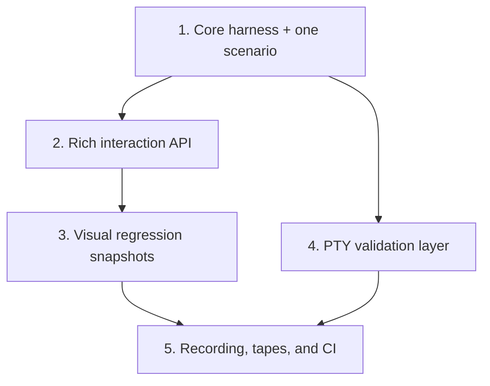

# TUI End-to-End Testing Framework

Plan for building a Rust-native, Playwright-inspired TUI testing framework that exercises full app flows through the ratatui rendering pipeline with scriptable input, auto-waiting locators, and snapshot assertions.

## How It Works — Simple Explanation

The framework introduces an `ag-tui-test` crate that provides five layered capabilities:

1. **In-process `TestBackend` harness** — Boots the full TUI app in memory using ratatui's `TestBackend`, injects key events through a scriptable `EventSource`, and reads the rendered terminal buffer directly. No real terminal needed. Tests run in sub-millisecond per frame, making them fast and deterministic.

1. **Playwright-style interaction API** — Rich primitives for simulating real user interaction: typing text, pressing key combos, navigating overlays, and driving multi-turn agent conversations with scripted `MockAgentChannel` responses. Locators find on-screen elements by text, regex, style, or region — similar to Playwright's `getByText`.

1. **Visual regression snapshots** — Captures the full styled terminal output (characters, colors, bold, borders) as stable text representations using `insta` snapshots. Region-scoped snapshots test individual components without full-screen fragility. Responsive layout helpers test the same screen at multiple terminal sizes.

1. **PTY-based true terminal validation** — A thin smoke layer that launches the actual `agentty` binary in a pseudo-terminal using `portable-pty`, parses real escape sequences with `vte`, and asserts on the reconstructed screen. Catches issues that `TestBackend` cannot: raw mode handling, escape sequence bugs, platform-specific rendering.

1. **Recording, tape DSL, and CI integration** — Record real TUI interactions and export them as test scripts. A declarative VHS-inspired tape DSL (`Type`, `Wait`, `Snapshot`, `Assert`) allows writing tests without Rust boilerplate. CI collects snapshot diff artifacts on failure for visual review on PRs.

## Steps

## 1) Ship the core test harness with one interactive scenario

### Why now

The codebase has strong unit-test coverage via `mockall` boundaries but no way to exercise a full user journey through the actual event loop, key handlers, and rendering pipeline. The existing `end_to_end_test_structure.md` plan covers workflow-level harness testing (fake CLIs, session state), but nothing tests what the user actually *sees* on screen. A minimal harness that drives the real `App` + `Terminal<TestBackend>` loop with injected events and buffer assertions proves the architecture before building richer APIs.

### Usable outcome

A developer can write a test that boots the full TUI app in-memory, sends a sequence of key events, and asserts on the rendered terminal buffer content — all without a real terminal, real agent, or real git repo.

### Substeps

- [ ] **Create the `ag-tui-test` crate and baseline config surface.** Add `crates/ag-tui-test/` as a workspace member with shared dependencies declared in the root `Cargo.toml`, create the local `AGENTS.md` plus symlinks, and add `crates/ag-tui-test/src/config.rs` with the first `TuiTestConfig` builder fields for terminal size, timeout, tick rate, injected mocks, temp-dir setup, and preloaded project or session state.

- [ ] **Implement the in-process app harness.** Create `crates/ag-tui-test/src/context.rs` with `TuiTestContext` owning the `Terminal<TestBackend>`, injected terminal and app event channels, the running app-loop handle, and readable app state; add the supporting `crates/ag-tui-test/src/event_source.rs` implementation of `EventSource` so tests can drive the real runtime through queued synthetic events and clean shutdown.

- [ ] **Add locator and auto-wait assertion primitives.** Create `crates/ag-tui-test/src/locator.rs` and `crates/ag-tui-test/src/assertion.rs` so tests can find exact text, substring matches, regex matches, and region-scoped content in a `Buffer`, then wait for visibility or mode changes through repeated `tick()`-driven rendering.

- [ ] **Add snapshot helpers for the first frame assertions.** Create `crates/ag-tui-test/src/snapshot.rs` with plain and styled buffer serializers plus an `assert_snapshot!` helper so the initial harness can capture stable `insta` snapshots of rendered terminal frames.

- [ ] **Write one full interactive scenario test.** Add `crates/agentty/tests/tui_session_list_navigation.rs` that:

  1. Boots the app with `TuiTestConfig` using mock agent and mock git, pre-populated with 3 sessions.
  1. Asserts the session list is visible (`expect_text(ctx, "Sessions").to_be_visible()`).
  1. Sends `Down` arrow key twice.
  1. Asserts the third session is highlighted.
  1. Sends `Enter` to open a session.
  1. Asserts the mode switched to `View` and the session content is rendered.
  1. Sends `Esc` to return to the list.
  1. Takes an `insta` snapshot of the final buffer state.

### Tests

- [ ] Run `cargo test -p ag-tui-test` for unit tests within the framework crate itself (locator matching, buffer-to-string conversion, event source behavior).
- [ ] Run the `tui_session_list_navigation` integration test and verify the insta snapshot is stable across runs.

### Docs

- [ ] Add `/// ` doc comments to all public types and methods in `ag-tui-test`.
- [ ] Update `CONTRIBUTING.md` with a "TUI E2E Tests" section explaining how to write and run TUI scenario tests.
- [ ] Update `docs/plan/AGENTS.md` directory index with this plan file.
- [ ] Add `ag-tui-test` to the module map at `docs/site/content/docs/architecture/module-map.md`.

## 2) Expand the locator and interaction API for complex scenarios

### Why now

After the core harness works for simple navigation, the framework needs richer interaction primitives to test prompt input, slash commands, overlays, confirmation dialogs, and multi-turn agent conversations — the flows where most UI bugs occur.

### Usable outcome

Developers can write tests for prompt editing (typing, backspace, cursor movement), slash command completion, confirmation dialogs, diff view scrolling, and multi-turn agent sessions with scripted responses.

### Substeps

- [ ] **Add text input simulation helpers.** Extend `TuiTestContext` in `crates/ag-tui-test/src/context.rs` with:

  - `type_text(text: &str)` — sends each character as individual key events with realistic pacing.
  - `send_backspace(count)` — sends backspace key events.
  - `send_ctrl(char)` — sends Ctrl+key combos (`Ctrl+A`, `Ctrl+C`, etc.).
  - `send_key_sequence(keys: &[KeyEvent])` — sends a batch of key events with inter-key delay.
  - `clear_input()` — sends `Ctrl+U` to clear the current input line.

- [ ] **Add overlay and popup locator support.** Extend `Locator` in `crates/ag-tui-test/src/locator.rs` with:

  - `Locator::by_border(ctx, BorderType)` — detect bordered regions (popups, dialogs).
  - `Locator::by_style(ctx, Style)` — find cells with specific styling (selected item highlight, error text).
  - `Locator::focused_input(ctx)` — locate the active text input area by cursor position.

- [ ] **Add multi-turn session scenario support.** Create `crates/ag-tui-test/src/scenario.rs` with a `Scenario` builder:

  - `Scenario::new().on_prompt("write tests").reply("I'll write the tests now").on_prompt("looks good").reply("Done!").build()` — chainable mock agent turn definitions.
  - The builder produces a configured `MockAgentChannel` that responds to sequential prompts with scripted replies.
  - Support for simulating `InProgress` → `Review` state transitions with realistic timing.

- [ ] **Write prompt input and slash command scenario tests.** Add `crates/agentty/tests/tui_prompt_interaction.rs`:

  1. Boot app, navigate to a session, enter prompt mode.
  1. Type a message, verify it appears in the input area.
  1. Use backspace, verify character deletion.
  1. Type `/` and verify slash command suggestions appear.
  1. Select a slash command and verify completion.
  1. Submit the prompt and verify the session transitions to `InProgress`.

- [ ] **Write confirmation dialog scenario test.** Add `crates/agentty/tests/tui_confirmation_dialog.rs`:

  1. Boot app with a session in `Review` state.
  1. Press the merge key, verify the confirmation dialog appears.
  1. Assert dialog text and button labels are visible.
  1. Press `y` to confirm, verify the dialog closes and merge proceeds.
  1. Repeat with `n` to verify cancellation.

### Tests

- [ ] Run all new integration tests and verify snapshot stability.
- [ ] Run existing unit tests to ensure the `EventSource` trait changes are backward-compatible.

### Docs

- [ ] Add a `## Writing Complex Scenarios` section to `CONTRIBUTING.md` with examples of prompt, dialog, and multi-turn test patterns.
- [ ] Update `ag-tui-test` crate-level doc comment with a usage guide.

## 3) Add visual regression testing with styled snapshots and diff reporting

### Why now

Text-only assertions catch content bugs but miss styling regressions (wrong colors, missing bold, broken borders). After interaction coverage is solid, adding style-aware snapshots and clear diff reporting catches a broader class of visual regressions.

### Usable outcome

Developers can snapshot the full styled terminal output (including colors, bold, borders) and get clear, human-readable diffs when a visual regression occurs. CI can run the full TUI snapshot suite and fail on unexpected visual changes.

### Substeps

- [ ] **Implement rich buffer serialization.** Enhance `crates/ag-tui-test/src/snapshot.rs` to produce a stable, human-readable text format that encodes:

  - Character content per cell.
  - Foreground and background colors (using named color tokens like `[fg:red]`, `[bg:blue]`).
  - Text modifiers (`[bold]`, `[dim]`, `[italic]`, `[underline]`).
  - A clean grid layout with row numbers for easy visual inspection.
  - Style annotations only emitted when they change from the previous cell (run-length encoding for readability).

- [ ] **Add region-scoped snapshots.** Add `snapshot_region(buffer, Rect) -> String` to capture only a specific area of the screen. This is critical for testing individual components (status bar, footer, popup content) without full-screen snapshot fragility.

- [ ] **Add snapshot diff reporting.** Create `crates/ag-tui-test/src/diff.rs` with a custom diff renderer that:

  - Highlights character-level differences between expected and actual buffers.
  - Shows row/column coordinates for changed cells.
  - Optionally renders side-by-side comparison for CI output.
  - Integrates with `insta`'s review workflow (`cargo insta review`).

- [ ] **Add responsive layout testing.** Create `crates/ag-tui-test/src/responsive.rs` with helpers to test the same screen at multiple terminal sizes:

  - `assert_responsive(ctx, &[(80, 24), (120, 40), (200, 50)], |ctx| { ... })` — runs the same assertion block at each size.
  - Produces separate named snapshots per size (e.g., `session_list_80x24.snap`, `session_list_120x40.snap`).

- [ ] **Write visual regression tests for key screens.** Add `crates/agentty/tests/tui_visual_regression.rs` with snapshot tests for:

  1. Empty session list (no sessions).
  1. Session list with multiple sessions (various states).
  1. Session view with agent output.
  1. Diff view with colored diff content.
  1. Help overlay.
  1. Status bar and footer bar.
     Test each at 80×24 (minimum) and 120×40 (default) sizes.

### Tests

- [ ] Run `cargo insta test` to verify all snapshots are generated and stable.
- [ ] Run the full test suite to ensure no regressions from the snapshot serialization changes.

### Docs

- [ ] Add a `## Visual Regression Testing` section to `CONTRIBUTING.md` explaining the `cargo insta review` workflow for TUI snapshots.
- [ ] Document the snapshot format in `ag-tui-test` crate docs so contributors understand the encoding.

## 4) Add PTY-based true terminal validation layer

### Why now

The in-process `TestBackend` layer validates app logic and rendering, but cannot catch issues in actual terminal escape sequence processing, raw mode handling, or platform-specific terminal behavior. A thin PTY layer on top provides confidence that the real binary works in a real terminal environment.

### Usable outcome

Developers can write tests that launch the actual `agentty` binary in a pseudo-terminal, send keystrokes, and assert on the real terminal output — catching escape sequence bugs, raw mode issues, and platform-specific rendering problems that `TestBackend` cannot detect.

### Substeps

- [ ] **Add `portable-pty` and `vte` dependencies.** Add `portable-pty` and `vte` to `[workspace.dependencies]` in the root `Cargo.toml` and as dependencies of `ag-tui-test`. `portable-pty` provides cross-platform PTY creation (Linux, macOS). `vte` parses terminal escape sequences to reconstruct the visible screen state from raw PTY output.

- [ ] **Implement `PtyTestContext`.** Create `crates/ag-tui-test/src/pty.rs` with a `PtyTestContext` struct that:

  - Spawns the `agentty` binary in a PTY with configurable size via `portable-pty`.
  - Captures raw terminal output into a buffer.
  - Parses escape sequences using `vte` (terminal state machine parser) to reconstruct the visible screen state.
  - Provides `send_key()`, `send_text()` for input injection using the same `Key` enum as the in-process layer.
  - Provides `wait_for_text(text, timeout)` auto-waiting assertion.
  - Provides `screenshot() -> String` for snapshot testing of the parsed screen.
  - Handles graceful shutdown (sends `Ctrl+C`, waits for exit, kills if needed).

- [ ] **Implement `ScreenParser`.** Create `crates/ag-tui-test/src/screen_parser.rs` that implements `vte::Perform` to maintain a virtual screen buffer:

  - Tracks cursor position, scrolling region, character set.
  - Handles SGR (color/style) sequences to track cell styles.
  - Handles cursor movement, erase, insert/delete line sequences.
  - Produces a `Buffer`-compatible output for reuse of `Locator` and snapshot APIs.

- [ ] **Implement `Key` enum and encoding.** Create `crates/ag-tui-test/src/key.rs` with:

  - `Key` enum variants: `Char(char)`, `Enter`, `Esc`, `Tab`, `Backspace`, `Up`, `Down`, `Left`, `Right`, `Home`, `End`, `PageUp`, `PageDown`, `Delete`, `Ctrl(char)`, `Alt(char)`, `F(u8)`.
  - `fn encode(key: &Key) -> Vec<u8>` — converts a `Key` to the raw byte sequence the PTY master expects (ANSI escape sequences for special keys, raw bytes for characters).
  - Used by both `PtyTestContext` (for raw PTY I/O) and as a convenient API for test authors.

- [ ] **Write one PTY smoke test.** Add `crates/agentty/tests/tui_pty_smoke.rs` (marked `#[ignore]` by default since it requires a built binary) that:

  1. Builds `agentty` binary.
  1. Launches it in a PTY.
  1. Waits for the session list to render.
  1. Sends `?` to open help.
  1. Asserts help overlay is visible.
  1. Sends `Esc` to close help.
  1. Sends `Ctrl+C` to quit.
  1. Verifies clean exit.

### Tests

- [ ] Run the PTY smoke test with `cargo test -- --ignored tui_pty_smoke` and verify it passes on the local platform.
- [ ] Unit tests for `Key` encoding verifying correct ANSI escape sequences.
- [ ] Unit tests for `ScreenParser` verifying correct screen reconstruction from sample escape sequences.
- [ ] Run the in-process test suite to ensure no regressions from shared API changes.

### Docs

- [ ] Add a `## PTY Tests` section to `CONTRIBUTING.md` explaining when to use PTY tests vs in-process tests, and the `--ignored` flag requirement.
- [ ] Document `PtyTestContext` and `ScreenParser` APIs in the `ag-tui-test` crate docs.
- [ ] Update `docs/site/content/docs/architecture/testability-boundaries.md` with the new PTY testing boundary.

## 5) Add test recording, playback, and CI integration

### Why now

After both in-process and PTY testing layers are functional, the final step is developer experience: making it easy to create tests from real interactions, replay them, and run the full suite in CI with clear failure reporting.

### Usable outcome

Developers can record a TUI interaction session and export it as a test script. CI runs the full TUI E2E suite with visual diff artifacts on failure. A declarative tape DSL allows writing tests without Rust boilerplate.

### Substeps

- [ ] **Implement test recording.** Create `crates/ag-tui-test/src/recorder.rs` with a `TestRecorder` that:

  - Wraps a `TuiTestContext` and records all injected events with timestamps.
  - On completion, exports a Rust test function source code with the recorded event sequence and snapshot assertions.
  - Supports `recorder.mark_assertion("session list visible")` to insert named checkpoints that become `expect_text` calls in the exported test.
  - Output format: a standalone `#[tokio::test]` function that can be pasted into a test file.

- [ ] **Implement test playback with VHS-style tape files.** Create `crates/ag-tui-test/src/tape.rs` with a simple DSL for declarative test scripts (inspired by Charmbracelet VHS but with assertions):

  ```
  # agentty-tape format
  Set Width 120
  Set Height 40
  Wait "Sessions"
  Key Down
  Key Down
  Key Enter
  Wait "Session output"
  Snapshot "session_view"
  Key Escape
  Wait "Sessions"
  Snapshot "back_to_list"
  ```

  - Each line maps to a scenario step.
  - `Set Width/Height` configures initial terminal size.
  - `Set Timeout <duration>` configures default wait timeout.
  - `Type "<text>"` types the quoted string.
  - Key names (`Enter`, `Tab`, `Esc`, `Up`, `Down`, `Ctrl+<char>`, `Alt+<char>`, `F1`–`F12`) map to key press events.
  - `Wait "<text>"` waits for text to appear (auto-waiting).
  - `Snapshot "<name>"` captures a named `insta` snapshot.
  - `StyledSnapshot "<name>"` captures a styled snapshot.
  - `Sleep <duration>` pauses execution.
  - `Resize <cols> <rows>` resizes the terminal.
  - `Assert "<text>"` / `AssertNot "<text>"` for text presence/absence.

- [ ] **Add CI snapshot artifact collection.** Create a CI helper in `crates/ag-tui-test/src/ci.rs` that:

  - On snapshot mismatch, writes the actual/expected/diff outputs to a `target/tui-test-artifacts/` directory.
  - Produces a summary report (markdown table) of all passed/failed snapshot comparisons.
  - Integrates with GitHub Actions artifact upload for visual review on PR failures.

- [ ] **Add CI workflow configuration.** Update `.github/workflows/` to:

  - Run in-process TUI tests as part of the default test suite.
  - Run PTY TUI tests in a dedicated job with proper PTY allocation.
  - Set `INSTA_UPDATE=no` to fail on snapshot mismatches.
  - Upload snapshot diff artifacts on failure for PR review.

- [ ] **Write tape-format tests for key user journeys.** Add tape files under `crates/agentty/tests/tapes/` for:

  1. `session_lifecycle.tape` — create session, type prompt, view response, merge.
  1. `project_switching.tape` — switch between projects, verify session list updates.
  1. `help_navigation.tape` — open help from various contexts, verify context-specific content.

### Tests

- [ ] Run tape-based tests and verify they produce stable snapshots.
- [ ] Test the recorder by recording a simple interaction and replaying the exported test.
- [ ] Verify CI workflow runs TUI E2E tests successfully in a test PR.
- [ ] Verify `cargo insta review` works correctly for both `ag-tui-test` and `agentty` snapshot locations.

### Docs

- [ ] Add a `## Recording Tests` section to `CONTRIBUTING.md` explaining the recording workflow.
- [ ] Add a `## Tape Format Reference` section documenting the tape DSL syntax.
- [ ] Document the tiered testing strategy in `CONTRIBUTING.md`: unit/mock tests → `TestBackend` snapshots → PTY E2E tests.
- [ ] Update `docs/site/content/docs/architecture/testability-boundaries.md` with the full TUI testing boundary map.

## Cross-Plan Notes

- `docs/plan/end_to_end_test_structure.md` owns the workflow-level harness (fake CLIs, session state assertions, deterministic scenario tests). This plan owns the *visual/interactive* TUI testing layer. The two are complementary: workflow tests validate business logic flows, TUI tests validate what the user sees and how input is handled.
- Both plans share the `CONTRIBUTING.md` testing documentation. Coordinate updates to avoid conflicting guidance. This plan adds TUI-specific sections; the workflow plan owns the deterministic-vs-live tiering guidance.
- `TuiTestContext` reuses the `MockAgentChannel` and `MockGitClient` patterns already established by the existing test infrastructure. No ownership conflict — this plan consumes those mocks, does not redefine them.

## Status Maintenance Rule

- After implementing any step in this plan, immediately update its checklist status in this document and refresh any snapshot rows that changed.
- When a step changes contributor workflow, test commands, or documentation, complete its `### Tests` and `### Docs` work in that same step before marking it complete.
- When the full plan is complete, remove the implemented plan file; if more work remains, move that work into a new follow-up plan file before deleting the completed one.

## Current State Snapshot

| Area | Current state in codebase | Status |
|------|---------------------------|--------|
| In-process TUI test harness | No framework for driving the app through `Terminal<TestBackend>` with injected events and buffer assertions. | Not started |
| Locator / element finder API | No equivalent of Playwright's `getByText` for ratatui buffers. | Not started |
| Auto-waiting assertions | No timeout-based polling assertions for TUI state. | Not started |
| Snapshot testing (`insta`) | Not used in the project; `TestBackend` not used for rendering assertions. | Not started |
| PTY-based terminal tests | No PTY test infrastructure; only unit tests with `mockall` and live provider tests (ignored). | Not started |
| Test recording/playback | No recording or declarative test scripting capability. | Not started |
| CI TUI visual regression | No TUI snapshot comparison in CI pipeline. | Not started |

## Implementation Approach

- Build a Rust-native framework (`ag-tui-test` crate) rather than depending on external TypeScript/Go tools, keeping the test stack homogeneous and CI-simple.
- Start with the in-process `TestBackend` layer because it is fast (sub-millisecond per frame), deterministic, and requires no external dependencies beyond ratatui itself. This covers 90% of TUI testing needs.
- Add the PTY layer only after the in-process layer is proven, since PTY tests are slower and platform-dependent. Keep PTY tests as a thin smoke layer, not the primary coverage mechanism.
- Follow Playwright's API design philosophy — locators, auto-waiting, readable assertions — because it is proven to reduce test flakiness and improve developer experience.
- Use `insta` for snapshot management because its review workflow (`cargo insta review`) is the Rust ecosystem standard and integrates cleanly with CI.
- The tape DSL is intentionally simple and domain-specific. Unlike VHS (which targets demo recording), our tapes include assertions (`Wait`, `Snapshot`) and are designed for automated testing, not visual documentation.

## Suggested Execution Order



1. Start with `1) Ship the core test harness with one interactive scenario` — this is the foundation that all later steps build on.
1. Start `2) Expand the locator and interaction API` after step 1 lands, as it extends the proven harness with richer primitives.
1. Start `3) Add visual regression testing` after step 2, since styled snapshots require the full interaction API to set up meaningful screen states.
1. Start `4) Add PTY-based true terminal validation` after step 1 (can run in parallel with steps 2–3), since it is architecturally independent from the in-process interaction API.
1. Start `5) Add test recording, playback, and CI integration` only after steps 3 and 4, as it ties together both layers into a cohesive developer experience.

## Out of Scope for This Pass

- Replacing existing `mockall`-based unit tests with TUI E2E tests — the two layers are complementary, not substitutes.
- Cross-platform Windows PTY testing (ConPTY) — start with macOS/Linux where development happens.
- GIF/video recording of test runs (VHS-style visual output generation for demos).
- Performance benchmarking of the test framework itself — focus on correctness and developer experience first.
- Visual test result dashboard or web UI for reviewing snapshots — rely on `cargo insta review` and CI artifacts.
- Testing third-party terminal emulator compatibility (iTerm2, Alacritty, WezTerm rendering differences).
- Accessibility testing (screen reader output, high-contrast mode) — valuable but separate concern.

## Research References

| Tool | Type | Language | Key Takeaway |
|------|------|----------|-------------|
| [ratatui `TestBackend`](https://ratatui.rs/recipes/testing/snapshots/) | In-memory render | Rust | Foundation — built-in buffer-based testing, pairs with `insta` for snapshots. Ships with ratatui, zero extra deps. |
| [Microsoft `tui-test`](https://github.com/microsoft/tui-test) | PTY E2E | TypeScript | API inspiration — Playwright-style locators (`getByText`), auto-waiting, snapshot testing, test isolation. 130 stars. |
| [Charmbracelet VHS](https://github.com/charmbracelet/vhs) | Recording | Go | Tape DSL inspiration — declarative scripting syntax (`Type`, `Enter`, `Wait`, `Sleep`). 18.9k stars. Not a testing tool (no assertions). |
| [`insta`](https://github.com/mitsuhiko/insta) | Snapshot | Rust | Snapshot management — `cargo insta review` workflow, redactions for non-deterministic values, inline snapshots. 2.8k stars. De facto Rust standard. |
| [`portable-pty`](https://docs.rs/portable-pty) | PTY | Rust | Cross-platform PTY creation for true terminal testing (macOS, Linux). Part of WezTerm ecosystem. |
| [`vte`](https://docs.rs/vte) | Parser | Rust | Terminal escape sequence parsing — implements a `vte::Perform` trait to build a virtual screen from raw PTY output. Used by Alacritty. |
| [`ratatui-testlib`](https://github.com/raibid-labs/ratatui-testlib) | PTY E2E | Rust | Prior art — PTY harness for ratatui apps with `wait_for_text`, `send_key`. Very early stage (4 stars), Linux-focused. Validates the approach. |
| [`vt100`](https://docs.rs/vt100) | Terminal emulator | Rust | Higher-level alternative to `vte` — full terminal emulator that maintains screen state. May be simpler than building on raw `vte`. |
