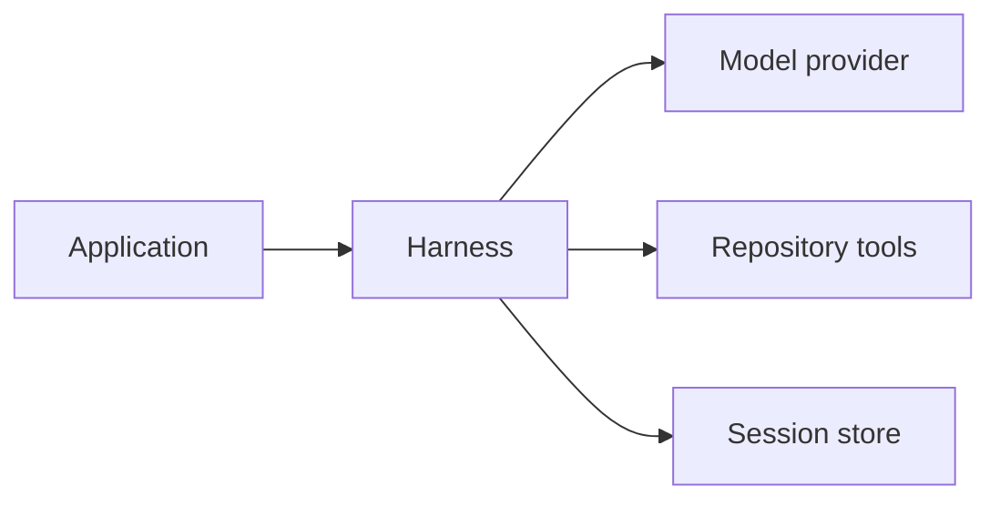
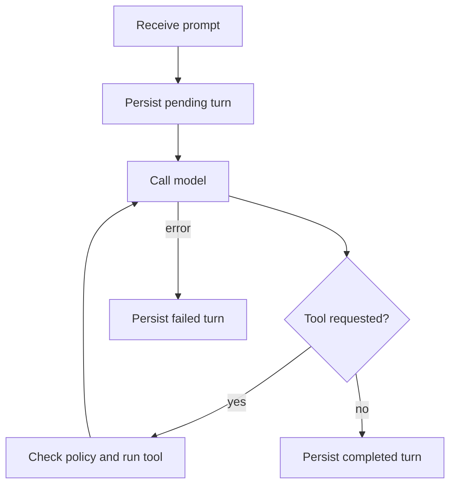

+++
title = "ag-harness Design"
description = "Model loop, durable sessions, and repository policy."
weight = 6
+++

# `ag-harness` — a light LLM harness

`ag-harness` is the base layer between an application and an LLM. It is Rust-native,
app-facing, and lightweight: an agent loop, three policy-checked tools, durable
sessions, and content-free lifecycle events. Product decisions stay in the application.
It is not yet an Agentty backend; product integration must follow the
[Execution](@/docs/core-components/execution.md) boundary.



## Core features

- **Three built-in tools** — `read`, `write` (git-style patches), and sandboxed `bash`.
- **Deny-by-default permissions** — every tool call passes an explicit per-turn policy.
- **Structured output** — every turn validates against a caller-supplied JSON schema.
- **Durable sessions** — SQLite by default; memory and custom stores share the same
  public contract.
- **Provider-neutral models** — built-in Muse, Kimi, and Qwen adapters behind one
  object-safe `Model` trait.
- **Typed lifecycle events** — content-free turn, model, and tool observations.

## Crates

```text
crates/
├── ag-harness       # library + ag-harness-sandbox launcher binary
└── ag-harness-cli   # interactive terminal host
```

## Public boundary

- `Harness` owns the model, validated repository, configured defaults, lifecycle
  observers, and the selected session store.
- `Session` is the only multi-turn abstraction; `run_once` executes a stateless turn.
- `TurnOptions` fixes the schema, `ToolPolicy`, limits, and optional `ComparisonBase`
  for one execution. Explicit options replace defaults; they are never merged.
- `Model` is the object-safe provider boundary. `ModelRegistry` resolves built-in or
  injected models by stable host keys with declared `ModelCapabilities`.
- `SessionStore` is the public persistence contract and `BashExecutor` the public
  command-execution contract; both accept host implementations.

## Agent loop

A turn continues until the model responds without requesting a tool, and the terminal
response must satisfy the caller's schema:



## Sessions

- The selected store is canonical. Provider-native continuation is an optimization,
  never the only copy of conversation state.
- One active turn per session. Renewable leases fence concurrent processes; expired
  leases mark turns `interrupted`, and only completed turns re-enter model context.
- Within one process, a single reservation lifecycle owns admission, lease renewal,
  finalization, and cleanup of abandoned owners. It recovers those owners before every
  turn acquisition or model switch, the same way for every store.
- Each turn records its effective options, comparison identity, and model provenance
  before execution. Write and command intents persist before their effects.
- `submit`/`recover` bind host-assigned request IDs to a fingerprint of the effective
  request, so matching retries return recorded outcomes instead of executing again.
- `switch_model` selects another registration for an idle session. `compact` publishes a
  schema-validated summary checkpoint that request projection replays ahead of the
  remaining recent turns.
- A registration may declare an approximate `ContextBudget`: requests keep the most
  recent whole turns that fit, and mandatory content that cannot fit fails with a typed
  error before any provider call.
- Each durable turn's `TurnReport` carries a `HistoryActivity` stating how many loaded
  turns were replayed or evicted and whether a checkpoint summary was replayed, so hosts
  observe context projection instead of inferring it from model answers.

## Cancellation and settlement

Controlled turns separate the caller's future from the turn's fate. `TurnControl`
cancels promptly, then `settled()`, `effects_settled()`, and `commands_settled()`
observe persistence cleanup, filesystem replacements, and command cleanup independently.
Retained work survives caller drop, and unresolved effects block new durable turns
rather than being forgotten. Neither boundary provides rollback or distributed workspace
fencing.

## Permissions and tools

All tools are denied by default; per-turn policy enables them explicitly.

- `read` — bounded file, list, search, and `show(head)` inspection.
- `write` — applies one bounded git-style unified diff.
- Comparisons (`diff`, `show(base)`) additionally require a host-pinned `ComparisonBase`
  commit; no base is ever chosen implicitly.
- `bash` — requires an explicit per-turn `BashConfig` naming an executor: the native
  sandbox launcher (Bubblewrap, Landlock, and seccomp on Linux; Seatbelt on macOS), a
  host-supplied `BashExecutor`, or the shipped unsandboxed executor for hosts already
  inside a container or VM. Workspace reads are the default; writes, external reads,
  environment values, and host-information exposure require explicit grants. Git
  metadata stays read-only, networking is denied, and unsupported policy fails closed on
  enforcing executors.

Repository tools receive a validated `Repository` with a trusted Git executable outside
the containing worktree; the library never searches `PATH`.

## Provider transport

Built-in Chat Completions clients bound one provider request to three minutes, because
reasoning models can spend more than a minute on one completion; a timed-out request is
reported as a transport failure without a retry, while a connection failure is retried
once. A `429` response is retried up to five times with exponential backoff capped at
five seconds, and a provider `Retry-After` is honored up to sixty seconds so a
per-minute quota can be waited out. Model content is parsed as one JSON object; content
that wraps the object in Markdown fences or surrounding prose is accepted when the
embedded object parses, and every accepted value is still validated against the
requested schema. Invalid content is reported with the parser diagnostic, the leading
character, and the length, never the content itself.

## Input and output

- `TurnInput` carries ordered, bounded text and image blocks; plain strings keep working
  for text-only turns.
- Image support is opt-in per model and validated before any provider request.
- Every turn requires an `OutputSchema`. The harness validates the terminal response
  locally and returns typed errors instead of falling back to unstructured text.

## Observability

Lifecycle observers receive content-free turn, model-request, and tool events; the host
chooses exporters. `LifecycleMetrics` and `LifecycleTraceObserver` project the stream to
OpenTelemetry without storing prompts or tool output in telemetry.

## Next iterations

1. **Agentty runtime adapters** — durable `AgentChannel` and ephemeral `OneShotClient`
   adapters over the shared turn engine, with Agentty-owned comparison baselines and
   permission mapping.
1. **Feature-gated product surface** — off-by-default Harness selection, capability
   checks, and deterministic Agentty end-to-end coverage.
1. **Narrow the `SessionStore` seam** — stores expose atomic record operations over
   plain data, and the harness applies the admission rules (generation, busy state,
   command fence, continuation compatibility, history budget) once, inside each store's
   transaction. It also builds `AcquiredTurn` and its lease on its own side of the seam.
   Today every adapter repeats those rules and constructs the lease guard itself. That
   is also why the reservation lifecycle still binds admission through a forwarding
   store handle.
1. **One settlement tracker behind `TurnControl`** — replace the separate persistence,
   effect, and command trackers with one phased tracker. It would expose a single
   settlement report and retry that enforce phase order in code rather than in rustdoc.
   This is a breaking public change.
1. **The acquired turn owns request projection and commit** — the acquired turn builds
   its model request and commits its outcome itself, so the rule that the store records
   the user input as message `0` never leaves one module. Host-request and plain turns
   become commit variants instead of flags.
1. **Shared lifecycle correlation for observers** — one correlator pairs turn and tool
   start/finish events for both `LifecycleTraceObserver` and `LifecycleMetrics`, instead
   of each observer rebuilding pending maps from the raw event stream.
