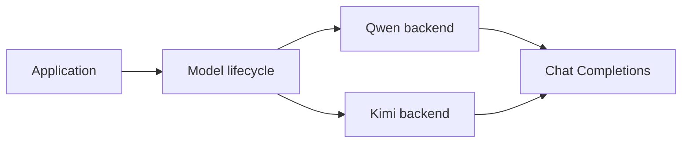

+++
title = "ag-harness Design"
description = "Provider-neutral model and runtime boundaries for ag-harness."
weight = 6
+++

# `ag-harness` Design

`ag-harness` is a small, Rust-native boundary between applications and LLM providers. It
exposes provider-neutral model calls while preserving provider-specific capabilities.

## Model Boundary

`Model` owns request-duration telemetry and validates every response against the
request's `OutputSchema`. Provider adapters implement `ModelBackend` to supply stable
identity and raw assistant output. Provider payloads, authentication, HTTP types, and
capability rules remain private.

Provider-owned adapters and compatibility rules live under the private `provider`
module. API-family clients remain separate so multiple providers can reuse a wire
protocol without sharing provider policy.

Qwen and Kimi share Chat Completions request execution and bounded response decoding.
Both providers request JSON Object output, include the requested `OutputSchema` in the
system instruction, and rely on shared local schema validation before returning a
successful response.

Schemas without an explicit object root and unsupported configurations fail explicitly
rather than falling back to unstructured output.

## Telemetry

The shared `Model` lifecycle records `gen_ai.client.operation.duration` for every
backend request, including failures and cancellations. Application binaries own
OpenTelemetry SDK setup, export, and shutdown. The Qwen and Kimi examples configure
OTLP/HTTP metrics through the standard `OTEL_EXPORTER_OTLP_ENDPOINT` and
`OTEL_EXPORTER_OTLP_HEADERS` environment variables. Each histogram observation is one
model call; aggregate its count by `gen_ai.provider.name` to separate providers. Their
default service names are `ag-harness-qwen` and `ag-harness-kimi`, while
`OTEL_SERVICE_NAME` remains an application-level override.

## Runtime Direction

Agent loops, tools, permissions, and persisted sessions should build on the model
boundary without introducing provider concepts into the application-facing API. Split
additional crates only when a boundary must be reused independently or shared across a
process boundary.

The next runtime iteration is one complete tool round trip from model request through
policy-controlled execution to the final response.
