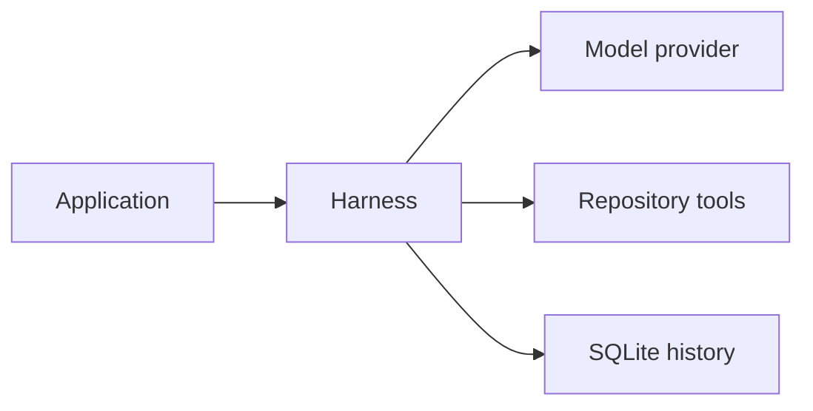
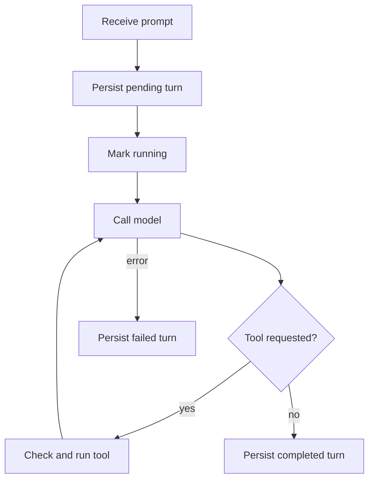

+++
title = "ag-harness Design"
description = "Model loop, durable sessions, and repository policy."
weight = 6
+++

# `ag-harness`

`ag-harness` is a Rust library for structured model turns. Applications select a model,
an output schema, a SQLite database, and the repository tools the model may use.

## Public boundary

- `Harness` owns the model, repository policy, lifecycle observers, and shared database
  pool.
- `Session` is the only multi-turn abstraction. It persists and restores bounded
  history.
- `Model` is the object-safe provider boundary. `ModelCompletion` carries the response,
  optional metadata, and an optional native continuation identifier.
- `run_once` executes a turn without durable history.

Repository tools are denied by default. `Tool::Read` and `Tool::Write` must be enabled
explicitly, and both receive a validated `Repository` configuration. The library host
selects an absolute Git executable whose configured location and canonical target are
outside the containing worktree. The companion CLI defaults to the first valid `git`
executable found in an absolute `PATH` entry and exposes `--git-executable` as an
override. `Repository` canonicalizes the selection once and never performs its own
`PATH` discovery. Unix hosts also verify effective execute access; other platforms defer
that check to process creation. Repository-relative tool arguments reject `.git`
components before filesystem access.

## Session lifecycle

SQLite is canonical. Provider-native continuation is an optional optimization, never the
only copy of conversation state.

Only completed turns are replayed. A process that disappears may leave a leased turn in
`pending` or `running`; the next open or turn start marks an expired lease as
`interrupted`. Failed and interrupted prompts remain available for diagnostics without
entering model context.

The database stores the output schema, system prompt, model identity, history budget,
provider continuation identifier, messages, and turn state. Oldest complete turns are
excluded from replay when the configured byte budget is exceeded.

Starting a turn loads bounded completed history in a read-only snapshot, then opens a
short writer transaction. The writer revalidates the snapshot and commits the turn as
`running` with a fresh lease. If the snapshot changed, acquisition retries before
persisting the prompt. Recovery of an abandoned turn can commit before that retry;
cancellation before the reservation commit does not persist a new prompt. History stays
canonical when multiple session handles were opened before the latest turn completed.
Each active turn also has an opaque owner token. If cancellation races with a successful
SQLite commit acknowledgment, cleanup scoped to the canonical database identity and
owner token interrupts only that abandoned turn before another turn is reserved. The
owner guard renews the lease while provider or tool work remains active; dropping the
send future stops renewal and records the turn as interrupted by cancellation.
Interruption atomically clears native provider continuation only when it actually
transitions an owned or expired active turn; delayed cleanup cannot clear a newer
completed turn's continuation. Cancellation returns promptly even when an
already-started filesystem write may finish afterward. Writes without a recorded outcome
remain `pending`; hash observations describe current content rather than proving whether
the cancelled operation finished. A failed renewal or lost owner token cancels the
in-flight request before it can continue model or tool work. If a turn fails and
recording that failure also fails, `SessionError` retains both errors instead of
replacing the original turn failure.

Validated writes commit an independent journal intent before filesystem replacement,
then record its acknowledged outcome before returning to the model. SQLite uses `FULL`
synchronous commits so the intent is synced before file mutation. Each record retains
the turn and tool-call identity, original repository root as native bytes, relative
path, and SHA-256 fingerprints of the expected and intended content; missing expected
content denotes a create. Journal failures stop execution. These records survive failed
turns and history eviction without treating partial conversation messages as completed
history.

`Session::writes()` exposes the journal after errors and reopening. For inactive turns
whose write outcome is pending or failed, it compares the original repository's current
file with both fingerprints, reporting a result match, expected match, conflict, or
unavailable observation. Observations do not prove which process wrote the file and are
recomputed: a cancelled filesystem operation may finish later. Recovery never reapplies
writes. Subsequent sends include write diagnostics from incomplete turns and disable
native continuation for that request so the provider receives this context. A dedicated
provider-facing representation omits the repository root; `Session::writes()` retains
the native `PathBuf` for host-side inspection, including non-UTF-8 Unix paths. Retries
count incomplete records in SQL and fetch at most 64 newest candidates. They select the
16 KiB diagnostic payload before reconciling files, reserving space for the longest
recovery label; omitted records cause no filesystem reads. Diagnostics report the total
number omitted. Oversized JSON-escaped paths are shortened and marked as prefixes; the
host can inspect their full paths with `Session::writes()`. Completion acknowledges only
the displayed record IDs in the same transaction as the completed turn, its bounded
diagnostic snapshot, and its provider continuation identifier. The snapshot precedes the
turn prompt in local history, preserving recovery context across reopening and provider
fallback. It counts toward the existing whole-turn history budget and is evicted with
its turn; it is historical context, not a fresh filesystem observation. Failed turns and
failed commits leave diagnostics pending, and omitted records remain eligible for later
sends. Once all diagnostics are acknowledged, subsequent sends retain native
continuation. `Session::writes()` always exposes the complete journal, including
acknowledged records.

## Resume and provider fallback

On resume, the harness validates the stored model identity and restores completed
history. If a completion includes a provider session identifier, the next request also
offers it to the adapter. `ModelError::ResumeUnavailable` causes one retry with the
provider identifier removed and the same SQLite history retained. The rejected native
resume and the replay are reported as separate provider attempts. A successful replay
replaces the stored continuation identifier with the one it returns, or clears the
identifier when it returns none. Failed turns, cancellation, and expired-lease recovery
clear the stored provider identifier atomically with the terminal turn state because the
harness cannot know whether the remote conversation advanced. Cleanup clears the
identifier only when it actually interrupts an active turn, so delayed cleanup cannot
invalidate a newer continuation. The next request replays completed SQLite history.

## Concurrency

The first create or resume initializes the harness's database pool and runs migrations.
Concurrent initialization is serialized, and failed initialization can be retried. All
sessions created or resumed through that harness share its four-connection limit.
Reconfiguring the database path resets the pool; separate harnesses own separate pools.

Different session IDs may run concurrently through the SQLite connection pool. A partial
unique index permits only one `pending` or `running` turn for a given session, so
concurrent writers receive `SessionError::Busy` instead of interleaving messages.

## Observability

Lifecycle observers receive content-free turn, model-request, and tool events. The host
chooses exporters. `LifecycleMetrics` and `LifecycleTraceObserver` project this stream
to OpenTelemetry without storing prompts or tool output in telemetry.

`run_once` owns terminal events for ephemeral turns. `Session::send` owns them for
durable turns and emits `TurnCompleted` only after committing messages and updating
session state. Durable turn durations include acquisition and persistence. Session
coordination or persistence failures emit `TurnFailed` with `session_error`; model or
tool failures retain their original classification even if recording the failure also
fails. Dropping either operation emits cancellation once.
