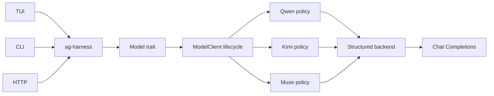
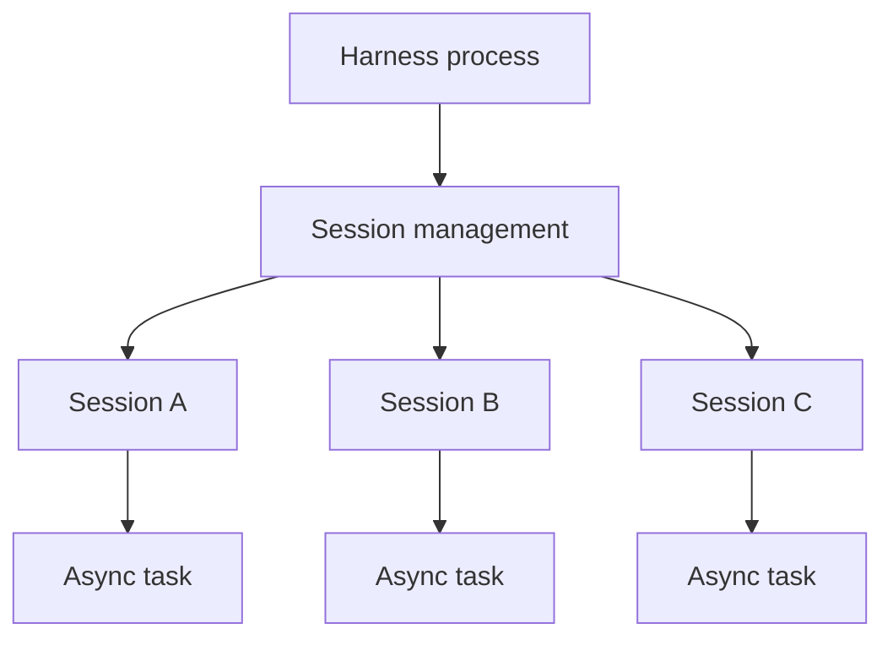
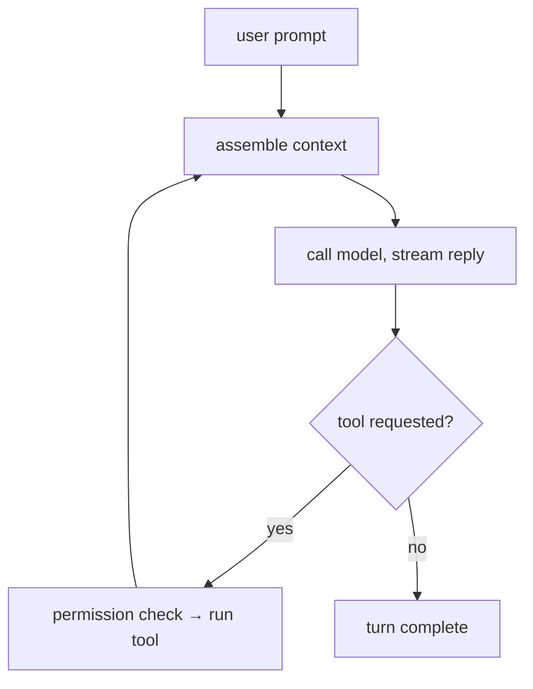
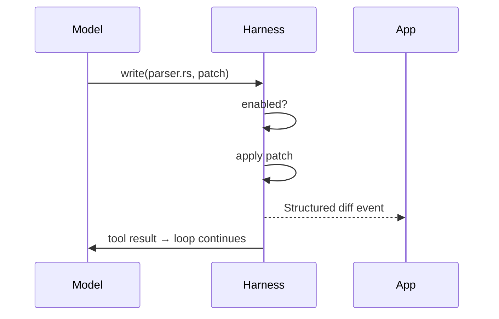

+++
title = "ag-harness Design"
description = "Design for the planned ag-harness runtime."
weight = 6
+++

# `ag-harness` - a light LLM harness

## Design status

This page describes the desired end state for `ag-harness`, not an inventory of APIs and
crates available today. Treat the runtime capabilities, crate split, and library API
below as design targets unless they are explicitly identified as the current foundation
or marked complete in the iteration and roadmap checklists.

`ag-harness` is the base layer between an application and an LLM. Rust-native,
app-facing and lightweight. It provides just the essentials: an agent loop, an closed
repository-tool permissions, session management, and a typed event stream, leaving the
actual product decisions entirely to your app.



## Core features

- **Repository tools** - closed, bounded read and write capabilities with
  provider-neutral JSON Schema definitions.
- **Structured edits** - the `write` tool applies git-style diff patches and emits
  clean, targeted diffs.
- **Tool permissions** - every tool call must match an explicitly enabled built-in and
  its argument schema.
- **Persisted sessions** - session state and required data are saved.

## Architecture

### Crates

```
agentty/
├── crates/
│   ├── ag-harness            # facade
│   ├── ag-harness-cli        # interactive command-line application
│   ├── ag-harness-protocol   # Op, Event, Diff, Usage
│   ├── ag-harness-core       # loop, tools, sessions, context, storage
```

### Model boundary

The current runtime foundation lives in the `ag-harness` library, while `ag-harness-cli`
owns the interactive command-line application. The object-safe `Model` trait lets
applications store supported clients behind `dyn Model`. `ModelClient` implements that
boundary, owns request-duration telemetry, and validates every response against the
request's `OutputSchema`. Provider request execution remains private so applications
cannot bypass this lifecycle. `ModelClient` validates and retains the provider and model
identity during construction, before any request starts. `Harness` independently
validates every terminal `ModelResponse::Output` against the same schema, so injected
`Model` implementations cannot bypass the application-facing output contract.

`ModelWithMetadata` guarantees completion metadata and automatically implements the
optional metadata path on `Model`; response-only `Model` implementations remain valid.

Provider-owned adapters and compatibility rules live under the private `provider`
module. API-family clients remain separate so multiple providers can reuse a wire
protocol without sharing provider policy.

The public `ModelProvider` catalog and `ModelConfiguration` builder are the single
source of truth for built-in provider identifiers, representative model IDs, credential
and endpoint environment variables, endpoint defaults, and client construction.
Applications consume that catalog generically instead of matching on each provider.
Application-owned prompts remain outside the catalog and model runtime.

Qwen, Kimi, and Muse share Chat Completions request execution and bounded response
decoding. Qwen and Kimi include the requested `OutputSchema` in the system instruction;
they request JSON Object output when no tools are active and omit that provider mode
during native tool calls. Muse uses Meta Model API's native JSON Schema response format
instead. Every provider retains shared local schema validation before returning a
successful response. Schemas without an explicit object root and unsupported
configurations fail explicitly rather than falling back to unstructured output. The
shared transport retries one failed send and up to five rate-limited requests, with
provider retry delays capped at five seconds. Rate-limit retries use the greater of a
provider's whole-second `Retry-After` value and bounded exponential backoff, avoiding a
tight retry loop when a provider understates its recovery interval.

Muse intentionally omits Meta's optional `strict` flag, whose documented default is
`false`. That keeps standard JSON Schema available while Meta enforces service limits,
such as schema depth and size, through bounded provider HTTP errors.

Muse exposes both `MUSE_SPARK_1_2` and `MUSE_SPARK_1_2_CONTRIBUTOR`. The contributor
model uses discounted pricing in exchange for permission to use its prompts and
completions to train future Meta models; the standard model does not use that data for
training. The Muse example defaults to the standard model and accepts an explicit
`MODEL_API_MODEL` override so applications must opt in to the contributor terms.

The current tool foundation includes:

- Portable name-and-JSON tool calls across Qwen, Kimi, and Muse, decoded into the closed
  built-in `read` and `write` contracts.
- Validated multi-call responses, executed in provider order with every result retained
  in one complete assistant/tool history group.
- Deny-by-default `Harness::allow()` selection for `Tool::Read` and `Tool::Write`.
  Applications cannot advertise or execute arbitrary host-defined tools.
- Bounded tool execution and continuation to schema-validated terminal output.
- Harness-side argument-schema validation, including calls returned by injected `Model`
  implementations, and 64 KiB result bounds.
- One built-in `read` tool with bounded `file`, `list`, `search`, `diff`, and `show`
  actions. In v0, `diff` and base-side `show` use the built-in `main` revision; the
  model cannot choose another revision. Its provider-portable schema remains flat;
  schema-valid fields rejected by a selected action return corrective tool feedback
  instead of terminating the turn.
- A built-in `write` tool for repository-relative patches. File access uses the
  injectable `FileSystem`; inspection actions use fixed read-only Git commands behind a
  private command-runner boundary. The runner uses an absolute Git executable outside
  the configured root, clears inherited Git environment, disables configured filesystem
  monitors, verifies canonical worktree scope, and drains subprocess streams while
  retaining complete bounded records.
- Model-correctable read and write rejections returned through the tool loop.
- Descriptor-relative file access without symlink traversal.
- One-file unified-diff writes with stale-safe atomic replacement and typed failures.

The `ag-harness-cli` package ships the `ag-harness` command, which starts an in-memory
chat with Muse, Kimi, or Qwen. Reads are scoped to `--read-dir`, comparison reads use
`main`, and writes require `--allow-write`. It derives provider parsing and help text
from the library catalog while retaining command-line defaults, application prompts,
terminal interaction, and output formatting.

## Session management

- One host process manages multiple independent sessions.
- An active session runs as an async task; sessions run in parallel.
- Each session processes its prompts in sequence.
- Session state is saved on disk and loaded when resumed.
- The app coordinates work across sessions.
- Closing the host process stops active turns; saved sessions remain resumable.



## Memory management

- Active session state is kept in memory.
- Session state is saved on disk.
- Idle sessions reload from disk when resumed.

## Agent loop

A turn loops until the model responds without requesting a tool:



### One tool call



## Editing

- **Write** - the model produces a git diff patch; the harness applies it. Alternative
  edit methods (exact-match string replacement, etc.) are future experiments.
- **Diff** - persisted sessions will stream applied changes as structured file-diff
  events; current writes return bounded status metadata.
- **Output caps** - oversized tool output is truncated head+tail with a marker, so one
  careless command can't flood the session's context. Per-tool limits; `read` supports
  line ranges for precise re-reads.

## Context

- **Project discovery** - finds the project root and `AGENTS.md`; the model explores the
  rest via `bash`.
- **Base prompt** - one minimal system prompt.

## Structured output

The model contract requires provider-neutral structured output:

- The caller supplies the expected JSON shape as a provider-independent schema.
- Each adapter uses the strongest structured-output mechanism its provider supports and
  returns raw assistant text. The shared `ModelClient` lifecycle parses and validates
  the returned JSON against the caller's schema. `Harness` validates terminal values
  again as the final application-facing trust boundary, including values returned by
  custom `Model` implementations.
- Provider-specific request fields remain inside the adapter. For Qwen, the adapter uses
  JSON Object mode and performs schema validation in the harness because Qwen guarantees
  valid JSON, not schema conformance.
- Every new model adapter must implement these structured-output semantics before it is
  added.

Configurations that cannot satisfy the contract, such as Qwen thinking mode, return an
explicit unsupported-configuration error rather than silently falling back to
unstructured text.

## Telemetry

- `ModelClient` records request duration and provider-reported input and output token
  usage when the application installs an OpenTelemetry meter provider.
- `with_lifecycle_observer()` emits lifecycle events, while `TurnOutcome::report()`
  returns a successful turn summary.
- Available telemetry includes request and tool durations, provider and model identity,
  token and call counts, outcomes, and failures.

## Permissions

All tools are denied by default. Applications select only the closed built-ins:

```rust
Harness::new(model)
    .repository(&repository_root)
    .allow(Tool::Read)
    .allow(Tool::Write)
```

## Model tiers

`ag-harness` will provide the ability to work with different AI model API tiers for the
best cost and performance:

- **Model variety** - frontier vs fast models: cheaper models for simpler tasks.
- **Batch/Flex processing** - designed for latency-tolerant, non-critical workloads,
  such as async jobs completed within 24 hours at 50% off.
- **Priority processing** - faster responses at a premium for latency-critical turns.

## Library API

- **Harness** - runs bounded tool calls to validated terminal JSON.
- **Model** - provider-neutral completion boundary.
- **Tool** - closed, deny-by-default repository capability selection.
- **FileSystem** - injectable repository I/O boundary.
- **Session, Turn, App** - planned persistence and event-streaming layers.

## Differences from existing harnesses

- **User-facing products** (Claude Code, OpenCode, Aider): format output for humans;
  `ag-harness` emits events for apps.
- **Minimal harnesses** ([Pi](https://pi.dev/)): TypeScript-first, no permission layer;
  `ag-harness` is Rust-native with enforced built-in tool permissions.
- **Vendor SDKs**: vendor-locked; `ag-harness` is model-agnostic.
- **Rust model-API crates** (`rig`): abstract the model call only; `ag-harness` adds the
  loop, persisted sessions, tools, permissions.
- **Heavy harnesses**: bundle orchestration; `ag-harness` leaves it to the app.

## Next iterations

- [x] **Compatibility benchmark.** Measure task quality, latency, token and tool usage
  across the live supported providers.

## Roadmap

- [ ] **v1 - library.** `ag-harness` - unified crate integrated into agentty.
- [ ] **Service wrapper.** `ag-harness-service` (JSON-RPC 2.0 over Unix socket,
  WebSocket for remote) + `ag-harness-client`.
