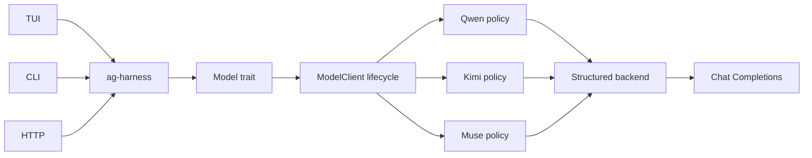
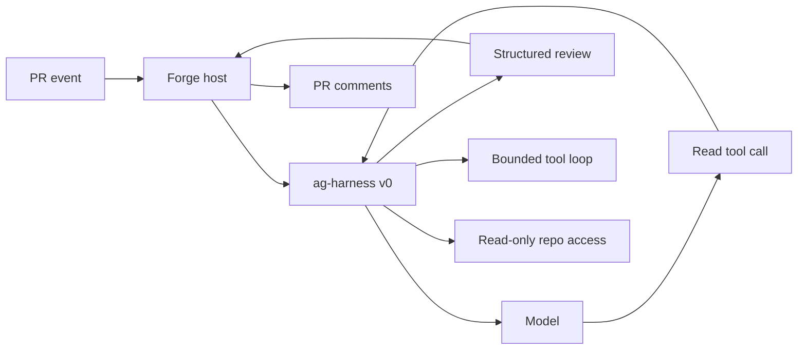
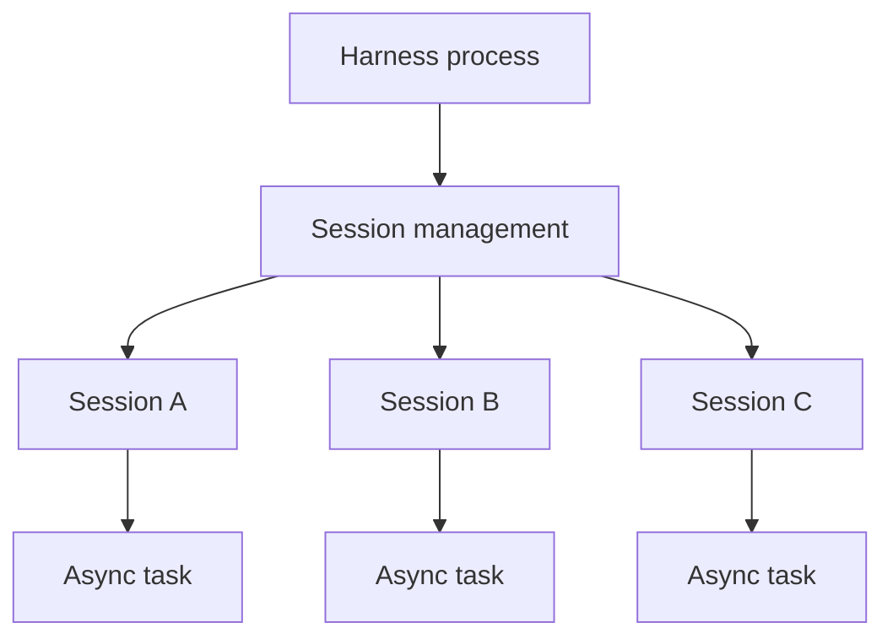
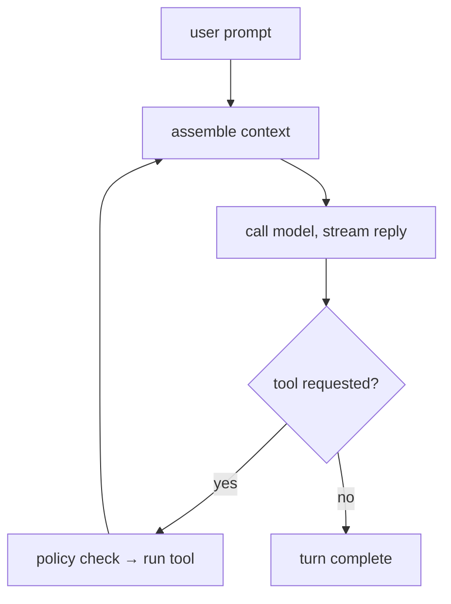
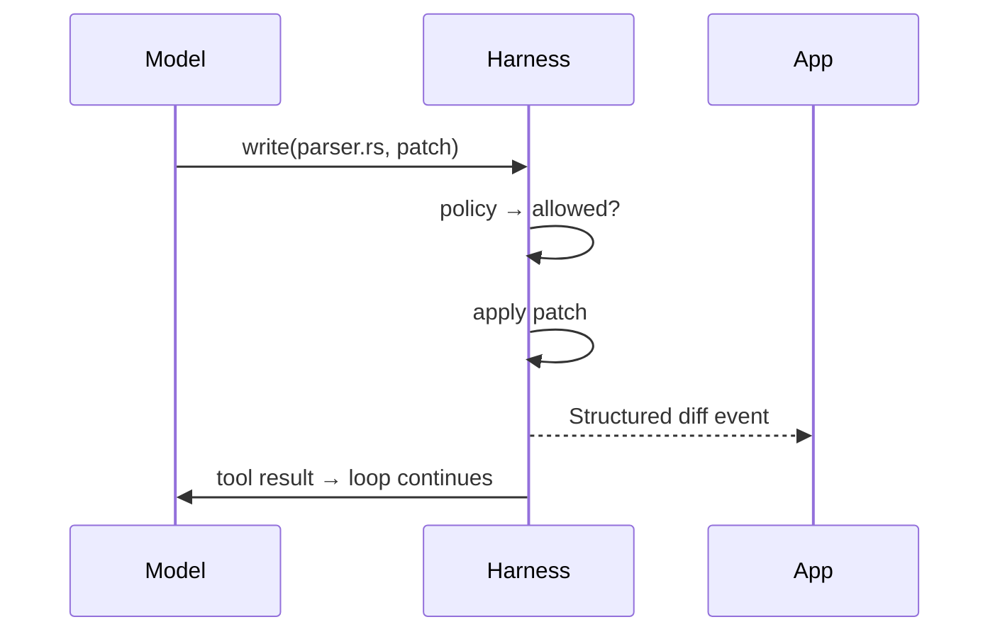
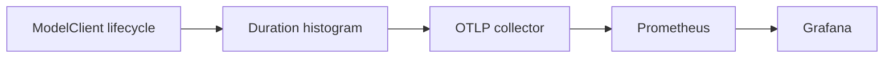

+++
title = "ag-harness Design"
description = "Design for the planned ag-harness runtime."
weight = 6
+++

# `ag-harness` - a light LLM harness

## Design status

This page describes the desired end state for `ag-harness`, not an inventory of APIs and
crates available today. Treat the runtime capabilities, crate split, and library API
below as design targets unless they are explicitly identified as the current foundation
or marked complete in the iteration and roadmap checklists.

`ag-harness` is the base layer between an application and an LLM. Rust-native,
app-facing and lightweight. It provides just the essentials: an agent loop, three core
tools, session management, and a typed event stream, leaving the actual product
decisions entirely to your app.



## `ag-harness` as a code review agent



V0 needs a bounded model-tool loop, read-only repository access, and structured review
output.

## Core features

- **Three built-in tools** - `read`, `write`, `bash`.
- **Structured edits** - the `write` tool applies git-style diff patches and emits
  clean, targeted diffs.
- **Permission policy** - every tool call passes a policy check.
- **Persisted sessions** - session state and required data are saved.

## Architecture

### Crates

```
agentty/
├── crates/
│   ├── ag-harness            # facade
│   ├── ag-harness-protocol   # Op, Event, Diff, Usage
│   ├── ag-harness-core       # loop, tools, sessions, context, storage
```

### Model boundary

The current foundation lives entirely in `ag-harness`. The object-safe `Model` trait
lets applications store supported clients behind `dyn Model`. `ModelClient` implements
that boundary, owns request-duration telemetry, and validates every response against the
request's `OutputSchema`. Provider request execution remains private so applications
cannot bypass this lifecycle. `ModelClient` validates and retains the provider and model
identity during construction, before any request starts.

Provider-owned adapters and compatibility rules live under the private `provider`
module. API-family clients remain separate so multiple providers can reuse a wire
protocol without sharing provider policy.

Qwen, Kimi, and Muse share Chat Completions request execution and bounded response
decoding. Qwen and Kimi request JSON Object output and include the requested
`OutputSchema` in the system instruction. Muse uses Meta Model API's native JSON Schema
response format instead. Every provider retains shared local schema validation before
returning a successful response. Schemas without an explicit object root and unsupported
configurations fail explicitly rather than falling back to unstructured output.

Muse intentionally omits Meta's optional `strict` flag, whose documented default is
`false`. That keeps standard JSON Schema available while Meta enforces service limits,
such as schema depth and size, through bounded provider HTTP errors.

Muse exposes both `MUSE_SPARK_1_2` and `MUSE_SPARK_1_2_CONTRIBUTOR`. The contributor
model uses discounted pricing in exchange for permission to use its prompts and
completions to train future Meta models; the standard model does not use that data for
training. The Muse example defaults to the standard model and accepts an explicit
`MODEL_API_MODEL` override so applications must opt in to the contributor terms.

The current wire-only tool foundation lets callers explicitly advertise the native
`read` function on an individual `ModelRequest`. Qwen, Kimi, and Muse translate the
shared `ToolDefinition` into their Chat Completions payload and decode exactly one
validated `ToolCall` with typed `ReadArguments`. A tool call remains distinct from
terminal `ModelResponse` output, which continues through local `OutputSchema`
validation. This slice stops at decoding: tool execution, filesystem access, tool-result
messages, and the continuation loop remain future work.

## Session management

- One host process manages multiple independent sessions.
- An active session runs as an async task; sessions run in parallel.
- Each session processes its prompts in sequence.
- Session state is saved on disk and loaded when resumed.
- The app coordinates work across sessions.
- Closing the host process stops active turns; saved sessions remain resumable.



## Memory management

- Active session state is kept in memory.
- Session state is saved on disk.
- Idle sessions reload from disk when resumed.

## Agent loop

A turn loops until the model responds without requesting a tool:



### One tool call



## Editing

- **Write** - the model produces a git diff patch; the harness applies it. Alternative
  edit methods (exact-match string replacement, etc.) are future experiments.
- **Diff** - applied changes are streamed back as structured file-diff events,
  renderable directly as git diffs.
- **Output caps** - oversized tool output is truncated head+tail with a marker, so one
  careless command can't flood the session's context. Per-tool limits; `read` supports
  line ranges for precise re-reads.

## Context

- **Project discovery** - finds the project root and `AGENTS.md`; the model explores the
  rest via `bash`.
- **Base prompt** - one minimal system prompt.

## Structured output

The model contract requires provider-neutral structured output:

- The caller supplies the expected JSON shape as a provider-independent schema.
- Each adapter uses the strongest structured-output mechanism its provider supports and
  returns raw assistant text. The shared `ModelClient` lifecycle parses and validates
  the returned JSON against the caller's schema.
- Provider-specific request fields remain inside the adapter. For Qwen, the adapter uses
  JSON Object mode and performs schema validation in the harness because Qwen guarantees
  valid JSON, not schema conformance.
- Every new model adapter must implement these structured-output semantics before it is
  added.

Configurations that cannot satisfy the contract, such as Qwen thinking mode, return an
explicit unsupported-configuration error rather than silently falling back to
unstructured text.

## Telemetry

The shared `ModelClient` lifecycle records `gen_ai.client.operation.duration` for every
backend request, including failures and cancellations. Application binaries own
OpenTelemetry SDK setup, export, and shutdown. The Qwen, Kimi, and Muse examples
configure OTLP/HTTP metrics through the standard `OTEL_EXPORTER_OTLP_ENDPOINT` and
`OTEL_EXPORTER_OTLP_HEADERS` environment variables. Each histogram observation is one
model call; aggregate its count by `gen_ai.provider.name` to separate providers. Their
default service names are `ag-harness-qwen`, `ag-harness-kimi`, and `ag-harness-muse`,
while `OTEL_SERVICE_NAME` remains an application-level override.



## Permissions

All tools are denied by default. The session policy explicitly allows tools and, for
`bash`, the permitted commands:

```rust
Policy {
    read: Allow,
    write: Deny,
    bash: AllowCommands(["cargo test", "git status", "rg *"]),
}
```

## Model tiers

`ag-harness` will provide the ability to work with different AI model API tiers for the
best cost and performance:

- **Model variety** - frontier vs fast models: cheaper models for simpler tasks.
- **Batch/Flex processing** - designed for latency-tolerant, non-critical workloads,
  such as async jobs completed within 24 hours at 50% off.
- **Priority processing** - faster responses at a premium for latency-critical turns.

## Library API

- **Harness** - creates and resumes sessions.
- **Session** - holds model, policy, working directory, and state.
- **Turn** - runs one prompt and streams text, diffs, completion, and failure events.
- **App** - configures the session and renders its events.

## Differences from existing harnesses

- **User-facing products** (Claude Code, OpenCode, Aider): format output for humans;
  `ag-harness` emits events for apps.
- **Minimal harnesses** ([Pi](https://pi.dev/)): TypeScript-first, no permission layer;
  `ag-harness` is Rust-native with an enforced policy hook.
- **Vendor SDKs**: vendor-locked; `ag-harness` is model-agnostic.
- **Rust model-API crates** (`rig`): abstract the model call only; `ag-harness` adds the
  loop, persisted sessions, tools, permissions.
- **Heavy harnesses**: bundle orchestration; `ag-harness` leaves it to the app.

## Next iterations

- [ ] **Tool round trip.** Support one model-requested tool through execution to the
  final response.
- [ ] **Persisted session round trip.** Run sequential turns in one resumable session,
  persist model and tool history, and stream typed lifecycle events to the host
  application.
- [x] **Second provider.** Integrate Kimi through the structured-output contract.

## Roadmap

- [ ] **v1 - library.** `ag-harness` - unified crate integrated into agentty.
- [ ] **Service wrapper.** `ag-harness-service` (JSON-RPC 2.0 over Unix socket,
  WebSocket for remote) + `ag-harness-client`.
