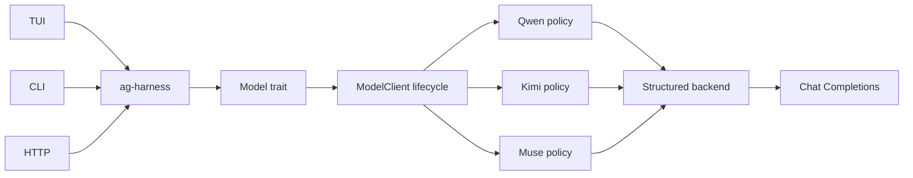
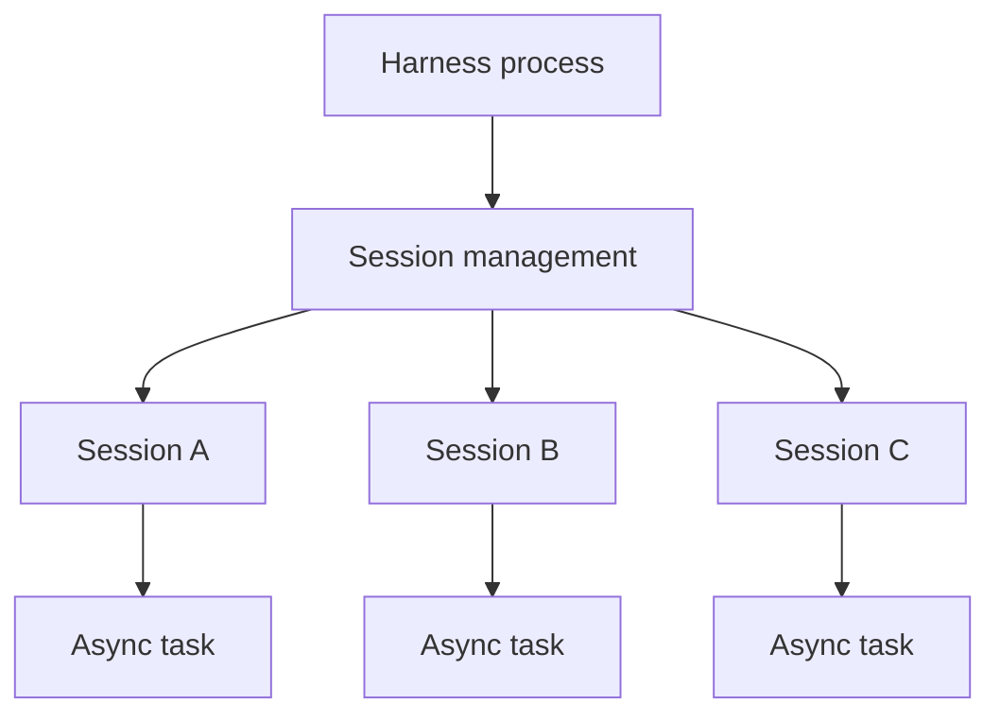
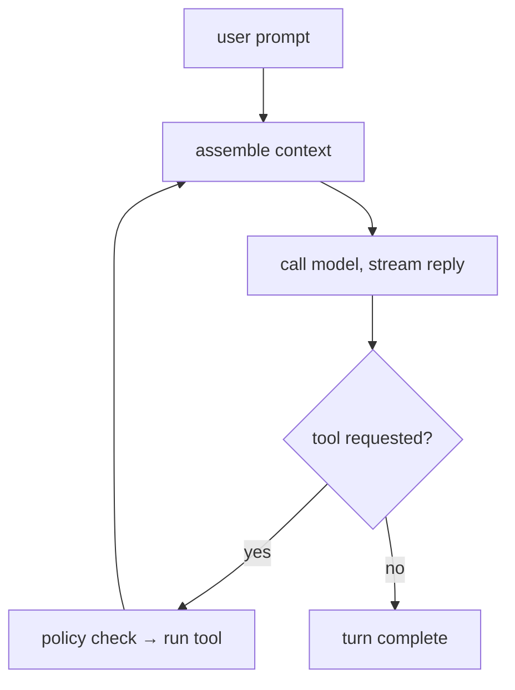
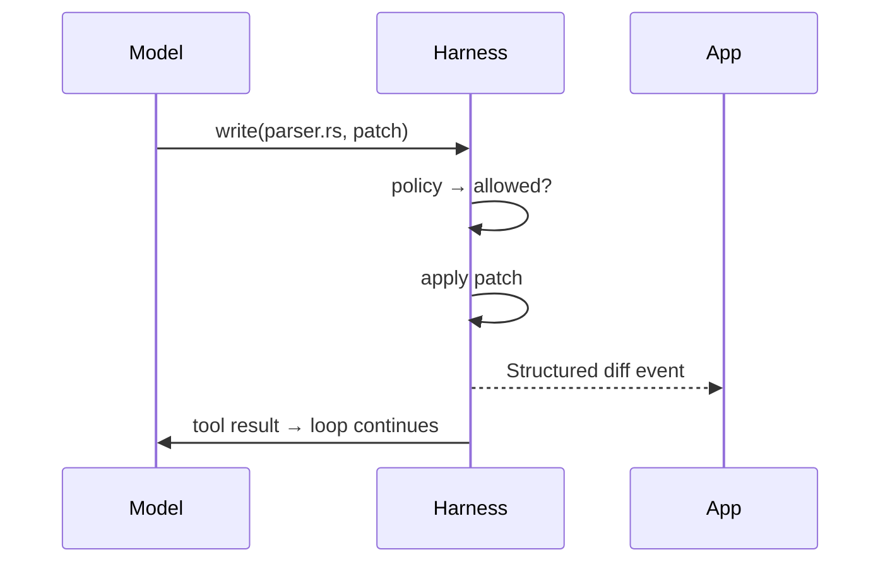

+++
title = "ag-harness Design"
description = "Design for the planned ag-harness runtime."
weight = 6
+++

# `ag-harness` - a light LLM harness

## Design status

This page describes the desired end state for `ag-harness`, not an inventory of APIs and
crates available today. Treat the runtime capabilities, crate split, and library API
below as design targets unless they are explicitly identified as the current foundation
or marked complete in the iteration and roadmap checklists.

`ag-harness` is the base layer between an application and an LLM. Rust-native,
app-facing and lightweight. It provides just the essentials: an agent loop, three core
tools, session management, and a typed event stream, leaving the actual product
decisions entirely to your app.



## Core features

- **Three built-in tools** - `read`, `write`, `bash`.
- **Structured edits** - the `write` tool applies git-style diff patches and emits
  clean, targeted diffs.
- **Permission policy** - every tool call passes a policy check.
- **Persisted sessions** - session state and required data are saved.

## Architecture

### Crates

```
agentty/
├── crates/
│   ├── ag-harness            # facade
│   ├── ag-harness-protocol   # Op, Event, Diff, Usage
│   ├── ag-harness-core       # loop, tools, sessions, context, storage
```

### Model boundary

The current foundation lives entirely in `ag-harness`. The object-safe `Model` trait
lets applications store supported clients behind `dyn Model`. `ModelClient` implements
that boundary, owns request-duration telemetry, and validates every response against the
request's `OutputSchema`. Provider request execution remains private so applications
cannot bypass this lifecycle. `ModelClient` validates and retains the provider and model
identity during construction, before any request starts.

`ModelWithMetadata` guarantees completion metadata and automatically implements the
optional metadata path on `Model`; response-only `Model` implementations remain valid.

Provider-owned adapters and compatibility rules live under the private `provider`
module. API-family clients remain separate so multiple providers can reuse a wire
protocol without sharing provider policy.

Qwen, Kimi, and Muse share Chat Completions request execution and bounded response
decoding. Qwen and Kimi request JSON Object output and include the requested
`OutputSchema` in the system instruction. Muse uses Meta Model API's native JSON Schema
response format instead. Every provider retains shared local schema validation before
returning a successful response. Schemas without an explicit object root and unsupported
configurations fail explicitly rather than falling back to unstructured output.

Muse intentionally omits Meta's optional `strict` flag, whose documented default is
`false`. That keeps standard JSON Schema available while Meta enforces service limits,
such as schema depth and size, through bounded provider HTTP errors.

Muse exposes both `MUSE_SPARK_1_2` and `MUSE_SPARK_1_2_CONTRIBUTOR`. The contributor
model uses discounted pricing in exchange for permission to use its prompts and
completions to train future Meta models; the standard model does not use that data for
training. The Muse example defaults to the standard model and accepts an explicit
`MODEL_API_MODEL` override so applications must opt in to the contributor terms.

The current tool foundation includes:

- Shared, typed `read` and `write` calls across Qwen, Kimi, and Muse.
- Explicit repository roots and deny-by-default permissions through `Harness::allow()`.
- Bounded tool execution and continuation to schema-validated terminal output.
- Descriptor-relative file access without symlink traversal.
- One-file unified-diff writes with stale-safe atomic replacement and typed failures.

The current `ag-harness` binary is a deliberately small interactive consumer of this
foundation. Its `run <model> [prompt]` command uses the Muse-compatible model path and
keeps history in memory, allows bounded reads beneath the current directory, and prints
sanitized model and tool metadata after each answer.

## Session management

- One host process manages multiple independent sessions.
- An active session runs as an async task; sessions run in parallel.
- Each session processes its prompts in sequence.
- Session state is saved on disk and loaded when resumed.
- The app coordinates work across sessions.
- Closing the host process stops active turns; saved sessions remain resumable.



## Memory management

- Active session state is kept in memory.
- Session state is saved on disk.
- Idle sessions reload from disk when resumed.

## Agent loop

A turn loops until the model responds without requesting a tool:



### One tool call



## Editing

- **Write** - the model produces a git diff patch; the harness applies it. Alternative
  edit methods (exact-match string replacement, etc.) are future experiments.
- **Diff** - persisted sessions will stream applied changes as structured file-diff
  events; current writes return bounded status metadata.
- **Output caps** - oversized tool output is truncated head+tail with a marker, so one
  careless command can't flood the session's context. Per-tool limits; `read` supports
  line ranges for precise re-reads.

## Context

- **Project discovery** - finds the project root and `AGENTS.md`; the model explores the
  rest via `bash`.
- **Base prompt** - one minimal system prompt.

## Structured output

The model contract requires provider-neutral structured output:

- The caller supplies the expected JSON shape as a provider-independent schema.
- Each adapter uses the strongest structured-output mechanism its provider supports and
  returns raw assistant text. The shared `ModelClient` lifecycle parses and validates
  the returned JSON against the caller's schema.
- Provider-specific request fields remain inside the adapter. For Qwen, the adapter uses
  JSON Object mode and performs schema validation in the harness because Qwen guarantees
  valid JSON, not schema conformance.
- Every new model adapter must implement these structured-output semantics before it is
  added.

Configurations that cannot satisfy the contract, such as Qwen thinking mode, return an
explicit unsupported-configuration error rather than silently falling back to
unstructured text.

## Telemetry

The shared `ModelClient` lifecycle records `gen_ai.client.operation.duration` for every
backend request, including failures, invalid output, and cancellations. It also records
provider-reported input and output counts in `gen_ai.client.token.usage`; absent usage
produces no estimate. Metrics remain metadata-only, and applications own OpenTelemetry
setup, export, and shutdown.

Lifecycle telemetry emits typed, ordered, metadata-only turn, model, and tool events.
Applications may observe and persist them independently from OpenTelemetry export; with
neither configured, no lifecycle data is retained or sent externally. Applications own
storage, retention, OpenTelemetry setup, export, and shutdown.

`LifecycleObserverSet` composes projections over that one ordered stream. Observers run
in registration order, and each callback has an independent panic boundary. Reentrant
events wait behind the event currently being fanned out so every observer sees the same
sequence order.

Sensitive content is excluded. Any future content capture remains separate, explicit,
bounded, redacted, and disabled by default.

### OpenTelemetry semantic-convention contract

`ag-harness` targets the OpenTelemetry GenAI semantic conventions at revision
[`eaefa142a94cefe5d199d47e4a73727dfbd825df`](https://github.com/open-telemetry/semantic-conventions-genai/tree/eaefa142a94cefe5d199d47e4a73727dfbd825df).
The conventions are Development status, so this immutable revision, rather than the
repository's moving `main` branch, defines the compatibility contract.

The current projections implement these standard histograms:

| Instrument                            | Unit               | Explicit bucket boundaries                    |
| ------------------------------------- | ------------------ | --------------------------------------------- |
| `gen_ai.client.operation.duration`    | `s`                | `0.01` through `81.92`, doubling each step    |
| `gen_ai.client.token.usage`           | `{token}`          | `1` through `67108864`, quadrupling each step |
| `gen_ai.invoke_agent.duration`        | `s`                | `0.1` through `409.6`, doubling each step     |
| `gen_ai.invoke_agent.inference_calls` | `{inference_call}` | `1` through `128`, doubling each step         |
| `gen_ai.invoke_agent.tool_calls`      | `{tool_call}`      | `1` through `128`, doubling each step         |
| `gen_ai.execute_tool.duration`        | `s`                | `0.01` through `81.92`, doubling each step    |

Both model-client instruments record the required `gen_ai.operation.name` value `chat`,
the provider identity, and the requested model when available. Token measurements also
record the required `gen_ai.token.type` value `input` or `output`. Failed duration
measurements record `error.type`. Instrument names, descriptions, units, boundaries,
attribute names, and well-known values are centralized in the telemetry module.

`LifecycleMetrics` counts started model requests and requested client-side tools once
per turn, but records tool duration only after `ToolStarted`. Executions include
`gen_ai.tool.name` and `gen_ai.tool.type=function`; unavailable agent identity and
dynamic model identity are omitted.

The provider registry contains one standard value and two documented custom values:

| Provider | `gen_ai.provider.name` | Registry status                                                            |
| -------- | ---------------------- | -------------------------------------------------------------------------- |
| Kimi     | `moonshot_ai`          | OpenTelemetry well-known value                                             |
| Muse     | `meta`                 | Custom value; no OpenTelemetry value identifies Meta Model API             |
| Qwen     | `alibaba_cloud`        | Custom value; no OpenTelemetry value identifies Alibaba Cloud Model Studio |

Model request failures use this bounded `error.type` vocabulary:

| Value                       | Meaning                                                 |
| --------------------------- | ------------------------------------------------------- |
| HTTP status code            | Provider returned that valid HTTP error status          |
| `cancelled`                 | The request future was dropped before completion        |
| `request_error`             | Request construction or an unclassified client failure  |
| `transport_error`           | Transport failed before a provider response was decoded |
| `provider_error`            | Provider failure without an available HTTP status       |
| `invalid_provider_response` | Provider response envelope was malformed                |
| `invalid_response`          | Successful response was incomplete or unusable          |
| `unsupported_output`        | Provider could not satisfy the output contract          |
| `response_too_large`        | Response exceeded a configured safety bound             |
| `invalid_output`            | Output failed JSON parsing or schema validation         |
| `invalid_tool_call`         | Tool call was missing, malformed, or unsupported        |

Turn and tool projections additionally use `cancelled`, `tool_execution_error`,
`tool_denied`, `tool_call_limit`, and `repository_required`.

Messages, prompts, system instructions, tool arguments, tool results, response bodies,
repository content, and internal lifecycle identifiers are never projected to
OpenTelemetry. Opt-in content attributes and events remain disabled even when the
semantic conventions define them.

Upgrading the pinned revision requires an explicit conformance change. That change must
review the source models and generated metric, span, and event documents; update the
pin, central constants, provider and error registries, contract tests, and this
architecture page together; and preserve the metadata-only policy. When the pinned
revision has no applicable convention, the fact remains an internal `LifecycleEvent`
instead of being exported under an invented standard-looking name.

## Permissions

All tools are denied by default. Applications enable current tools explicitly:

```rust
Harness::new(model)
    .repository(repository_root)
    .allow(Tool::Read)
    .allow(Tool::Write)
```

## Model tiers

`ag-harness` will provide the ability to work with different AI model API tiers for the
best cost and performance:

- **Model variety** - frontier vs fast models: cheaper models for simpler tasks.
- **Batch/Flex processing** - designed for latency-tolerant, non-critical workloads,
  such as async jobs completed within 24 hours at 50% off.
- **Priority processing** - faster responses at a premium for latency-critical turns.

## Library API

- **Harness** - runs bounded tool calls to validated terminal JSON.
- **Model** - provider-neutral completion boundary.
- **FileSystem** - injectable repository I/O boundary.
- **Session, Turn, App** - planned persistence and event-streaming layers.

## Differences from existing harnesses

- **User-facing products** (Claude Code, OpenCode, Aider): format output for humans;
  `ag-harness` emits events for apps.
- **Minimal harnesses** ([Pi](https://pi.dev/)): TypeScript-first, no permission layer;
  `ag-harness` is Rust-native with an enforced policy hook.
- **Vendor SDKs**: vendor-locked; `ag-harness` is model-agnostic.
- **Rust model-API crates** (`rig`): abstract the model call only; `ag-harness` adds the
  loop, persisted sessions, tools, permissions.
- **Heavy harnesses**: bundle orchestration; `ag-harness` leaves it to the app.

## Next iterations

- [x] **Read tool round trip.** Complete a model-requested repository read.
- [x] **Write tool round trip.** Complete a model-requested repository write.
- [x] **Completion metadata foundation.** Normalize provider response identity, finish
  outcome, optional token usage, and stable model failure classifications.
- [x] **Lifecycle event foundation.** Emit ordered, correlated, metadata-only turn,
  model, and tool events through an optional application observer.
- [x] **Model-client metrics.** Record request duration, reported input and output token
  usage, operation and model identity, and bounded failures without sensitive or
  high-cardinality content.
- [x] **Turn and tool metric projection.** Derive aggregate turn and tool measurements
  from lifecycle facts without double-counting model-client metrics.
- [ ] **Lifecycle trace projection.** Represent a turn as a parent span with correlated
  model and tool children, including correct completion, failure, and cancellation.
- [ ] **OTLP contract coverage.** Decode exported test payloads and verify signal names,
  relationships, attributes, batching and shutdown, and the absence of fixture secrets.
- [ ] **Durable host journal.** Define a versioned host-owned event envelope, delivery
  and checkpoint policy, retention, corruption recovery, and compatibility behavior.
- [ ] **Persisted session round trip.** Run sequential turns in one resumable session,
  and persist model and tool history.
- [x] **In-memory chat round trip.** Run sequential turns with user, assistant, and tool
  history, plus sanitized per-turn activity reports.
- [x] **Second provider.** Integrate Kimi through the structured-output contract.

## Roadmap

- [ ] **v1 - library.** `ag-harness` - unified crate integrated into agentty.
- [ ] **Service wrapper.** `ag-harness-service` (JSON-RPC 2.0 over Unix socket,
  WebSocket for remote) + `ag-harness-client`.
