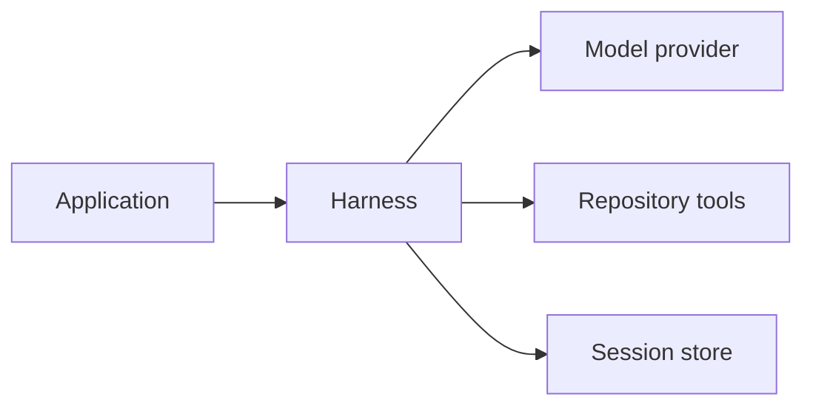
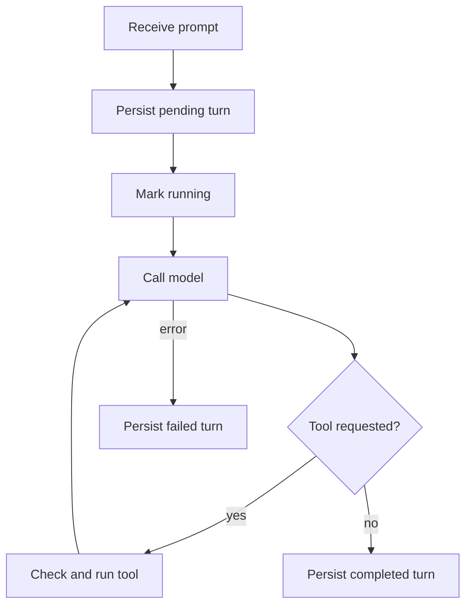

+++
title = "ag-harness Design"
description = "Model loop, durable sessions, and repository policy."
weight = 6
+++

# `ag-harness`

`ag-harness` is a Rust library for structured model turns. Applications select a model,
per-turn output schemas and tool permissions, and a session store for multi-turn
history.

## Public boundary

- `Harness` owns the model, validated repository, configured defaults, lifecycle
  observers, and selected session store with shared lazy SQLite initialization.
- `ModelRegistry` resolves stable host keys for `Harness::from_registry`. Registrations
  retain owned or shared injected models or built-in clients, host-declared
  capabilities, and the same `ExecutionIdentity` key/revision contract used by
  host-request recovery. Harnesses and sessions capture the registration independently
  of the registry lifetime. Duplicate and unknown keys fail explicitly; direct model
  construction remains available. Stores retain each session's registration key and
  revision. Resume rejects a different or absent registration, independently of provider
  metadata. Legacy and directly created sessions retain no registration and resume
  through direct construction until explicitly switched.
- One internal engine prepares requests, runs provider attempts and tools, retries
  rejected native continuations, and validates output for both entry points.
- Immutable `TurnOptions` fixes the required schema, effective `ToolPolicy`,
  `TurnLimits`, and optional validated `ComparisonBase` for one execution. A later turn
  can use different options.
- `Session` is the only multi-turn abstraction. It persists and restores bounded
  history. Sessions and builders own their runtime resources and can outlive the
  creating `Harness` or move into spawned tasks.
- `TurnInput` is the shared user-input type for one-shot and durable turns: ordered,
  bounded text and image blocks with plain-string conversion for text-only input.
- `BashExecutor` and `BashProcess` form the public object-safe Bash execution boundary.
  `BashConfig::new` selects the default native sandbox launcher;
  `BashConfig::for_executor` selects an explicit host executor, including the shipped
  `UnsandboxedExecutor::without_isolation` for hosts already inside a container or VM.
  Selection is always explicit, with no fallback and no environment-based choice.
- `Model` is the object-safe provider boundary. `ModelCompletion` carries the response,
  optional metadata, and an optional native continuation identifier.
- `run_once` executes a turn without durable history.

Repository tools are denied by default. `Tool::Read` and `Tool::Write` must be enabled
explicitly, and both receive a validated `Repository` configuration. The library host
selects a trusted Git executable outside the worktree. The companion CLI discovers a
suitable executable or accepts `--git-executable`; the library never searches `PATH`.
Repository tools enforce path containment and exclude Git metadata.

## Per-turn options

`Harness::run_once_with_options` and `Session::send_with_options` accept a complete
`TurnOptions` snapshot. Explicit permissions replace harness defaults; they are never
merged with defaults or earlier turns. An empty `ToolPolicy` denies every tool. Denied
tools are neither advertised nor executable. The tool-call budget applies across all
provider attempts and counts individual calls inside batches.

Existing `run_once` and `send` methods resolve fresh options from configured defaults.
`send` uses the stored session schema and the permissions and tool-call budget captured
when its builder was obtained or the session was resumed. Handles also capture the
repository, filesystem, reasoning effort, and lifecycle observers. Later harness
reconfiguration affects new handles. Resume retains the stored schema, system prompt,
and history budget. An explicit override never changes these defaults, including after
reopening. Permission downgrades retain completed conversation history and previously
read content; they govern current tool execution.

The future Agentty adapters will resolve new options from each request's protocol
profile, permission mode, and host-selected comparison context. Agentty owns review-loop
behavior. Mutable counters, cancellation, and shared provider-call budget accounting
remain execution state rather than configuration. Agentty permission mapping remains
later work.

Bash runs through the host-selected executor behind explicit per-turn host policy and a
separate tool permission. The harness retains policy validation, intent persistence
before any spawn, the original deadline, the combined output budget, cancellation, and
bounded cleanup retries; the selected executor owns process launch, its documented
enforcement, output capture, and cleanup, and declares the cleanup scope carried on
every recorded outcome. Each executor's stable identity enters durable policy snapshots
and host-request fingerprints; legacy snapshots decode as the native default without
changing their recorded fingerprints. Workspace reads are the default; writes, runtime
reads, environment values, and host-information exposure require grants. Git metadata
stays read-only, networking is deny-only, and unsupported policy fails closed for
enforcing executors; the unsandboxed executor applies only launch configuration and
enforces no boundary of its own. On the native executor, Linux currently rejects
workspace write grants before execution, because static Bubblewrap mounts cannot protect
Git metadata created later beneath a writable directory; macOS enforces write grants
through Seatbelt metadata denials. A dedicated trusted launcher clears inherited
descriptors before running untrusted code. Linux uses Bubblewrap, seccomp, and a PID
namespace. macOS uses Seatbelt and reports best-effort process-group cleanup: escaped
descendants may remain alive under the inherited sandbox. Neither pipe EOF nor the main
shell exit establishes completion of the executor's cleanup scope.

A combined stdout/stderr budget and the original monotonic deadline bound preparation,
execution, and capture. The supervisor retains cleanup after caller drop and preserves
main exit, termination, output truncation, execution failure, and cleanup failure
separately. Applied writes survive failure; aggregate memory, process-count, and disk
quotas are excluded.

Both stores commit command intent before spawning and record outcomes separately from
patch writes. Pending or unresolved commands block admission atomically; duplicate host
IDs return their recorded status without spawning. `commands_settled()` and
`retry_commands()` observe and retry retained cleanup/recording independently of
persistence and filesystem replacement settlement. Explicit owner-scoped reconciliation
can unblock a stopped command after the host accounts for its effects without
fabricating a missing outcome. Policy fingerprints include a host revision for secrets
and executable configuration, but snapshots and telemetry exclude environment values.

## Turn input

`TurnInput` validates image content at construction: nonempty PNG or JPEG bytes whose
container signature matches the declared media type, bounded per image, per input count,
in aggregate, and by deterministic encoded size. Invalid input fails before acquisition
or provider execution. Text-only input normalizes to one text message, keeping legacy
stored strings and recorded text host-request fingerprints unchanged; image-bearing
input keeps exact block order through storage, replay, and a versioned message codec.
Image-bearing fingerprints cover each image's media type and content digest plus the
registration's image capability. Decoding stored input checks integrity only, never the
current new-input bounds, and images count toward the whole-turn replay budget at their
data-URL length. Durable turns reject image-bearing input that alone exceeds the
session's replay budget before acquisition, rather than silently evicting it together
with all earlier history.

Image support is opt-in at the `Model` boundary: `Model::validate_input` rejects
image-bearing input by default, and registered models must also declare `image_input` in
`ModelCapabilities`. Both checks run before acquisition. Built-in providers translate
image blocks to Chat Completions `image_url` data URLs only for configurations whose
support is documented or qualified by the live provider checks; some providers accept
image parts for text-only models and invent their content, so support is never inferred
from a model family. Other configurations reject current and replayed image content with
a typed error before network access. Image payloads stay out of telemetry and bounded
diagnostics.

## Context projection

A registered model may declare an approximate `ContextBudget` in its
`ModelCapabilities`. When the effective registration declares one, request construction
weighs the system prompt, current input, advertised tool definitions, and reserved
output through an injectable `ContextEstimator` — a byte-ratio heuristic by default —
and keeps the most recent complete turns that fit the remaining weight. Weights are
deterministic approximations, never exact provider token counts; images weigh their
encoded data-URL length.

Selection drops only whole turns, so tool-call/result groups are never split, and it
never drops the current input: mandatory content that cannot fit fails with a typed
error before acquisition and before any provider request. The budget covers every
provider request of a turn — tool traffic grows the request between model calls, and a
grown request that no longer fits fails with the same typed error before the next call.
Budgeted registrations always replay the projected normalized history and never reuse
native continuation, because the provider-side conversation can retain turns the byte
replay budget already evicted from loading. Projection changes only the outgoing
request. Canonical messages, host requests, model provenance, and write journals remain
intact, and the stored byte-based replay budget still bounds history loading. Switching
models applies the target registration's budget to subsequent turns.

Model-aware accounting supersedes the byte-based image rejection: when the effective
registration declares a `ContextBudget`, image-bearing input is weighed through the
estimator during mandatory-content admission, and input that cannot fit fails with the
same typed budget error before acquisition rather than the data-URL history check.
Registrations without a budget keep the byte-based rejection.

## Session model switching

`Session::switch_model` selects an existing registration for an idle session. Switching
shares admission with turns and managed-effect settlement. Stores atomically fence the
captured model generation, persist the new identity, and clear native continuation.
Older handles cannot execute new work, including after switching back to their model;
resume captures the current generation. Each new turn retains immutable model
provenance. Recovery lookup and matching recorded retries remain available across
switches without running a model or tool again.

Completed normalized messages and tool groups remain canonical. Targets must support
historical tool calls, and image-bearing user history requires a target that declares
image input and whose adapter accepts it. Provider-specific reasoning currently rejects
switching rather than silently discarding content; validation includes history outside
the replay budget. SQLite validates paginated history outside its writer transaction and
rechecks the source revision before mutation. A cancelled waiter retains admission until
the switch finishes; hosts resume to observe an uncertain acknowledgment.

## Compaction checkpoints

`Session::compact` summarizes a session's completed turns into a versioned,
schema-validated `SessionCheckpoint` and publishes it through the store. Generation runs
the session's current model through the shared engine with every tool denied, outside
store writer transactions, and bounded by the effective context budget: the previous
checkpoint and the most recent uncovered turns that fit are rendered into one bounded
source, dropping older turns first when the budget is tight. Dropping the returned
future cancels generation before anything is published, and a session with no uncovered
completed turn returns without a model call.

A checkpoint records the covered-history boundary, the structured summary, the source
model generation, and model/provenance identity. Publication is atomic and rejected as
stale unless the session's model generation still matches and coverage never regresses
below an existing checkpoint; a rejected publication changes nothing. Both stores
enforce the same contract and return the current checkpoint alongside bounded history
from load and acquisition.

Request projection replays the checkpoint summary ahead of the uncovered turns that fit
the remaining budget, as ordinary user-role conversation data rather than
higher-priority instructions. When even the summary cannot fit, projection falls back to
bounded recent history. A checkpointed session replays projected history instead of
native continuation. Generation, validation, or persistence failure leaves the previous
checkpoint and its projection intact. Canonical messages, host requests, model
provenance, and write journals are never rewritten; the summary only changes outgoing
requests.

## Repository comparisons

Hosts supply a validated `ComparisonBase` through `TurnOptions`. It pins a full commit
OID in the selected repository scope for `diff` and `show(base)`, regardless of branch
movement or replacement refs. Descriptions and results identify that base. Worktree and
`HEAD` reads remain live; models cannot select another comparison revision.

There is no default base. Without one, comparisons are neither advertised nor
executable; file, list, search, and `show(head)` remain available. Validation preserves
the trusted Git executable and repository-path boundaries.

The CLI resolves `--comparison-base <REV>` once per `run` or `resume` invocation and
reuses the commit across its chat turns. Commit tags are accepted; invalid selections
fail before a model call. A new invocation resolves its explicit selection again.

## Session lifecycle

The selected store is canonical; SQLite remains the default implementation. Built-in
`MemoryStore` provides process-local sessions through the same injection API. Its clones
share identity and state; independently constructed stores are isolated. It retains
canonical turns and write journals for the shared state's lifetime, with no restart
durability. The history budget bounds replay rather than total retained memory.
Provider-native continuation is an optional optimization, never the only copy of
conversation state. Durable execution uses a public object-safe `SessionStore` contract
for atomic acquisition, ownership, terminal transitions, bounded history, and write
journals. Its `SqliteStore` implementation owns queries, transactions, and row decoding.
Owned handles retain shared storage initialization and temporary-database lifetime.
Acquisition binds the guard to the active store handle before commit, so store
decorators also observe renewal, journal settlement, terminal transitions, and
abandoned-acquisition cleanup. Durable option snapshots retain their separate codec.
Hosts inject a shared implementation with `Harness::store`, or open `SqliteStore`
explicitly. Custom backends use public reservation, identity, history, error, and
options-compatibility types without accessing SQLite internals.

Local admission is shared by backing-store and session identity and retained through
acquisition acknowledgment and abandoned-owner cleanup. Failed cleanup keeps admission
until owner-scoped recovery succeeds. Backend transactions remain authoritative across
processes. `Session::send_controlled` and storage-free `Harness::run_once_controlled`
return lazy turn futures with separately retained `TurnControl` handles. Cancellation
stops the waiter promptly; retained work finishes acquisition or terminal acknowledgment
and owner cleanup. `settled()` observes that persistence settlement even after caller
future drop; failed cleanup remains observable and can be retried for the same owner. A
terminal commit already in progress can still succeed after cancellation. Hosts keep the
Tokio runtime running until settlement. `effects_settled()` separately observes managed
filesystem replacements and their outcome-recording attempts. Replacement workers retain
execution and local admission after cancellation or caller drop, including ordinary
turns; persistence cleanup can settle while a replacement remains outstanding. An
unacknowledged worker failure is explicitly unresolved and protects local admission for
the remainder of the process. Journal-recording failure remains observable without
claiming the acknowledged filesystem operation is still running. Neither settlement
boundary establishes distributed workspace fencing or rollback.

Only completed turns are replayed. A process that disappears may leave a leased turn in
`pending` or `running`; the next open or turn start marks an expired lease as
`interrupted`. Failed and interrupted prompts remain available for diagnostics without
entering model context.

Each durable turn records its effective options and comparison identity before
execution, with a versioned internal fingerprint. Older history remains readable;
missing historical options are not inferred from current defaults. Reading historical
comparison metadata does not require the original repository or Git objects. Only
bounded, completed history enters model context.

Turn ownership and renewable leases prevent concurrent execution within one session.
Acquisition revalidates persisted history so stale handles cannot replay an outdated
conversation. Cancellation interrupts the abandoned turn; loss of ownership stops
in-flight work. Reservation commits retain their owner through acknowledgement even when
the caller disappears. Renewal and terminal persistence share an exclusion gate and
remain bounded by the last confirmed lease deadline. A successful terminal
acknowledgement stops renewal before completion is reported. Cleanup cannot interrupt a
newer turn. If recording a failure also fails, `SessionError` retains both errors.

Durable writes require live ownership to persist an intent before changing files, and
persist an outcome before returning to the model. Existing intents can settle after
lease expiry or turn termination, scoped to their original owner. Intent persistence
failure prevents the write; outcome persistence failure stops the turn and leaves the
result unknown. `Session::writes()` exposes these records after errors, reopening, and
history eviction. They describe past attempts, not current file contents. Stateless
`run_once` calls have no durable journal.

## Resume and provider fallback

On resume, the harness validates the stored model identity and restores completed
history. A provider continuation is reusable only when the last completed turn's schema,
permissions, and comparison identity match the current options. Unknown legacy semantics
force history replay; a tool-budget change alone does not invalidate continuation.

`ModelError::ResumeUnavailable` triggers one retry using the same stored history without
the rejected identifier. Failed or cancelled turns and expired leases also invalidate
continuation, because the remote conversation may have advanced. Delayed cleanup cannot
clear a newer turn's continuation.

## Host request recovery

`Session::submit` atomically binds a session-scoped host ID and effective-request
fingerprint to acquisition. Completed duplicates return the stored output and activity;
active, failed, and interrupted requests return typed recorded states. Different input
or effective execution configuration conflicts. `Session::recover` reads canonical
status and the turn's write journal, including pending outcomes, without execution.

The fingerprint includes host-declared execution identity/revision as well as input,
options, repository scope, system prompt, reasoning settings, and history budget. Hosts
must revise their identity when injected model or filesystem behavior changes. This
contract is separate from stored-options continuation compatibility. Legacy turns remain
readable without host IDs. SQLite retains full terminal outcomes after reopen; memory
storage provides the same contract without restart durability.

Local duplicate classification precedes admission rejection. Backends enforce duplicate
classification and acquisition atomically across independent handles. Cancellation can
race terminal commit, so recovery reports the committed outcome even when the original
waiter returned cancellation. New execution requires a new ID; this does not guarantee
exactly-once external effects or prove that pending effects stopped.

## Concurrency

Sessions and builders share lazy initialization of a bounded SQLite connection pool.
Initialization failures can be retried. Changing the harness database path gives new
handles a separate lazy pool; existing handles keep their database. Building a handle
and calling `run_once` never open storage. Different session IDs may run concurrently,
but only one turn can be active per session. Concurrent writers receive
`SessionError::Busy` instead of interleaving messages.

## Observability

Lifecycle observers receive content-free turn, model-request, and tool events. The host
chooses exporters. `LifecycleMetrics` and `LifecycleTraceObserver` project this stream
to OpenTelemetry without storing prompts or tool output in telemetry.

`run_once` owns terminal events for ephemeral turns. `Session::send` owns them for
durable turns and emits `TurnCompleted` only after committing messages and updating
session state. Legacy durable turn durations include acquisition and persistence.
Host-ID turns retain the engine duration captured before terminal persistence so retries
return the identical activity report. Their execution observation starts only after new
turn acquisition; recorded retries, rejected acquisition, and recovery lookups emit no
execution events. Within an observed turn, session coordination or persistence failures
emit `TurnFailed` with `session_error`; model or tool failures retain their original
classification even if recording the failure also fails. Dropping an observed operation
emits cancellation once.

## Next iterations

Owned session handles, injected transactional stores, memory storage, observable
cancellation and filesystem-effect settlement, host-turn recovery, registry-based model
construction and idle-session model switching, ordered text/image input, model-aware
context projection, journaled sandboxed Bash with host-selected executors, and
structured compaction checkpoints are delivered library capabilities. Sandbox-library
adoption remains rejected: no evaluated candidate denies writes to Git metadata created
after launch on Linux, so the native launcher, seccomp filter, and AppArmor provisioning
stay.

1. **Linux Bash write access**

   Restore Linux workspace write grants by adding Landlock write rules inside the
   existing Bubblewrap launcher. Protect Git metadata that exists at launch, including
   linked-worktree administrative directories resolved through `.git` pointer files. A
   repository the command itself creates inside a writable grant is the command's own
   output and is not retroactively protected; macOS keeps its stronger pattern-based
   metadata denial.

1. **Agentty runtime adapters**

   Implement durable `AgentChannel` and ephemeral `OneShotClient` adapters over the
   shared turn engine. Carry host-selected comparison context in both request paths,
   validate it against the execution repository, and build fresh per-turn options.
   Agentty owns baseline selection: its effective diff baseline may be a merge base or
   advance past already-applied patches, rather than the target branch tip. Reuse that
   policy through Agentty's Git boundary so Harness inspection agrees with the product
   diff, including diverged branches and stacked sessions. Do not infer the base from
   prompt text or impose the companion CLI's invocation lifetime on Agentty.

1. **Feature-gated product surface**

   Add off-by-default Harness selection, capability checks, and deterministic Agentty
   end-to-end coverage.
