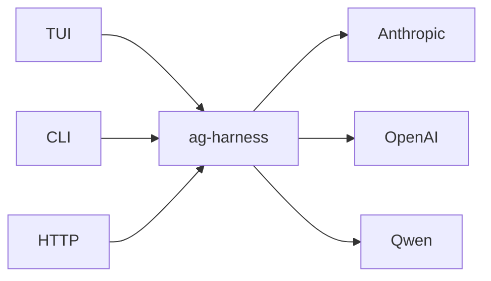
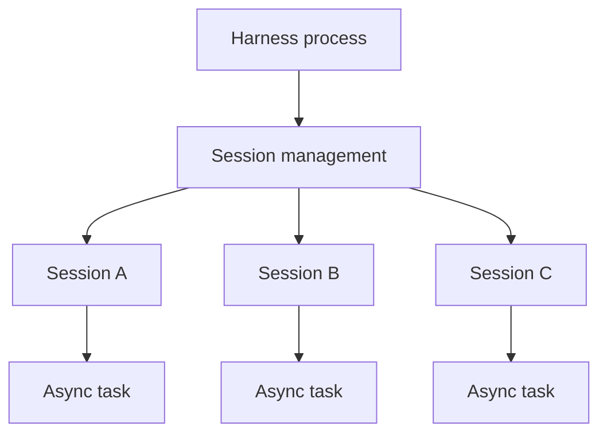
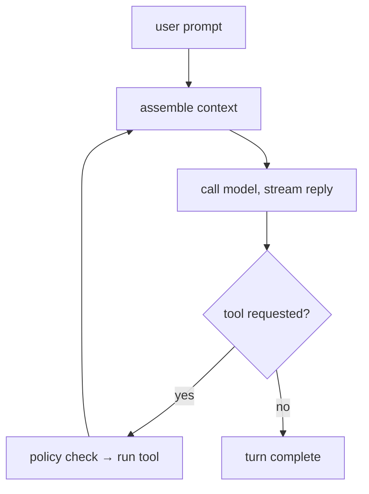
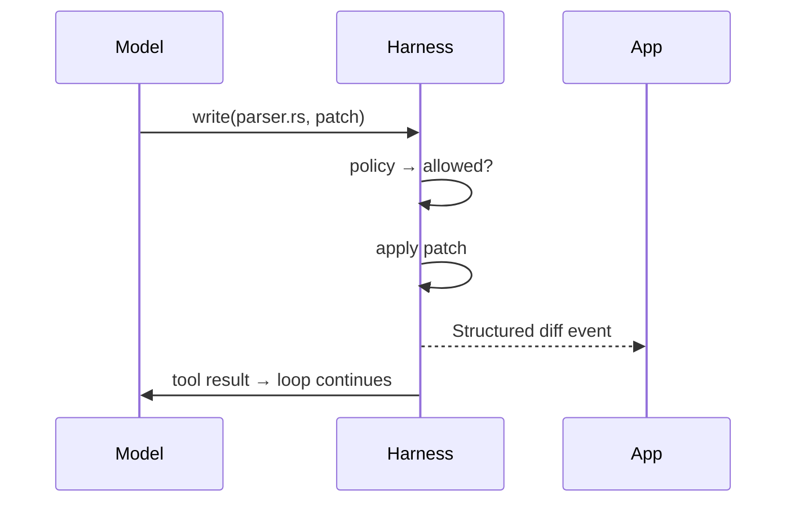
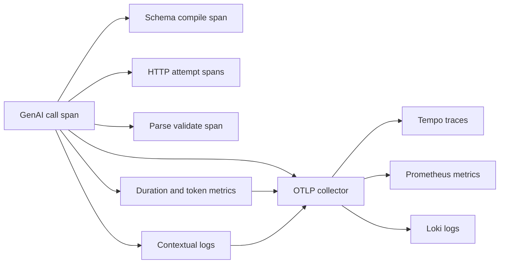

+++
title = "ag-harness Design"
description = "Design for the planned ag-harness runtime."
weight = 6
+++

# `ag-harness` - a light LLM harness

`ag-harness` is the base layer between an application and an LLM. Rust-native,
app-facing and lightweight. It provides just the essentials: an agent loop, three core
tools, session management, and a typed event stream, leaving the actual product
decisions entirely to your app.



## Core features

- **Three built-in tools** - `read`, `write`, `bash`.
- **Structured edits** - the `write` tool applies git-style diff patches and emits
  clean, targeted diffs.
- **Permission policy** - every tool call passes a policy check.
- **Persisted sessions** - session state and required data are saved.

## Architecture

### Crates

```
agentty/
├── crates/
│   ├── ag-harness            # facade
│   ├── ag-harness-protocol   # Op, Event, Diff, Usage
│   ├── ag-harness-core       # loop, tools, sessions, context, storage
```

The current foundation lives entirely in `ag-harness`: the provider-neutral `Model`
contract requires an `OutputSchema` on every `ModelRequest` and returns validated JSON
in `ModelResponse`. `Qwen` is its first adapter.

## Session management

- One host process manages multiple independent sessions.
- An active session runs as an async task; sessions run in parallel.
- Each session processes its prompts in sequence.
- Session state is saved on disk and loaded when resumed.
- The app coordinates work across sessions.
- Closing the host process stops active turns; saved sessions remain resumable.



## Memory management

- Active session state is kept in memory.
- Session state is saved on disk.
- Idle sessions reload from disk when resumed.

## Agent loop

A turn loops until the model responds without requesting a tool:



### One tool call



## Editing

- **Write** - the model produces a git diff patch; the harness applies it. Alternative
  edit methods (exact-match string replacement, etc.) are future experiments.
- **Diff** - applied changes are streamed back as structured file-diff events,
  renderable directly as git diffs.
- **Output caps** - oversized tool output is truncated head+tail with a marker, so one
  careless command can't flood the session's context. Per-tool limits; `read` supports
  line ranges for precise re-reads.

## Context

- **Project discovery** - finds the project root and `AGENTS.md`; the model explores the
  rest via `bash`.
- **Base prompt** - one minimal system prompt.

## Structured output

The model contract requires provider-neutral structured output:

- The caller supplies the expected JSON shape as a provider-independent schema.
- Each adapter uses the strongest structured-output mechanism its provider supports,
  then the harness parses and validates the returned JSON against the caller's schema.
- Provider-specific request fields remain inside the adapter. For Qwen, the adapter uses
  JSON Object mode and performs schema validation in the harness because Qwen guarantees
  valid JSON, not schema conformance.
- Every new model adapter must implement these structured-output semantics before it is
  added.

Configurations that cannot satisfy the contract, such as Qwen thinking mode, return an
explicit unsupported-configuration error rather than silently falling back to
unstructured text.

## Telemetry

- **Traces** - one GenAI call span with child spans for schema compilation, every HTTP
  attempt, and response parsing and validation.
- **Correlation** - `gen_ai.conversation.id` links the call span to its harness session.
- **Retries** - transient failures retry up to twice with bounded jitter and
  `Retry-After` support.
- **Metrics** - operation duration and token usage, labeled only by provider and model.
- **Logs** - existing `tracing` events export with their active trace context.
- **Ownership** - model adapters instrument calls; binaries configure exporters and
  flush providers on exit.
- **Privacy** - prompt, response, and schema content are not recorded.



### View telemetry locally

- Start the Grafana OpenTelemetry stack:

  ```bash
  podman run --rm -it -p 3000:3000 -p 4318:4318 \
    docker.io/grafana/otel-lgtm:latest
  ```

- Run the Qwen example with OTLP export enabled:

  ```bash
  export AG_HARNESS_EXTERNAL_OTEL=1
  export OTEL_EXPORTER_OTLP_ENDPOINT=http://127.0.0.1:4318
  export DASHSCOPE_API_KEY=your-key
  export DASHSCOPE_BASE_URL=your-qwen-base-url
  export AG_HARNESS_SESSION_ID=session-123 # Optional

  cargo run -p ag-harness --example qwen
  ```

- Open `http://127.0.0.1:3000` (`admin`/`admin`): Tempo shows traces, Prometheus shows
  metrics, and Loki shows logs.

## Permissions

All tools are denied by default. The session policy explicitly allows tools and, for
`bash`, the permitted commands:

```rust
Policy {
    read: Allow,
    write: Deny,
    bash: AllowCommands(["cargo test", "git status", "rg *"]),
}
```

## Model tiers

`ag-harness` will provide the ability to work with different AI model API tiers for the
best cost and performance:

- **Model variety** - frontier vs fast models: cheaper models for simpler tasks.
- **Batch/Flex processing** - designed for latency-tolerant, non-critical workloads,
  such as async jobs completed within 24 hours at 50% off.
- **Priority processing** - faster responses at a premium for latency-critical turns.

## Library API

- **Harness** - creates and resumes sessions.
- **Session** - holds model, policy, working directory, and state.
- **Turn** - runs one prompt and streams text, diffs, completion, and failure events.
- **App** - configures the session and renders its events.

## Differences from existing harnesses

- **User-facing products** (Claude Code, OpenCode, Aider): format output for humans;
  `ag-harness` emits events for apps.
- **Minimal harnesses** ([Pi](https://pi.dev/)): TypeScript-first, no permission layer;
  `ag-harness` is Rust-native with an enforced policy hook.
- **Vendor SDKs**: vendor-locked; `ag-harness` is model-agnostic.
- **Rust model-API crates** (`rig`): abstract the model call only; `ag-harness` adds the
  loop, persisted sessions, tools, permissions.
- **Heavy harnesses**: bundle orchestration; `ag-harness` leaves it to the app.

## Next iterations

1. **Tool round trip.** Support one model-requested tool through execution to the final
   response.
1. **Second provider.** Integrate another model API through the structured-output
   contract.

## Roadmap

1. **v1 - library.** `ag-harness` - unified crate integrated into agentty.
1. **Service wrapper.** `ag-harness-service` (JSON-RPC 2.0 over Unix socket, WebSocket
   for remote) + `ag-harness-client`.
