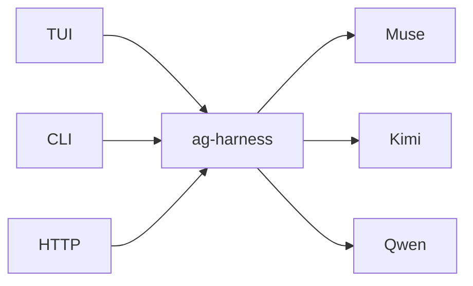
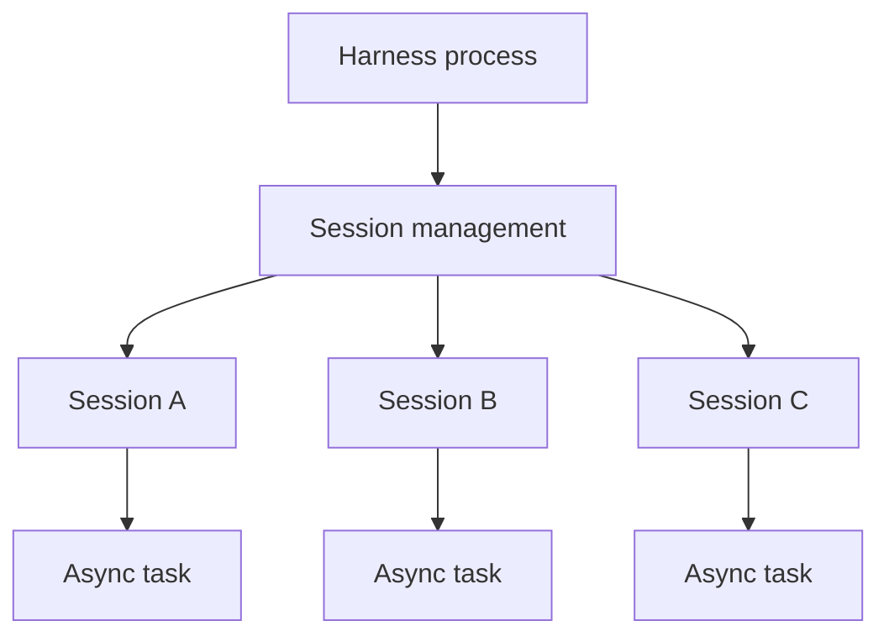
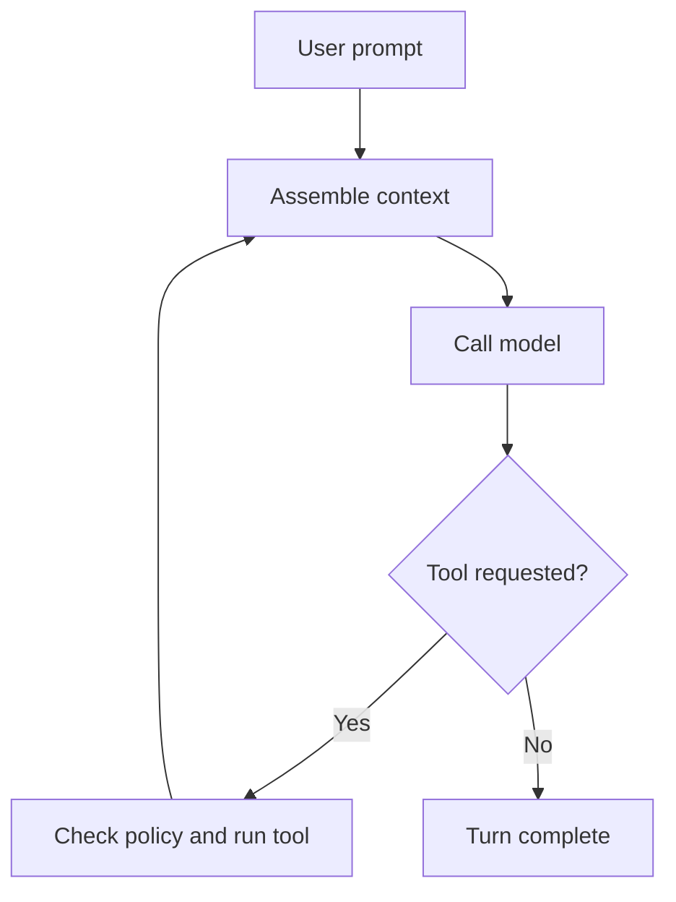
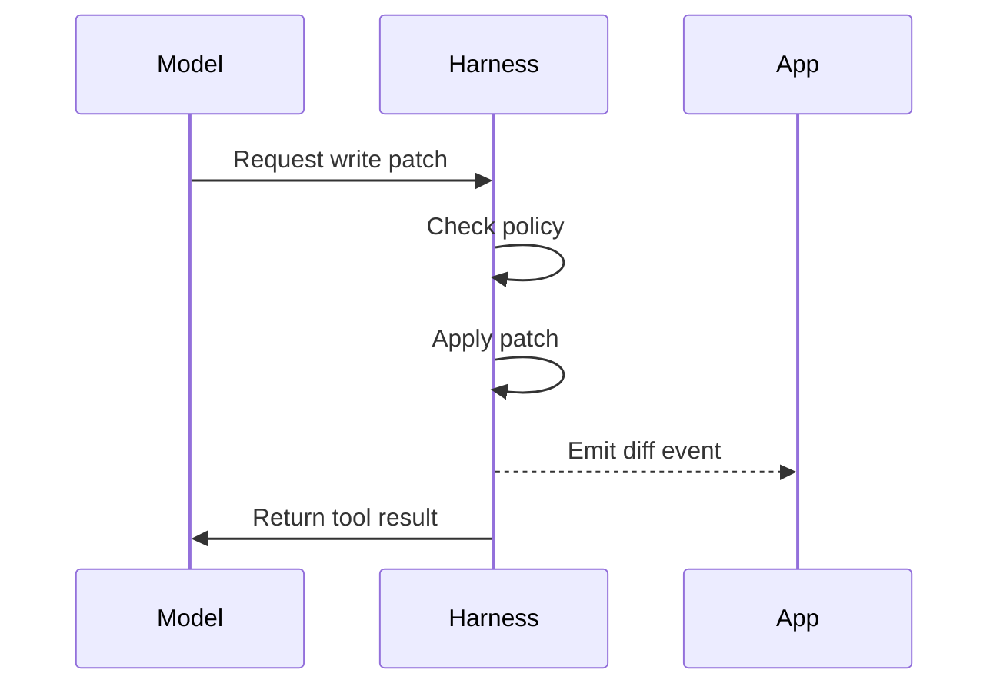
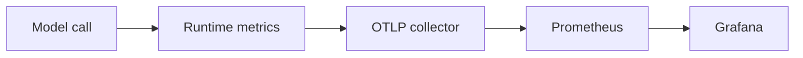

+++
title = "ag-harness Design"
description = "Design for the planned ag-harness runtime."
weight = 6
+++

# `ag-harness` - a light LLM harness

`ag-harness` is the base layer between an application and an LLM. It is Rust-native,
app-facing, and lightweight. It provides the essentials: an agent loop, three core
tools, session management, and a typed event stream, leaving product decisions to the
application.



## Core features

- **Three built-in tools** - `read`, `write`, and `bash`.
- **Structured edits** - `write` applies git-style patches and emits targeted diffs.
- **Permission policy** - every tool call passes an explicit policy check.
- **Persisted sessions** - session state is saved and can be resumed.
- **Typed events** - applications receive model, tool, diff, completion, and failure
  events.

## Architecture

### Crates

```text
agentty/
└── crates/
    ├── ag-harness            # facade
    ├── ag-harness-cli        # interactive CLI
    ├── ag-harness-protocol   # operations and events
    └── ag-harness-core       # loop, tools, sessions, storage
```

The crates separate the public API, protocol types, runtime behavior, and interactive
CLI. A provider-neutral model contract keeps Muse, Kimi, Qwen, and future adapters
behind the same structured-output and tool-calling boundary.

## Session management

- One host process manages multiple independent sessions.
- Active sessions run concurrently as async tasks.
- Each session processes its prompts in sequence.
- Session state is saved on disk and loaded when resumed.
- The application coordinates work across sessions.
- Stopping the host ends active turns while saved sessions remain resumable.



## Memory management

- Active session state stays in memory.
- Resumable session state is persisted to disk.
- Idle sessions reload from disk when resumed.

## Agent loop

A turn continues until the model responds without requesting a tool:



### One tool call



## Editing

- **Write** - the model supplies a git-style patch and the harness applies it.
- **Diff** - applied changes are streamed as structured file-diff events.
- **Output caps** - oversized tool output is truncated with a marker.
- **Focused reads** - `read` supports bounded inspection and precise re-reads.

## Context

- **Project discovery** - finds the project root and applicable `AGENTS.md` guidance.
- **Repository exploration** - the model inspects the project through bounded tools.
- **Base prompt** - one minimal system prompt establishes the harness contract.

## Structured output

- The caller supplies the expected JSON shape as a provider-neutral schema.
- Each adapter uses the strongest structured-output mechanism its provider supports.
- The harness parses and validates terminal output against the caller's schema.
- Provider-specific request fields stay inside the adapter.
- Every model adapter implements the same structured-output and tool-calling semantics.

Unsupported configurations return an explicit error instead of silently falling back to
unstructured text.

### External model adapters

`ModelRequest::messages()` exposes the ordered conversation as immutable `ModelMessage`
entries. External adapters translate system instructions, retained turns, assistant tool
calls, and correlated results from this view rather than from `prompt()` alone.
`ToolCall::from_json()` shares bounded built-in argument decoding with native providers;
call serialization and optional reasoning are available for provider replay. History
mutation, tool permissions, execution limits, and terminal schema validation remain
owned by the harness.

## Telemetry

- **Metrics** - record model and tool duration, token usage, and outcomes.
- **Labels** - identify the provider and model without application-specific dimensions.
- **Ownership** - the harness records observations; the host configures export.
- **Lifecycle** - applications can observe calls, tools, completion, and failure.



## Permissions

All tools are denied by default. A session policy explicitly enables tools and, for
`bash`, the commands it may run:

```rust
Policy {
    read: Allow,
    write: Deny,
    bash: AllowCommands(["cargo test", "git status", "rg *"]),
}
```

## Model tiers

- **Model variety** - choose fast or frontier models for the task.
- **Batch/Flex processing** - run latency-tolerant background work at lower cost.
- **Priority processing** - favor response time for latency-sensitive turns.
- **Application choice** - the application selects the model and processing tier.

## Library API

- **Harness** - creates and resumes sessions.
- **Session** - holds the model, policy, working directory, and state.
- **Turn** - runs one prompt and streams typed events.
- **Model** - provides the provider-neutral completion boundary.
- **App** - configures sessions, coordinates work, and renders events.

## Differences from existing harnesses

- **User-facing products** (Claude Code, OpenCode, Aider) format output for humans;
  `ag-harness` emits events for applications.
- **Minimal harnesses** ([Pi](https://pi.dev/)) are TypeScript-first and omit an
  enforced permission layer; `ag-harness` is Rust-native and policy-driven.
- **Vendor SDKs** are provider-specific; `ag-harness` is model-neutral.
- **Rust model API crates** such as `rig` abstract model calls; `ag-harness` adds the
  loop, sessions, tools, permissions, and events.
- **Heavy harnesses** bundle orchestration; `ag-harness` leaves it to the application.

## Next iterations

1. **Complete the tool set.** Add policy-constrained `bash` execution alongside `read`
   and `write`.
1. **Persisted sessions.** Add resumable state and the typed event stream around the
   existing model and tool loop.

## Roadmap

1. **v1 - library.** Integrate the unified `ag-harness` crate into Agentty.
1. **Service wrapper.** Add `ag-harness-service` and `ag-harness-client` for local and
   remote applications.
