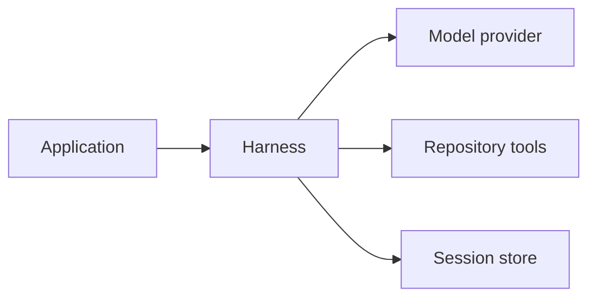
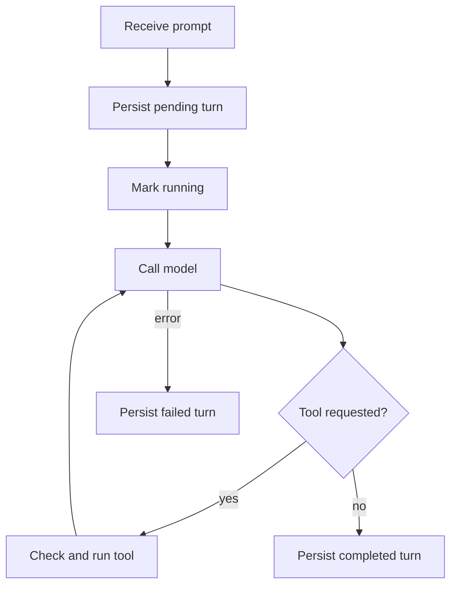

+++
title = "ag-harness Design"
description = "Model loop, durable sessions, and repository policy."
weight = 6
+++

# `ag-harness`

`ag-harness` is a Rust library for structured model turns. Applications select a model,
per-turn output schemas and tool permissions, and a session store for durable sessions.

## Public boundary

- `Harness` owns the model, validated repository, configured defaults, lifecycle
  observers, and selected session store with shared lazy SQLite initialization.
- One internal engine prepares requests, runs provider attempts and tools, retries
  rejected native continuations, and validates output for both entry points.
- Immutable `TurnOptions` fixes the required schema, effective `ToolPolicy`,
  `TurnLimits`, and optional validated `ComparisonBase` for one execution. A later turn
  can use different options.
- `Session` is the only multi-turn abstraction. It persists and restores bounded
  history. Sessions and builders own their runtime resources and can outlive the
  creating `Harness` or move into spawned tasks.
- `Model` is the object-safe provider boundary. `ModelCompletion` carries the response,
  optional metadata, and an optional native continuation identifier.
- `run_once` executes a turn without durable history.

Repository tools are denied by default. `Tool::Read` and `Tool::Write` must be enabled
explicitly, and both receive a validated `Repository` configuration. The library host
selects a trusted Git executable outside the worktree. The companion CLI discovers a
suitable executable or accepts `--git-executable`; the library never searches `PATH`.
Repository tools enforce path containment and exclude Git metadata.

## Per-turn options

`Harness::run_once_with_options` and `Session::send_with_options` accept a complete
`TurnOptions` snapshot. Explicit permissions replace harness defaults; they are never
merged with defaults or earlier turns. An empty `ToolPolicy` denies every tool. Denied
tools are neither advertised nor executable. The tool-call budget applies across all
provider attempts and counts individual calls inside batches.

Existing `run_once` and `send` methods resolve fresh options from configured defaults.
`send` uses the stored session schema and the permissions and tool-call budget captured
when its builder was obtained or the session was resumed. Handles also capture the
repository, filesystem, reasoning effort, and lifecycle observers. Later harness
reconfiguration affects new handles. Resume retains the stored schema, system prompt,
and history budget. An explicit override never changes these defaults, including after
reopening. Permission downgrades retain completed conversation history and previously
read content; they govern current tool execution.

The future Agentty adapters will resolve new options from each request's protocol
profile, permission mode, and host-selected comparison context. Agentty owns review-loop
behavior. Mutable counters, cancellation, and shared provider-call budget accounting
remain execution state rather than configuration. Sandboxed Bash and Agentty permission
mapping remain later work.

Private execution contracts define immutable command and sandbox policy values, explicit
workspace-write, external-read, environment, and host-information grants, and deny-only
networking. Git metadata remains read-only, including linked-worktree administration. A
shared stdout/stderr byte budget and monotonic deadline bound the execution contract;
retained cancellation and cleanup control survives a dropped execution future. Results
keep the main exit, execution error, termination reason, output truncation, and cleanup
failure separate. Applied writes are not rolled back; aggregate memory, process-count,
and disk quotas are excluded. These contracts have no production executor or public
entry point. Future backends must enforce the policy against hostile commands,
descendants, and repository contents before launching anything.

Private platform-independent supervision uses injected backends to bound execution,
output, and cleanup. Cancellation and deadlines apply throughout the lifecycle, and
retained control survives dropped callers. Completion includes descendant cleanup;
cleanup failures remain separate from execution results. Production backends remain
unavailable.

## Repository comparisons

Hosts supply a validated `ComparisonBase` through `TurnOptions`. It pins a full commit
OID in the selected repository scope for `diff` and `show(base)`, regardless of branch
movement or replacement refs. Descriptions and results identify that base. Worktree and
`HEAD` reads remain live; models cannot select another comparison revision.

There is no default base. Without one, comparisons are neither advertised nor
executable; file, list, search, and `show(head)` remain available. Validation preserves
the trusted Git executable and repository-path boundaries.

The CLI resolves `--comparison-base <REV>` once per `run` or `resume` invocation and
reuses the commit across its chat turns. Commit tags are accepted; invalid selections
fail before a model call. A new invocation resolves its explicit selection again.

## Session lifecycle

The selected store is canonical; SQLite remains the default implementation.
Provider-native continuation is an optional optimization, never the only copy of
conversation state. Durable execution uses a public object-safe `SessionStore` contract
for atomic acquisition, ownership, terminal transitions, bounded history, and write
journals. Its `SqliteStore` implementation owns queries, transactions, and row decoding.
Owned handles retain shared storage initialization and temporary-database lifetime.
Acquisition binds the guard to the active store handle before commit, so store
decorators also observe renewal, journal settlement, terminal transitions, and
abandoned-acquisition cleanup. Durable option snapshots retain their separate codec.
Hosts inject a shared implementation with `Harness::store`, or open `SqliteStore`
explicitly. Custom backends use public reservation, identity, history, error, and
options-compatibility types without accessing SQLite internals.

Local admission is shared by backing-store and session identity and retained through
acquisition acknowledgment and abandoned-owner cleanup. Failed cleanup keeps admission
until owner-scoped recovery succeeds. Backend transactions remain authoritative across
processes. `Session::send_controlled` and storage-free `Harness::run_once_controlled`
return lazy turn futures with separately retained `TurnControl` handles. Cancellation
stops the waiter promptly; retained work finishes acquisition or terminal acknowledgment
and owner cleanup. `settled()` observes that persistence settlement even after caller
future drop; failed cleanup remains observable and can be retried for the same owner. A
terminal commit already in progress can still succeed after cancellation. Hosts keep the
Tokio runtime running until settlement. This persistence boundary does not establish
filesystem-effect completion; an already-started replacement can finish afterward.

Only completed turns are replayed. A process that disappears may leave a leased turn in
`pending` or `running`; the next open or turn start marks an expired lease as
`interrupted`. Failed and interrupted prompts remain available for diagnostics without
entering model context.

Each durable turn records its effective options and comparison identity before
execution, with a versioned internal fingerprint. Older history remains readable;
missing historical options are not inferred from current defaults. Reading historical
comparison metadata does not require the original repository or Git objects. Only
bounded, completed history enters model context.

Turn ownership and renewable leases prevent concurrent execution within one session.
Acquisition revalidates persisted history so stale handles cannot replay an outdated
conversation. Cancellation interrupts the abandoned turn; loss of ownership stops
in-flight work. Reservation commits retain their owner through acknowledgement even when
the caller disappears. Renewal and terminal persistence share an exclusion gate and
remain bounded by the last confirmed lease deadline. A successful terminal
acknowledgement stops renewal before completion is reported. Cleanup cannot interrupt a
newer turn. If recording a failure also fails, `SessionError` retains both errors.

Durable writes require live ownership to persist an intent before changing files, and
persist an outcome before returning to the model. Existing intents can settle after
lease expiry or turn termination, scoped to their original owner. Intent persistence
failure prevents the write; outcome persistence failure stops the turn and leaves the
result unknown. `Session::writes()` exposes these records after errors, reopening, and
history eviction. They describe past attempts, not current file contents. Stateless
`run_once` calls have no durable journal.

## Resume and provider fallback

On resume, the harness validates the stored model identity and restores completed
history. A provider continuation is reusable only when the last completed turn's schema,
permissions, and comparison identity match the current options. Unknown legacy semantics
force history replay; a tool-budget change alone does not invalidate continuation.

`ModelError::ResumeUnavailable` triggers one retry using the same stored history without
the rejected identifier. Failed or cancelled turns and expired leases also invalidate
continuation, because the remote conversation may have advanced. Delayed cleanup cannot
clear a newer turn's continuation.

## Concurrency

Sessions and builders share lazy initialization of a bounded SQLite connection pool.
Initialization failures can be retried. Changing the harness database path gives new
handles a separate lazy pool; existing handles keep their database. Building a handle
and calling `run_once` never open storage. Different session IDs may run concurrently,
but only one turn can be active per session. Concurrent writers receive
`SessionError::Busy` instead of interleaving messages.

## Observability

Lifecycle observers receive content-free turn, model-request, and tool events. The host
chooses exporters. `LifecycleMetrics` and `LifecycleTraceObserver` project this stream
to OpenTelemetry without storing prompts or tool output in telemetry.

`run_once` owns terminal events for ephemeral turns. `Session::send` owns them for
durable turns and emits `TurnCompleted` only after committing messages and updating
session state. Durable turn durations include acquisition and persistence. Session
coordination or persistence failures emit `TurnFailed` with `session_error`; model or
tool failures retain their original classification even if recording the failure also
fails. Dropping either operation emits cancellation once.

## Next iterations

1. **Stores and recovery**

   Add a production memory store and host turn IDs for idempotent recovery.

1. **Model switching**

   Resolve models through a registry and switch a durable session without discarding its
   normalized history.

1. **Rich input and images**

   Replace text-only user messages with ordered, bounded text and image content blocks.

1. **Sandboxed Bash**

   Add a cancellable command tool with fixed workspace scope, timeouts, output limits,
   and explicit network policy.

1. **Context management**

   Preserve the durable log while projecting model-aware recent history and structured
   compaction checkpoints.

1. **Agentty runtime adapters**

   Implement durable `AgentChannel` and ephemeral `OneShotClient` adapters over the
   shared turn engine. Carry host-selected comparison context in both request paths,
   validate it against the execution repository, and build fresh per-turn options.
   Agentty owns baseline selection: its effective diff baseline may be a merge base or
   advance past already-applied patches, rather than the target branch tip. Reuse that
   policy through Agentty's Git boundary so Harness inspection agrees with the product
   diff, including diverged branches and stacked sessions. Do not infer the base from
   prompt text or impose the companion CLI's invocation lifetime on Agentty.

1. **Feature-gated product surface**

   Add off-by-default Harness selection, capability checks, and deterministic Agentty
   end-to-end coverage.
