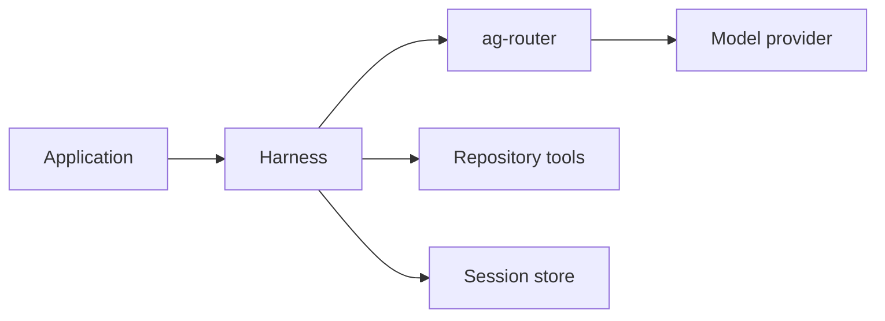
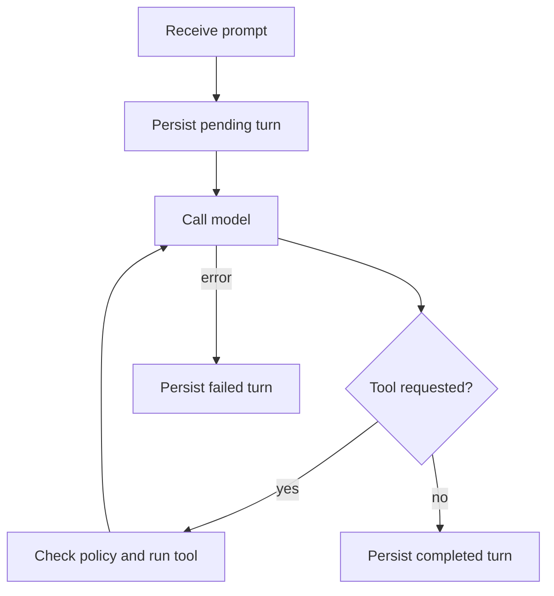

+++
title = "ag-harness Design"
description = "Model loop, durable sessions, and repository policy."
weight = 6
+++

# `ag-harness` — a light LLM harness

`ag-harness` is the base layer between an application and an LLM. It is Rust-native,
app-facing, and lightweight: an agent loop, three policy-checked tools, durable
sessions, and content-free lifecycle events. Product decisions stay in the application.
It is not yet an Agentty backend; product integration must follow the
[Execution](@/docs/core-components/execution.md) boundary.


```mermaid
flowchart LR
    App["Application"] --> H["Harness"]
    H --> R["ag-router"]
    R --> M["Model provider"]
    H --> T["Repository tools"]
    H --> S["Session store"]
```

## Core features

- **Three built-in tools** — `read`, `write` (git-style patches), and sandboxed `bash`.
- **Deny-by-default permissions** — every tool call passes an explicit per-turn policy.
- **Structured output** — every turn validates against a caller-supplied JSON schema.
- **Durable sessions** — SQLite by default; memory and custom stores share the same
  public contract.
- **Provider-neutral models** — built-in Muse, Kimi, and Qwen clients use `ag-router`
  behind the object-safe `Model` trait.
- **Typed lifecycle events** — content-free turn, model, and tool observations.

## Crates

```text
crates/
├── ag-router        # structured chat routing + provider transports
├── ag-harness       # library + ag-harness-sandbox launcher binary
└── ag-harness-cli   # interactive terminal host
```

## Public boundary

- `Harness` owns the model and its required `ContextBudget`, validated repository,
  configured defaults, lifecycle observers, and the selected session store.
- `Session` is the only multi-turn abstraction; `run_once` executes a stateless turn.
- `Session::turn` is the configurable durable-turn entry point: chain `options` and
  `host_id`, then either await the turn or `start` it for a `TurnControl`.
  `Harness::turn` takes explicit options for a stateless turn and is likewise awaited or
  started; it has no host ID.
- `TurnOptions` fixes the schema, `ToolPolicy`, and optional `ComparisonBase` for one
  execution. Explicit options replace defaults; they are never merged.
- The crate root exports what a typical host needs; extension points and detailed
  records live in the `provider`, `model`, `tool`, `bash`, `turn`, `store`, `recovery`,
  and `lifecycle` modules.
- `Model` is the object-safe provider boundary. `ModelRegistry` resolves built-in or
  injected models by stable host keys with declared `ModelCapabilities`.
- `SessionStore` is the public persistence contract and `BashExecutor` the public
  command-execution contract; both accept host implementations. Stores expose atomic
  record operations; the harness applies admission rules and builds each lease.

## Agent loop

A turn continues until the model responds without requesting a tool, and the terminal
response must satisfy the caller's schema. There is no tool-call limit: cancellation and
the required `ContextBudget` bound a turn, which fails typed once the next request no
longer fits.


```mermaid
flowchart TD
    Prompt["Receive prompt"] --> Pending["Persist pending turn"]
    Pending --> Model["Call model"]
    Model --> Tool{"Tool requested?"}
    Tool -->|yes| Execute["Check policy and run tool"]
    Execute --> Model
    Tool -->|no| Complete["Persist completed turn"]
    Model -->|error| Failed["Persist failed turn"]
```

## Sessions

- The selected store is canonical. Every request replays projected history; providers
  never hold conversation state.
- One active turn per session. Renewable leases fence concurrent processes; expired
  leases mark turns `interrupted`, and only completed turns re-enter model context.
- Reservation and model switching run in one store-owned atomic section that reads the
  admission state and records the harness's decision: recorded host requests first, then
  the model generation, an idle session, and no unresolved command.
- Within one process, a single reservation lifecycle owns admission, lease renewal,
  finalization, and cleanup of abandoned owners. It recovers those owners before every
  turn acquisition or model switch, the same way for every store.
- Each turn records its effective options, comparison identity, and model provenance
  before execution. Write and command intents persist before their effects.
- `host_id`/`recover` bind host-assigned request IDs to a fingerprint of the effective
  request, so matching retries return recorded outcomes instead of executing again.
- `switch_model` selects another registration for an idle session. `compact` publishes a
  schema-validated summary checkpoint that request projection replays ahead of the
  remaining recent turns.
- Every harness has an approximate `ContextBudget`, passed to `Harness::new` or declared
  by its registration: requests keep the most recent whole turns that fit, and mandatory
  content that cannot fit fails with a typed error before any provider call.
- Each durable turn's `TurnReport` carries a `HistoryActivity` stating how many loaded
  turns were replayed or evicted and whether a checkpoint summary was replayed, so hosts
  observe context projection instead of inferring it from model answers.

## Cancellation and settlement

Started turns (`turn(...).start()`) separate the caller's future from the turn's fate.
`TurnControl` cancels promptly, then `settled()`, `effects_settled()`, and
`commands_settled()` observe persistence cleanup, filesystem replacements, and command
cleanup independently. Retained work survives caller drop, and unresolved effects block
new durable turns rather than being forgotten. Neither boundary provides rollback or
distributed workspace fencing.

## Permissions and tools

All tools are denied by default; per-turn policy enables them explicitly.

- `read` — bounded file, list, search, and `show(head)` inspection.
- `write` — applies one bounded git-style unified diff.
- Comparisons (`diff`, `show(base)`) additionally require a host-pinned `ComparisonBase`
  commit; no base is ever chosen implicitly.
- `bash` — requires an explicit per-turn `BashConfig` naming an executor: the native
  sandbox launcher (Bubblewrap, Landlock, and seccomp on Linux; Seatbelt on macOS), a
  host-supplied `BashExecutor`, or the shipped unsandboxed executor for hosts already
  inside a container or VM. Workspace reads are the default; writes, external reads,
  environment values, and host-information exposure require explicit grants. Git
  metadata stays read-only, networking is denied, and unsupported policy fails closed on
  enforcing executors. Output shares one capture budget: each stream keeps its start and
  end, a short stream cedes its unused share, and the outcome reports the bytes omitted
  from each stream.

Repository tools receive a validated `Repository` with a trusted Git executable outside
the containing worktree; the library never searches `PATH`.

## Provider transport

`ag-router` owns built-in Chat Completions transport, provider wire policies, and local
JSON Schema validation. Its public `Router::execute` request names a `provider/model`
and always includes a `JsonSchemaFormat`; terminal output is validated JSON, while
intermediate function calls return to the caller for execution. The harness converts its
built-in tool requests and responses at this boundary and retains tool permissions,
sessions, lifecycle events, and telemetry. The router currently covers chat completion;
it has no streaming or automatic provider fallback.

Built-in Chat Completions clients bound one provider request to three minutes, because
reasoning models can spend more than a minute on one completion; a timed-out request is
reported as a transport failure without a retry, while a connection failure is retried
once. A `429` response is retried up to five times with exponential backoff capped at
five seconds, and a provider `Retry-After` is honored up to sixty seconds so a
per-minute quota can be waited out. Model content is parsed as one JSON object; content
that wraps the object in Markdown fences or surrounding prose is accepted when the
embedded object parses, and every accepted value is still validated against the
requested schema. Invalid content is reported with the parser diagnostic, the leading
character, and the length, never the content itself.

## Input and output

- `TurnInput` carries ordered, bounded text and image blocks; plain strings keep working
  for text-only turns.
- Image support is opt-in per model and validated before any provider request.
- Every turn requires an `OutputSchema`. The harness validates the terminal response
  locally and returns typed errors instead of falling back to unstructured text.

## Observability

Lifecycle observers receive content-free turn, model-request, and tool events; the host
chooses exporters. `LifecycleMetrics` and `LifecycleTraceObserver` project the stream to
OpenTelemetry without storing prompts or tool output in telemetry. Awaited and started
turns alike run under the caller's OpenTelemetry context, so harness spans nest under
the host's span; a started turn keeps the context current at its first poll.

## Next iterations

Planned, not shipped. Each step lands as its own change, in this order:

1. **The acquired turn owns request projection and commit** — host-request and plain
   turns become commit variants instead of flags.
1. **Stopped-turn replay** — each finished tool exchange persists under the turn owner.
   Failed and interrupted turns replay with a stop note, never as completed history; one
   too large for the history budget replays only its input and note.
1. **One settlement tracker behind `TurnControl`** — one phased tracker replaces the
   persistence, effect, and command trackers. This breaking change lands before Agentty
   depends on it.
1. **Agentty `AgentKind::Harness`** — one release behind Agentty's existing boundaries:
   - A native backend beside the CLI and app-server transports provides a durable
     `AgentChannel` and the one-shot path. The harness session shares the Agentty
     session ID and is canonical; a missing database restarts from Agentty's replay
     transcript.
   - `ReadOnly` maps to `read`. Edit modes add `write` and unsandboxed `bash`, which
     inherits Agentty's full environment except the `MODEL_*`, `KIMI_*`, and
     `DASHSCOPE_*` provider key and URL variables. Like Codex full access, and unlike
     Claude, `bash` does not keep the main checkout read-only.
   - API keys come from environment variables; the harness is available when any
     provider key is set. Each session's database lives under the Agentty data root,
     outside the session worktree, so session commits and worktree cleanup never include
     it; session deletion removes it explicitly.
   - Deterministic `FeatureTest` coverage uses a scripted provider.

Later: proactive compaction, and one correlator shared by `LifecycleTraceObserver` and
`LifecycleMetrics`.
