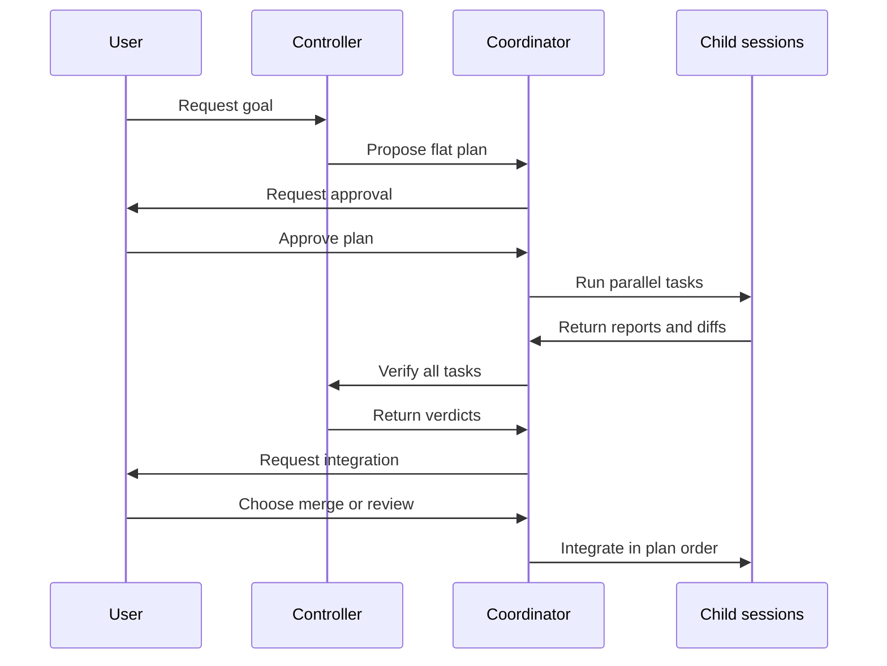
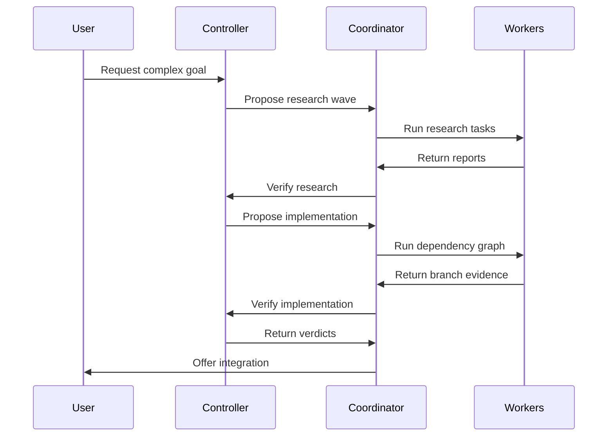
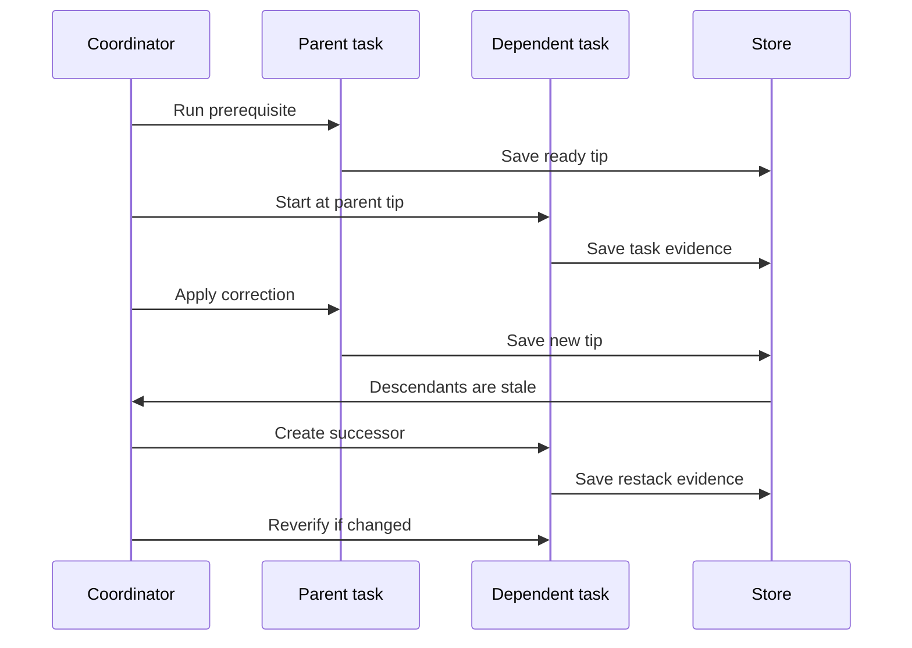

+++
title = "Orchestrator Design"
description = "Current orchestrator behavior and the target wave, dependency, and campaign design."
weight = 7
+++

 Agentty currently runs one goal as a
flat campaign of managed child sessions. The target design adds independent waves,
declared dependencies, and an interactive board for multi-round research and dependent
implementation.

<!-- more -->

## Design Status

 **Current Model** and **Current
Limits** describe the preview feature that ships today. **Target Model**, **Delivery
Phases**, and **Invariants to Preserve** are design targets, not shipped behavior.

See [Parallel Orchestration](@/docs/usage/workflow.md) for user-facing instructions.

## Current Model

### Roles and Ownership

| Role                      | Branch changes | Purpose                    |
| ------------------------- | -------------- | -------------------------- |
| `Worker`                  | Owns           | Ordinary user session      |
| `Orchestrator`            | Prompt: none   | Plans and verifies         |
| `OrchestrationWorker`     | Owns           | Implements one task        |
| `OrchestrationResearcher` | Read-only      | Returns a temporary report |

The hierarchy is two levels: one controller and its managed children. The controller's
structured response proposes model-authored plans, verdicts, and continuations; Agentty
validates and applies them. User actions directly approve plans, choose integration,
cancel campaigns, and detach children. Managed children otherwise hide mutation actions,
but users can still inspect transcripts, diffs, and worktrees.

The controller is instructed not to edit, but this is only a prompt policy. Researchers
alone receive enforced read-only permissions; controller edits would be uncommitted and
unobserved.

### Campaign Flow

One campaign-global status moves from approval through execution, verification, and
integration. Every task ever added belongs to that same phase.

The controller emits `subtasks` of one kind per response. Initial implementation plans
need at least two tasks; research waves and retries may contain one. Every task needs a
unique valid key, prompt, and acceptance criteria. Safe touched-area validation applies
only to implementation tasks. Valid tasks persist before approval. Research
auto-approves when **Auto-approve Research** is enabled, which is the default.

The coordinator claims tasks before creating children, links each child before sending
its prompt, and limits live children by **Orchestrator Parallelism**: three by default,
up to eight. Eight is a per-response fan-out limit, not a campaign limit. All children
start from the controller's base; plan order affects integration only.

Implementation workers receive up to three focused-review remediation passes. When all
tasks settle, the controller receives one bounded, inert verification envelope
containing acceptance criteria, reports or branch evidence, review outcomes, and changed
paths. The response accepts at most eight verdicts. Explicit `pass` verdicts advance;
flagged or missing verdicts park. Reusing a task key starts a correction or a fresh
researcher.

The user then makes one campaign-wide choice between local merge and forge review
requests. Local integration follows plan order. Research-only campaigns need no
integration choice and complete automatically.

### Controls and Recovery

The controller shows a non-scrolling status board above chat. `a` approves the parked
plan or integration gate, and `Enter` continues controller chat. To cancel the campaign,
return to the Sessions list and press `c` on the controller; the confirmation includes
its active children. One relay slot serializes blocking worker questions.

Campaign, task, child-link, and long-running operation state persist in SQLite. Claims
and stable operation identifiers let restart re-link children and retry interrupted
review, continuation, or roll-up work without duplicating it.

## Current Limits

- **Global barrier.** One status and one accumulating task list prevent waves from
  progressing independently.
- **Verification overflow.** Follow-up turns can grow a campaign beyond the
  eight-verdict response limit. Roll-up still enters integration; excess tasks remain
  `Ready`, block approval, and do not receive another automatic verification turn.
- **No dependencies.** Every child starts from the same base; merge order is not a task
  graph.
- **One task kind per response.** Research and implementation cannot be proposed
  together, even during follow-up.
- **Fragile research rounds.** A passing research campaign completes unless the same
  verification response proposes the next round.
- **No hierarchy depth.** Managed children cannot own sub-campaigns.
- **Weak control surface.** The board clips, hides task detail, cannot edit a plan, and
  exposes no per-task recovery actions.
- **Serialized questions.** Only one worker question can reach the controller at a time.
- **Leaky boundary.** Orchestration policy lives in the app layer, while child creation
  exposes persistence row identifiers through the session API.

## Target Model

### Intended Workflow

 A campaign becomes a durable
conversation that can alternate research, implementation, and review rounds while
independent work continues.

### Waves and Controller Dispatch

A persisted wave owns its tasks, kind, phase, and verification generation. Waves
schedule and verify independently, so research and implementation can coexist in
different waves. The campaign status is their roll-up.

Wave membership freezes at approval and is capped at eight task keys, matching the
verdict response limit. New scope creates another wave. One dispatch verifies every
`Ready` or `Reported` task in the wave. Its verification generation completes only after
each has a generation-matched verdict; only explicit passes advance. The initial design
never splits one verification generation across controller turns.

Waves also introduce execution history. Each task execution row is unique by task and
generation, links one session and an optional predecessor, and the task points to its
active execution. This replaces the current single child-session link and lets stale
root work continue in a managed successor without reopening a terminal session.

The one controller session remains serialized. Ready waves enter a durable dispatch
queue keyed by wave, message kind, and generation. A campaign claim allows one
controller turn in flight; other waves keep running or wait visibly.

The provider response is saved before application. Each dispatch records the expected
campaign and originating-wave lifecycle versions. User lifecycle actions advance the
relevant version. Cancel and close atomically advance the campaign version and
invalidate every queued or in-flight dispatch.

One compare-and-set transaction applies a response only while the campaign remains open
and both lifecycle versions match. It records verdicts, correction generations, at most
one follow-up wave, its approval state, and dispatch completion. A mismatch marks the
response superseded without mutating work. Replay cannot duplicate work. The dispatch
also captures the research auto-approval authorization so restart cannot change the
result.

A campaign closes only through a board action after every wave is settled. Closing
persists `Done` and releases the controller. Settled includes passed reports,
integrated, blocked, detached, failed, or canceled tasks, but not pending integration or
remediation. Cancel abandons open work; an ineligible close action shows the blocker.

### Dependency Graph

 Implementation tasks gain
`depends_on`. The initial version allows one same-wave dependency, rejects cycles and
unknown keys, and rejects multiple parents until a materialized multi-parent base has
defined conflict and cleanup semantics.

A prerequisite is dependency-ready only when it is `Ready`, still owns its managed
branch, and has a persisted branch-tip generation. Gating on a verdict would deadlock:
wave verification waits for all tasks, including the dependent.

Failure, cancellation, or detachment persists `DependencyBlocked` on every descendant
before cleanup. Each block records the root cause and the immediate prerequisite
generation it awaits.

When a retried prerequisite reaches a newer `Ready` generation, a unique recovery
transition keyed by blocked task, prerequisite task, and successful generation advances
the direct-child frontier. A child that never started returns to `Planned` against the
new tip. A child with prior work gets one successor execution and enters restack; its
last branch stays retained until that succeeds or the campaign is abandoned. Replays do
not create another execution, and deeper descendants remain blocked until their own
prerequisite becomes `Ready`. Graph-aware cancellation previews and stops descendants
without touching unrelated work.

### Managed Stacks and Generations

 The user-facing `Stacked` mode
cannot launch dependencies: `Ready` managed sessions are terminal, while that mode
requires an active parent and creates an unlinked draft.

The session API therefore adds `OrchestrationStackedChild`. A durable claim pins the
prerequisite tip, eagerly creates a managed worktree, persists both task and parent
links, assigns `OrchestrationWorker`, and submits the prompt automatically. A task uses
the execution history introduced with waves, preserving old terminal sessions as
evidence while naming one active generation.

Every prerequisite-tip change, including a correction, synchronizes the full descendant
chain. A terminal dependent is never reopened; a successor execution session restacks
from its retained tip. Each verdict records the task, prerequisite, branch, and base
generations it verified.

A canonical patch fingerprint decides whether a clean restack preserved both the
child-owned patch and its dependency context. Only then may a new verdict explicitly
carry forward the old one. Corrections, changed context, conflicts, and failures forbid
carry-forward; they trigger re-verification or park the affected subtree.

### Durable Operations

Stable, generation-qualified identities make every side effect restart-safe:

| Operation    | Durable identity       | Restart rule                         |
| ------------ | ---------------------- | ------------------------------------ |
| Dispatch     | Wave and generation    | Apply by lifecycle CAS or supersede  |
| Spawn        | Task execution         | Re-link or retry creation            |
| Restack      | Task branch generation | Inspect tips and patch fingerprints  |
| Base refresh | Task execution         | Resume, finalize, or park the rebase |
| Integration  | Task integration       | Reconcile Git or forge state         |

Transient events only wake reconciliation. Persisted operation state, expected commits,
fingerprints, and bounded conflict evidence decide the outcome. Newer generations
supersede older pending work; an unknown in-flight result is never duplicated.

### Campaign-Wide Integration

 All waves target one campaign
base, so local merges and review requests share a durable queue and one claim. The
campaign records the base commit, tree, and monotonic generation; tasks and verdicts
record which generation they used.

The integration approach is persisted per implementation wave. At its integration gate,
the board offers `LocalMerge` or `ReviewRequest`. A compare-and-set against the open
campaign and wave lifecycle versions saves the choice and approval generation, then
enqueues its passed tasks. Research waves skip the gate, and one wave cannot mix
approaches.

Queue entries copy that approval generation and approach. A retry keeps the approach and
increments a durable task integration generation. The user may change the approach only
before the first entry is claimed; the replacement approval invalidates unclaimed
entries through the same lifecycle compare-and-set.

Before verification and integration, the coordinator resolves the actual base. A stale
root task gets a new managed successor session, rebases from its retained tip, then
repeats focused review and wave verification. Dependents use transitive restacking.
Conflicts park the queue entry with evidence.

Queue eligibility follows the dependency graph. A prerequisite integrates before its
descendants. A descendant can claim the queue only after required ancestor restacks
finish and its verdict matches the resulting task, prerequisite, branch, and campaign
base generations.

Each accepted integration advances the base generation and makes older queued evidence
stale, including later tasks from the same wave. A local merge is accepted after its Git
operation reconciles. The coordinator transitively restacks affected descendants and
refreshes and re-verifies changed work before it can re-enter the queue.

A review-request attempt records its head, target base commit and tree, request
identity, and integration generation. It holds the claim until terminal reconciliation,
closure, or detachment. Forge state only wakes reconciliation. Before the task can
become `Integrated`, the coordinator compares the actual target history and tree with
the recorded base and expected merge result. A match atomically accepts the integration.

An intervening base change makes the attempt stale. While the request is open, the task
refreshes against the new base, repeats focused review and wave verification, then
updates the request or supersedes it with one persisted replacement attempt. If it
already merged, the landed tree remains under reconciliation until the same checks pass;
failure parks corrective or revert evidence. A request closed without merge retries
under the wave's persisted approach. Restart resumes the recorded attempt before any new
side effect.

### Interactive Campaign Board

 The board becomes a selectable,
scrollable task table with a detail pane for prompts, acceptance criteria, touched
areas, evidence, verdicts, dependencies, questions, and integration state.

Users can edit or drop tasks before approval; approve a plan wave; choose the
integration approach for a passed implementation wave; retry, cancel, or detach a task;
answer any queued worker question; and close or cancel a campaign. Canceling a non-leaf
task previews affected descendants.

Every visible action requires an E2E feature test.

### Nested Campaigns and API Boundary

Session roles split into ownership (user or managed) and capability (worker or
orchestrator). A managed orchestrator may own a depth-capped sub-campaign after waves
and dependencies are proven.

Orchestration policy moves into `ag-session` behind plan, wave, task, and graph
operations. The frontend-neutral API uses opaque handles instead of database row IDs;
the app layer supplies runtime, persistence, Git, and forge adapters.

## Rollout Phases

These are product milestones, not individual PRs. They ship in order; each phase starts
after the previous phase is complete.

| Phase | Scope                      | Depends on | Outcome                                 |
| ----- | -------------------------- | ---------- | --------------------------------------- |
| 1     | Control surface and safety | —          | Usable, enforceable flat campaigns      |
| 2     | Durable waves              | 1          | Multi-round research and explicit close |
| 3     | Safe independent work      | 2          | Concurrent implementation waves         |
| 4     | Dependency graphs          | 3          | Single-parent stacked DAG workflows     |
| 5     | Nested orchestration       | 4          | Depth-capped recursive campaigns        |

Phase 1 delivers the interactive board, plan and task actions, queued worker questions,
and enforced controller read-only permissions.

Phase 2 adds bounded wave persistence, execution generations, opaque handles, serialized
lifecycle-fenced dispatch, atomic follow-up creation, and campaign close. Existing
campaigns migrate as wave one.

Phase 3 adds wave-scoped integration approval, the campaign integration claim, base
generations, successor refresh, focused review, re-verification, and restart
reconciliation. Implementation waves do not integrate independently before this phase.

Phase 4 adds managed stacked creation and exposes `depends_on` only when validation,
dependency-ready scheduling, block recovery, graph-aware cancellation, transitive
restacking, and topological integration work end to end.

Phase 5 splits ownership from capability and adds managed orchestrators, sub-campaign
roll-up, cancellation, recovery, and hierarchy rendering.

A phase may span several reviewable PRs, but incomplete workflow shapes stay internal.
Schema changes include migration and restart coverage; visible behavior includes usage
docs and an E2E feature test.

## Invariants to Preserve

- Plans persist before approval. **Auto-approve Research** is standing authorization for
  research only; implementation always requires explicit approval.
- Agentty, not model-authored text, owns lifecycle mutation. Controller read-only
  behavior remains a prompt policy until execution permissions enforce it.
- Claims, stable operation identities, and lifecycle and evidence generations prevent
  stale or duplicate work.
- Controller inputs are bounded and model-authored reports are marked inert.
- Researchers are read-only and their temporary worktrees are reclaimed.
- Status and verdicts come from observed session state and generation-matched evidence.
- Branch cleanup waits until required evidence and successor links are durable.
