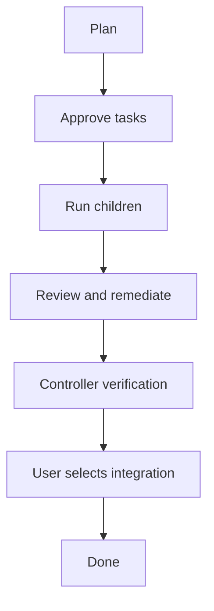

+++
title = "Orchestrator Design"
description = "Current orchestrator behavior and the target wave, dependency, and campaign design."
weight = 7
+++

 Agentty currently runs one goal as a
flat campaign of managed child sessions. The target design adds independent waves,
declared dependencies, and an interactive board for multi-round research and dependent
implementation.

<!-- more -->

## Design Status

 **Current Model** and **Current
Limits** describe the preview feature that ships today. **Target Model**, **Rollout
Phases**, and **Invariants to Preserve** are design targets, not shipped behavior.

See [Parallel Orchestration](@/docs/usage/workflow.md) for user-facing instructions.

## Current Model

### Roles and Ownership

| Role                      | Branch changes | Purpose                    |
| ------------------------- | -------------- | -------------------------- |
| `Worker`                  | Owns           | Ordinary user session      |
| `Orchestrator`            | Prompt: none   | Plans and verifies         |
| `OrchestrationWorker`     | Owns           | Implements one task        |
| `OrchestrationResearcher` | Read-only      | Returns a temporary report |

The hierarchy is two levels: one controller and its managed children. The controller's
structured response proposes model-authored plans, verdicts, and continuations; Agentty
validates and applies them. User actions directly approve plans, choose integration,
cancel campaigns, and detach children. Managed children otherwise hide mutation actions,
but users can still inspect transcripts, diffs, and worktrees.

The controller is instructed not to edit, but this is only a prompt policy. Researchers
alone receive enforced read-only permissions; controller edits would be uncommitted and
unobserved.

### Campaign Flow

A campaign has one shared phase from approval through integration. All tasks belong to
that phase, including tasks added later.

One response proposes at most eight tasks of one kind. Initial implementation needs at
least two; research and retries may contain one. Each task has a stable key, prompt, and
acceptance criteria. Implementation touched areas are planning references, not edit
restrictions. Plans persist before approval; research auto-approval is enabled by
default.

Claims and persisted child links prevent duplicate creation. Parallelism defaults to
three, with a maximum of eight. All children start from the controller's base; plan
order controls integration, not dependencies.

Implementation workers get up to three review/remediation passes. Once tasks settle, the
controller verifies an inert envelope of criteria, results, and evidence. Research
reports are individually capped at 32 KiB after JSON encoding; the aggregate is not
capped. At most eight verdicts fit one response. Explicit passes advance; missing or
flagged verdicts park. Reused keys continue an implementation child or start a fresh
researcher.

The user chooses local merges or review requests for the campaign. Research-only work
needs no integration.

### Controls and Recovery

The controller shows a non-scrolling status board above chat. `a` approves the parked
plan or integration gate, and `Enter` continues controller chat. To cancel the campaign,
return to the Sessions list and press `c` on the controller; the confirmation includes
its active children. One relay slot serializes blocking worker questions.

Campaign, task, child-link, and long-running operation state persist in SQLite. Claims
and stable operation identifiers let restart re-link children and retry interrupted
review, continuation, or roll-up work without duplicating it.

## Current Limits

- **Global barrier.** One status and one accumulating task list prevent waves from
  progressing independently.
- **Verification overflow.** Follow-up turns can grow a campaign beyond the
  eight-verdict response limit. Roll-up still enters integration; excess tasks remain
  `Ready`, block approval, and do not receive another automatic verification turn.
- **No dependencies.** Every child starts from the same base; merge order is not a task
  graph.
- **One task kind per response.** Research and implementation cannot be proposed
  together, even during follow-up.
- **Fragile research rounds.** A passing research campaign completes unless the same
  verification response proposes the next round.
- **No hierarchy depth.** Managed children cannot own sub-campaigns.
- **Weak control surface.** The board clips, hides task detail, cannot edit a plan, and
  exposes no per-task recovery actions.
- **Serialized questions.** Only one worker question can reach the controller at a time.
- **Persistence-coupled API.** Child creation exposes storage identifiers through the
  session API.

## Target Model

### Intended Workflow

A proposed campaign remains open across research, implementation, and review waves,
allowing independent work to continue while the controller plans the next round.

### Waves and Controller Dispatch

Each persisted wave owns its kind, phase, tasks, and verification generation. Approved
membership freezes at eight keys; new scope creates another wave. Waves schedule
independently, but each verification dispatch must cover all ready/reported tasks in its
wave. Every task needs a generation-matched verdict before verification completes.

Execution history links task generations to sessions and predecessors, preserving old
terminal sessions while identifying one active execution. One durable controller queue
serializes dispatch by wave, message kind, and generation.

Responses persist before application. A compare-and-set transaction checks the open
campaign and originating wave's lifecycle versions, then applies verdicts, corrections,
at most one follow-up wave, approval state, and dispatch completion. Mismatches
supersede the response without effects. Cancel/close invalidate outstanding dispatches;
captured research authorization survives restart.

Explicit close requires all waves settled, with no pending integration or remediation.
Cancel abandons open work; ineligible close explains its blocker.

### Dependency Graph

Implementation tasks gain one same-wave `depends_on` prerequisite. Reject unknown keys,
cycles, and multiple parents until multi-parent conflict and cleanup semantics exist.

A prerequisite becomes dependency-ready at `Ready` with managed branch ownership and a
persisted tip generation. Waiting for its verdict would deadlock wave verification.
Failure, cancellation, or detachment blocks descendants before cleanup and records the
cause and awaited generation.

A newer ready prerequisite advances only its direct-child frontier through an idempotent
recovery transition. Unstarted children return to `Planned`; existing work receives a
successor execution and restack, retaining its old branch until success or abandonment.
Deeper descendants wait for their own prerequisites. Cancellation stops the affected
subtree without touching unrelated work.

### Managed Stacks and Generations

Ordinary `Stacked` mode cannot launch managed dependencies: it requires an active parent
and creates an unlinked draft. The proposed `OrchestrationStackedChild` API instead
claims a prerequisite tip, creates the worktree, persists task/parent links, assigns the
managed role, and submits work automatically.

Prerequisite changes synchronize the full descendant chain. Terminal sessions never
reopen; successor sessions restack retained work. Verdicts record task, prerequisite,
branch, and base generations.

A canonical patch fingerprint may justify explicitly carrying a verdict forward only
when both the child patch and dependency context survive a clean restack. Corrections,
changed context, conflicts, or failures require re-verification or a parked subtree.

### Durable Operations

Stable, generation-qualified identities make every side effect restart-safe:

| Operation    | Durable identity       | Restart rule                         |
| ------------ | ---------------------- | ------------------------------------ |
| Dispatch     | Wave and generation    | Apply by lifecycle CAS or supersede  |
| Spawn        | Task execution         | Re-link or retry creation            |
| Restack      | Task branch generation | Inspect tips and patch fingerprints  |
| Base refresh | Task execution         | Resume, finalize, or park the rebase |
| Integration  | Task integration       | Reconcile Git or forge state         |

Transient events only wake reconciliation. Persisted operation state, expected commits,
fingerprints, and bounded conflict evidence decide the outcome. Newer generations
supersede older pending work; an unknown in-flight result is never duplicated.

### Campaign-Wide Integration

All waves share one campaign base, durable integration queue, and claim. The campaign
tracks base commit, tree, and generation; task verdicts identify the generation
verified.

Each implementation wave persists one approved approach: `LocalMerge` or
`ReviewRequest`. Queue entries carry that approval generation. Retries retain the
approach; users may change it only before the first claim, invalidating unclaimed
entries atomically. Research skips integration.

Before verification or integration, resolve the actual base. Stale root tasks receive
successor sessions for refresh, focused review, and verification; dependents restack
transitively. Conflicts park with evidence. Prerequisites integrate first, and
descendant verdicts must match all resulting generations.

Every accepted integration advances the base and invalidates older queued evidence,
including same-wave siblings. Local merges reconcile Git effects before acceptance.
Review-request attempts persist head, target, expected result, request identity, and
generation, holding the claim through terminal reconciliation. Forge status alone is
insufficient: target history and tree must match before accepting integration.

Base changes make an attempt stale. Open requests refresh, re-review, and reverify
before update or persisted replacement. Already-merged requests remain under
reconciliation; failed checks park corrective or revert evidence. Closed requests retry
under the saved approach. Restart reconciles the recorded attempt before new effects.

### Interactive Campaign Board

The proposed board is a scrollable task table with detail for criteria, evidence,
verdicts, dependencies, questions, and integration. Users can edit/drop unapproved
tasks, approve waves, select integration, retry/cancel/detach tasks, answer queued
questions, and close/cancel campaigns. Non-leaf cancellation previews affected
descendants. Every visible action requires E2E coverage.

### Nested Campaigns and API Boundary

Roles separate ownership from capability. After waves and dependencies are proven,
managed orchestrators may own depth-capped sub-campaigns.

Extend the frontend-neutral orchestration/session APIs with opaque plan, wave, task, and
graph handles instead of storage row identifiers. Keep campaign policy in the shared
orchestration layer; the application supplies execution, persistence, Git, and forge
adapters.

## Rollout Phases

Ship these milestones in order; incomplete workflow shapes stay internal.

| Phase | Deliverable                                                                 |
| ----- | --------------------------------------------------------------------------- |
| 1     | Interactive controls, worker questions, enforced controller read-only mode  |
| 2     | Durable waves, execution history, fenced dispatch, explicit close           |
| 3     | Shared integration claim, base refresh, re-verification, recovery           |
| 4     | Single-parent dependencies, block recovery, restacking, ordered integration |
| 5     | Depth-capped nested campaigns and hierarchy controls                        |

Existing campaigns migrate as wave one. Concurrent implementation integration waits for
phase 3; `depends_on` waits for complete phase-4 lifecycle support. Schema changes need
migration/restart tests; visible behavior needs usage docs and E2E tests.

## Invariants to Preserve

- Plans persist before approval. **Auto-approve Research** is standing authorization for
  research only; implementation always requires explicit approval.
- Agentty, not model-authored text, owns lifecycle mutation. Controller read-only
  behavior remains a prompt policy until execution permissions enforce it.
- Claims, stable operation identities, and lifecycle and evidence generations prevent
  stale or duplicate work.
- Controller inputs are bounded and model-authored reports are marked inert.
- Researchers are read-only and their temporary worktrees are reclaimed.
- Status and verdicts come from observed session state and generation-matched evidence.
- Branch cleanup waits until required evidence and successor links are durable.
