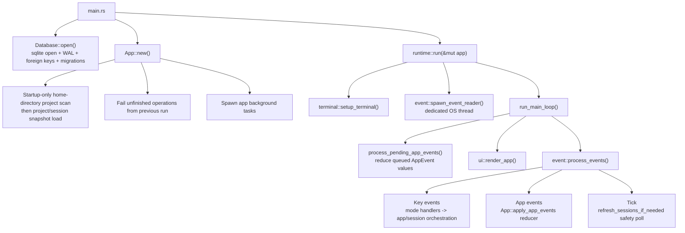
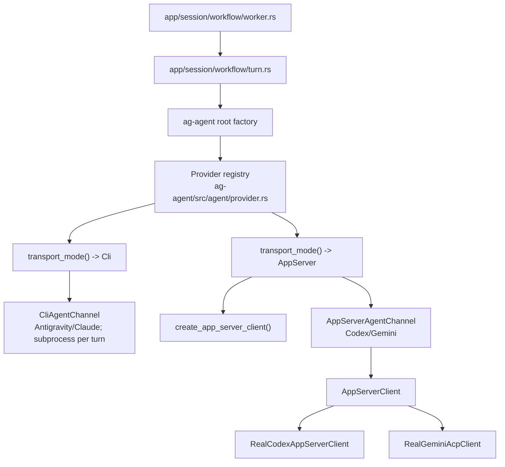

+++
title = "Runtime Flow"
description = "Goals, workspace map, runtime event flow, background tasks, and agent channel transport model."
weight = 2
+++

 This guide documents Agentty's
runtime data flows at a high level: the foreground event loop, reducer/event buses,
session-worker turn execution, merge/rebase/sync orchestration, and background tasks.
Implementation details live in the module docstrings; this page explains how the pieces
fit together.

<!-- more -->

## Architecture Goals

 Agentty runtime design is built around
these constraints:

- Keep domain logic independent from infrastructure and UI.
- Keep long-running or external operations behind trait boundaries for testability.
- Keep runtime event handling responsive by offloading background work to async tasks.
- Keep AI-session changes isolated in git worktrees and reviewable as diffs.
- Decouple agent transport (CLI subprocess vs app-server RPC) behind a unified channel
  abstraction.

## Workspace Map

| Path                      | Responsibility                                                       |
| ------------------------- | -------------------------------------------------------------------- |
| `crates/ag-forge/`        | Shared forge review-request library (`gh`/`glab` adapters).          |
| `crates/ag-git/`          | Shared git, worktree, sync, rebase, and merge library.               |
| `crates/ag-agent/`        | Shared agent provider models plus channel and transport boundaries.  |
| `crates/ag-protocol/`     | Shared structured response protocol and turn prompt payload library. |
| `crates/ag-tui-text/`     | Shared markdown, mermaid, wrapping, and truncation text helpers.     |
| `crates/agentty/`         | Main TUI application crate.                                          |
| `crates/testty/`          | TUI end-to-end testing framework.                                    |
| `crates/ag-xtask/`        | Workspace maintenance and automation commands.                       |
| `docs/site/content/docs/` | End-user and contributor documentation.                              |

## Main Runtime Flow

 Primary foreground path from process start
to one event-loop cycle:

 Foreground loop details:

- `run_main_loop()` drains one bounded batch of queued app events before draw so touched
  sessions sync from their live handles without a full list-wide sweep every frame.
- `run_main_loop()` owns `PresentationState`; input measurement and `ui::render_app()`
  share its bounded `RenderCacheStore`. `App` neither constructs Ratatui frames nor owns
  render caches.
- `process_events()` waits on terminal events, app events, or tick, then drains a
  bounded batch of queued terminal events to avoid one-key-per-frame lag.
- Tick interval is `50ms`; metadata-based session reload fallback is `5s`.

## Data Channels

 Agentty uses four primary runtime data
channels:

- **Terminal `Event` channel** (`runtime/event.rs`): the event-reader thread forwards
  `crossterm` events into `runtime::process_events()`.
- **App event bus** (`AppEvent`): background tasks and workers send typed events into
  the `App::apply_app_events()` reducer for safe cross-task state mutation.
- **Turn event stream** (`TurnEvent`): `AgentChannel` implementations stream transient
  loader-thought and PID updates to the session turn consumer while the final transcript
  waits for the completed turn result.
- **Session handles** (`SessionHandles`): shared `Arc<Mutex<...>>` transcript, status,
  PID, and queued-message state. Handles are the single source of truth for live session
  data; the reducer re-projects them into render snapshots on `SessionUpdated` without a
  full DB reload.

## App Event Reducer

 `App::apply_app_events()` is the
single reducer path for async app events. Each cycle drains queued events up to a
bounded budget, coalesces them into one `AppEventBatch` (refresh, git status, model, and
loader updates), and applies side effects in stable order. Key behaviors:

- Refresh events set reload flags instead of reloading inline; the expensive
  home-directory project discovery runs only during `App::new()`.
- Git-status and review-request events carry a sync-context generation so stale
  completions are discarded after the active project or session changes.
- Diff markdown preview reads carry the selected session, path, and request generation
  in `AppEvent::DiffPreviewLoaded`; the reducer applies them only to the matching
  loading diff or help-overlay snapshot.
- Externally merged review requests transition sessions to read-only `Merged`; only a
  successful user-triggered sync of the request's local target advances them to `Done`.
  Closed requests transition editable sessions to `Canceled`.
- Terminal statuses (`Done`, `Canceled`) drop per-session worker senders so workers can
  shut down their runtimes.

## Session Chat Rendering

 The session chat panel is rendered
by `crates/agentty/src/ui/page/session_chat.rs` and
`crates/agentty/src/ui/component/session_output.rs`. The durable transcript is the
ordered `session_message` rows (typed `UserPrompt`, `AssistantAnswer`, `WorkflowNotice`,
rows). Replaceable output lives in the session's typed transient-message slots instead
of render-time visibility predicates. Each slot has stable identity, typed content, an
output anchor, and an explicit lifecycle. Reducer paths upsert or retract summary,
focused-review, workflow-feedback, manual-branch-publish, and published-branch-sync
slots; starting a later turn clears older turn-scoped slots in one place.

Manual branch and review-request publishing returns from its branch-name popup to
`AppMode::View` before spawning the task. Its session-scoped transient slot renders the
animated progress row, then the terminal reducer event replaces that row with inline
success or failure output without changing whichever app mode is active at completion.
Successful review-request creation retracts the transient row and appends its
single-line URL result as a durable `WorkflowNotice` at the current transcript position.
Later turns therefore leave the result in its original history position instead of
reconstructing a transient between turns. The manual task holds the same per-session
branch-operation lock as completed-turn auto-push for its full push and forge-metadata
workflow.

Published-branch auto-push completion sends one terminal reducer event carrying its
`WorkflowNotice`. After accepting the current operation identifier, the reducer persists
the notice, retracts the matching loading slot, and projects the durable transcript
message in the same batch. Stale completions therefore cannot write a notice, and no
frame can contain both the progress row and completed notice. The output-layout cache
keys the transient-store version rather than maintaining a separate fingerprint for
every temporary channel. Structured clarification questions render in the bottom
question panel (`AppMode::Question`), not inside the output component.

Runtime owns one shared `RenderCacheStore` for markdown, diff, and session-output layout
caches. The session-output cache keeps a bounded stable-body layer keyed by the typed
transcript's cached content hash, width, theme, queued input, and transient-message
version. Workflow-only status changes such as `Review` entering `Rebasing` reuse that
body and append only the dynamic status tail. Changes in this area should keep caches
bounded and route layout/count helpers and the final paint path through the same cached
derived data instead of recomputing the render twice per frame.

## Session Turn Data Flow

 From prompt submit to persisted result:

1. Prompt mode drains presentation-owned composer state into a typed submission, or
   resolves a presentation-owned slash-menu selection. `app/prompt_intent.rs` executes
   the requested session workflow and returns typed composer/navigation effects; prompt
   mode applies those effects to `AppMode`.
1. `start_session()` (first prompt) or `reply()` (follow-up) persists the command in
   `session_operation` and enqueues it on the per-session worker.
1. The worker marks the operation `running`, checks cancel flags, verifies worktree
   isolation, and delegates to `workflow/turn.rs` or the queued session-sync workflow.
   An **InProgress** sync request can enqueue only through the sender already owned by
   that worker; it cannot lazily create another worker. The same in-memory chat queue
   accepts follow-up prompts while the worker is **InProgress** or **Rebasing**, and
   drains them after the active operation. The receiver is checked between every pair of
   retractable queued-chat turns, so a command received during one chat turn waits for
   that turn and then runs before the remaining chat queue.
1. Immediately before a chat turn, the worker resolves the persisted personality ID
   through `PersonalityCatalogClient`. The catalog scans only the session worktree's
   `.agents/agents` directory. The worker compares the resolved prompt fingerprint with
   the last successfully applied personality and prepares an active, updated, cleared,
   or unchanged personality payload.
1. `workflow/turn.rs` builds a `TurnRequest`, including that personality payload, and
   calls `AgentChannel::run_turn()`, which streams `TurnEvent` values (loader updates)
   and returns a `TurnResult`.
1. `workflow/post_turn.rs` appends the final assistant transcript output, then
   `TurnPersistence::apply(...)` transactionally stores the summary payload, question
   payload, token-usage deltas, and provider conversation markers.
1. `AppEvent::AgentResponseReceived` carries the reducer projection so the active
   session updates without a forced reload. If persistence fails, the worker appends a
   recovery error and falls back to a durable-state reload.
1. When `a` requests the session-type selector, the app asks `GitClient` to verify the
   effective pre-commit hook whenever the project contains `.pre-commit-config.yaml` or
   `.pre-commit-config.yml`. A missing executable hook opens a warning overlay with
   installation commands and future-enforcement guidance. `Enter` continues to the
   selector; `Esc` or `q` returns to the list without creating a session.
1. Auto-commit keeps one evolving commit on the session branch: the first file-changing
   turn creates it, later turns regenerate the message from the cumulative diff with the
   project's `Default Fast Model` and amend `HEAD`; an empty amend drops the reverted
   commit. After a successful normal commit, the app checks hook readiness again and
   persists the first copy of each distinct `[Commit Warning]` when configured
   validation did not run, avoiding repeated identical notices across later turns.
   Installed-hook failures continue through normal commit error handling. The session
   title is synced from the commit text.
1. If the session already tracks a published upstream branch and no chat message or sync
   operation is queued, a per-session branch-operation guard transfers to the detached
   auto-push until it finishes. Every sync request holds the same guard through status
   transition and operation persistence, so its rebase is observed before publish starts
   or waits until the active publish completes. Post-rebase auto-push transfers the
   guard again, preventing a subsequent sync from starting until that publish finishes.
   After a successful push, linked review-request and commit metadata are resolved and
   refreshed. Agentty reads the current remote title and description after each
   successful push and sends them, the cumulative session summary, and the generated
   commit metadata through one semantic reconciliation prompt. The prompt keeps the
   title byte-for-byte stable unless the primary objective changed materially and
   updates the description while retaining intentional user additions such as issue
   links, checklists, instructions, and context. No metadata baseline is persisted. A
   proposed description that omits any substantive current line is rejected. Before
   editing, the forge adapter reads the remote fields again and applies each changed
   field only if it still matches the value used during reconciliation. This is
   best-effort concurrent-edit protection: GitHub and GitLab metadata updates have no
   atomic version precondition, so a manual edit made after the final read can still be
   overwritten. Lookup or evaluation failures append the existing warning notice instead
   of being discarded. The push result is persisted as a durable transcript notice and
   atomically replaces the matching transient progress row when the reducer applies the
   terminal sync event.
1. Completed stacked-parent turns fan out `SessionCommand::Rebase` to review-ready
   materialized children so child branches replay onto the latest parent branch.
1. Diff metadata is refreshed before the final status becomes `Review` or `Question`
   (failures return to `Review`). Successful refreshes persist line totals, size, and
   explicit empty/present state so binary and metadata-only diffs remain discoverable.
   Failed refreshes persist unknown availability without erasing the last known totals,
   allowing the diff view to surface its Git diagnostic.

### Operation Lifecycle and Recovery

 Turn execution is durable and
restart-safe:

- Before enqueue: insert `session_operation` row (`queued`).
- Worker transitions: `queued -> running -> done/failed/canceled`.
- Cancel requests are persisted and checked before command execution.
- On startup, unfinished operations are failed with reason `Interrupted by app restart`,
  interrupted rebase operations abort stale in-progress git rebase metadata, and
  impacted sessions are reset to `Review`. Pending post-merge stacked-child syncs are
  requeued.

### Status Transition Rules

 Runtime status transitions enforced by
`Status::can_transition_to()` or explicit cancellation paths:

- `Draft -> InProgress` (first prompt)
- Draft session in `Draft` status -> `Canceled` (list-mode cancel before first turn)
- `Review/Question -> InProgress` (reply)
- Root `Review/AgentReview -> Review` (forked session snapshot opens as a new
  review-ready session)
- `Review -> Queued -> Merging -> Done` (local merge queue path for sessions without a
  linked review request)
- `Review/AgentReview -> Rebasing -> Review/Question` (session sync path; starting from
  `AgentReview` cancels pending focused-review output)
- `InProgress -> Rebasing -> Review/Question` (session sync requested during a running
  turn is queued on the session worker and starts after the active turn)
- `Review/Question -> Canceled`
- `InProgress -> Review` (user stops the current turn)
- `InProgress -> Canceled` (list-mode cancel stops the running turn)
- `InProgress/Rebasing -> Review/Question` (post-turn or post-sync)

Stacked-session gates are enforced before branch work starts: a stacked draft
materializes only when its parent is review-ready and no stack member is busy; parent
merge-queue and slash-command branch work are blocked while a materialized child remains
linked; parent sync and replies are allowed when materialized children are idle. All
checks are computed from one stack snapshot so parent, child, and sibling decisions
share the same busy state.

## Agent Channel Architecture

 Session workers are transport-agnostic through
`AgentChannel`:

 Key types
(`crates/ag-agent/src/channel/contract.rs`, re-exported by the `ag-agent` crate root,
with prompt payloads owned by `ag-protocol` and re-exported through
`domain/turn_prompt.rs`):

| Type               | Purpose                                         |
| ------------------ | ----------------------------------------------- |
| `TurnRequest`      | Turn inputs, continuation, and personality.     |
| `TurnContinuation` | Fresh, replay, or provider-resume context.      |
| `TurnEvent`        | Thought, completion, failure, or PID event.     |
| `TurnResult`       | Assistant output, usage, and provider id.       |
| `AgentRequestKind` | Start, resume, account-read, or utility intent. |

 App-server providers return a
`provider_conversation_id` in `TurnResult`. Post-turn application persists it, along
with an instruction-bootstrap marker. The next worker turn constructs one
`TurnContinuation`, so channels receive only valid combinations for a fresh request,
transcript replay, or native provider resume and can choose between resending the full
prompt contract and a compact reminder.

Bootstrap and replay requests include the active personality after the protocol
instructions. Delta-only requests include it only when the selection or prompt body
changed, and emit a clear marker when the personality was removed. Successful turn
persistence records the applied ID and prompt fingerprint so retries do not advance the
delivery state prematurely.

Codex keeps its app-server runtime resident between turns. Gemini ACP shuts down after
each completed turn and replays the persisted transcript when a follow-up starts, so
review-ready sessions do not accumulate idle Gemini processes. Both app-server providers
run in isolated process groups; shutdown terminates the runtime and any tool or MCP
descendants it spawned.

 Session isolation guards:

- Before every worker-dispatched turn, `workflow/isolation.rs` verifies the session
  folder exists, is checked out on the expected `wt/<hash>` branch, and resolves to a
  linked worktree with a distinct main checkout.
- The worker snapshots the main checkout's tracked-file git status before each turn and
  inspects that status again after the turn. It appends a `[Main Checkout Warning]`
  transcript notice only when the status changed and remains dirty, so clean `HEAD`
  movement from parallel session merges and unchanged pre-existing dirt do not add
  transcript noise.
- Merge and `sync main` workflows require a clean target checkout before changing
  base-branch state.
- Provider permission policies are scoped per transport: Codex turns run with a
  non-interactive approval policy and workspace-write sandbox. Agentty immediately
  declines MCP elicitations and grants no additional permission requests so an
  app-server request cannot leave the turn waiting for interactive input. Codex tool
  input requests receive an empty answer set for the same reason. Claude turns receive
  session-scoped settings that deny writes to the known main checkout, Gemini ACP
  requests prefer one-shot allow options, and CLI-backed providers run from the session
  worktree process directory.

## Agent Interaction Protocol Flow

 Provider output is normalized to
one structured response protocol (`answer`, `questions`, `review_comment_outcomes`, and
optional `summary`):

1. Prompt builders in `crates/ag-agent/src/agent/` ask `crates/ag-protocol/src/` to
   prepend the shared protocol preamble with a self-descriptive JSON schema. CLI turns
   resend it every turn; persistent app-server turns reuse a compact reminder when the
   provider context already received the full bootstrap, and replay the transcript when
   provider context was lost. Transcript replay frames the new prompt as a follow-up in
   the whole-session context, so rollback wording applies to changes made during the
   Agentty session unless the user explicitly says otherwise. `crates/ag-protocol/src/`
   owns the shared response model, schema, parser diagnostics, protocol prompt
   envelopes, repair prompts, and turn prompt payloads.
1. Channels emit transient loader updates as `TurnEvent::ThoughtDelta` values while the
   turn runs; assistant transcript output is appended once from the final parsed result.
1. Transports that enforce the schema natively receive it through
   `SchemaRequiredPolicy`. Codex needs every property listed in `required`; validators
   that enforce `required` literally, such as Claude's `--json-schema`, receive
   `MinimumProtocolKeys` so only `answer` is mandatory and a reply that omits other
   optional fields still validates. Ordinary turns leave `review_comment_outcomes`
   empty; review-comment prompts provide the only accepted thread-ID allowlist.
1. Final output must parse as the shared protocol JSON object. Claude, Gemini, and Codex
   session turns fail closed on invalid output; Antigravity tries one protocol-repair
   retry and then preserves non-empty plain text as `answer`.
1. Turn errors are rendered into the session transcript, so no failure surface
   reproduces provider output. A rejected payload surfaces the parse reason plus
   *derived* diagnostics only (response sizing, parser location, visible top-level
   keys); the payload text itself is never quoted. Live `TurnEvent::ThoughtDelta`
   updates carry no provider output either. The transcript notice is length-capped as a
   backstop. The one deliberate exception is a CLI process that exits non-zero: its
   error keeps a bounded tail of the provider stream, because a crashed provider's own
   stderr (authentication failure, missing binary) is the only thing that explains the
   exit.
1. Provider-specific transport, stdin-vs-argv prompt delivery, strict parsing policy,
   and thought-phase handling are centralized in the provider registry
   (`crates/ag-agent/src/agent/provider.rs`).

## Clarification Question Loop

 Question-mode loop:

1. The worker receives a final parsed response containing clarification `questions`,
   persists them, and sets session status `Question`.
1. The reducer switches the active view to `AppMode::Question` when that session is
   focused.
1. The user answers each question (a blank free-text answer stores `no answer`).
1. Runtime builds one `Clarifications:` follow-up prompt listing each question and
   answer, and submits it as a normal reply turn.

Pressing `Ctrl+C` instead ends question mode immediately, restores the session to
`Review`, and does not send the generated clarification reply.

## Background Task Catalog

 Background execution paths and
their triggers:

- **Terminal event reader thread** (runtime startup): polls crossterm and forwards
  terminal events into the runtime loop.

- **Project sync orchestrator** (startup, project switch, ticks, list-mode `s`): owns
  one command queue per active project that serializes read-only `git fetch`,
  ahead/behind snapshots, review-request refreshes, and manual pull/rebase/push
  commands. Forge CLI calls are bounded to 30 seconds and cancel their subprocess on
  timeout so one unavailable provider cannot retain the queue indefinitely.

- **Version check** (startup): reports npm update availability.

- **Per-session worker loop** (first command enqueue): serializes all turn commands per
  session and manages channel lifecycle.

- **Per-turn event consumer** (every turn): consumes the `TurnEvent` stream and
  coalesces loader updates.

- **CLI stdout/stderr readers** (every CLI-backed turn): stream subprocess output into
  loader updates and final buffers.

- **App-server stream bridge** (every app-server turn): bridges provider stream events
  into the unified turn event stream.

- **Clipboard image persistence** (prompt image paste): reads a copied PNG file,
  clipboard image, or PNG path from `ag-clipboard` via `spawn_blocking`, stores it under
  `AGENTTY_ROOT/tmp/<session-id>/images/`, and inserts an inline `[Image #n]`
  placeholder. The backend supports macOS pasteboard, X11 reads, and Wayland reads via
  `wl-paste`; missing or unsupported backends report an inline paste error.

- **Session title generation** (first start turn): runs a one-shot title prompt and
  persists a concise generated title.

- **At-mention file indexing** (`@` in prompt or question input): lists session files
  for the mention picker, falling back to the project root for unstarted drafts.

- **Session-size refresh** (`Enter` on a session in list mode): recomputes the diff-size
  bucket off the key-handling path.

- **Branch-publish action** (session view `p`): returns to interactive session chat,
  then pushes with `--force-with-lease` and creates or refreshes the forge review
  request in the background; progress and completion render inline for that session,
  while the shared per-session branch-operation lock serializes it with auto-push.

- **Deferred session cleanup** (session delete): removes the worktree folder and branch
  after database deletion.

- **Session fork** (root session view `F`): creates a new worktree branch from the
  source session branch, copies `session_message` rows in one transaction, clears
  provider/review-request/stack linkage and source diff metadata, refreshes diff state
  directly from the new worktree, and marks the fork for one-time transcript replay
  before its first reply. Stacked child sessions do not expose this action.

- **Focused review assist** (entering review): runs the review prompt with the diff and
  saved user/agent chat history, then stores the result or error.

- **Sync-main workflow** (list-mode `s`): pull/rebase/push of the project branch through
  the sync orchestrator, with assisted conflict resolution.

- **Session merge task** (merge confirmation): rebase, squash merge with the session
  commit message, worktree cleanup.

- **Session sync task** (view-mode `r`, stacked-parent fan-out): assisted rebase of the
  session branch; post-merge stacked-child syncs use `git rebase --onto` with the
  recorded parent commit as the old base.

Title generation, focused review, commit-message generation, and conflict assistance
submit owned `OneShotRequest` values through `OneShotClient`. Its production
implementation owns provider routing, CLI/app-server selection, protocol repair, runtime
cleanup, and usage aggregation; app workflow tests inject `MockOneShotClient` without
constructing provider commands.

## Sync, Merge, and Rebase Flows

 Project and session git workflows
use shared boundaries (`GitClient`, `FsClient`, assist helpers) with distinct
orchestration paths:

- `sync main`: selected project branch pull/rebase/push with optional assisted conflict
  resolution, serialized through the shared sync orchestrator.
- Session merge: queue-aware workflow for sessions without a linked forge review request
  — assisted rebase first, squash commit into the base branch reusing the session-branch
  `HEAD` commit message, then worktree cleanup and status `Done`. Once a review request
  is linked, the shared merge-eligibility policy hides the local action and rejects
  direct queue attempts.
- Session sync: assisted rebase onto the local base branch (unpublished) or the
  published upstream's remote base ref (published). Rebase-conflict prompts run through
  the existing session channel so the provider keeps conversation context while Agentty
  owns staging and `git rebase --continue`.
- Review-request publish: push with `--force-with-lease`, then create or refresh the
  forge review request through `ReviewRequestClient`; only open same-branch requests are
  reused. The task does not own the active app mode, so its completion cannot interrupt
  later navigation. It holds the same branch-operation lock as post-turn auto-push, so
  overlapping requests queue rather than running concurrent force-pushes.
- Background review-request sync: review-ready sessions with a published branch or
  linked request are polled; merged requests persist the reviewed session-head hash and
  move the session to read-only `Merged`, while closed requests move to `Canceled`.
  `Merged` remains in the Active group and background refresh never archives, cleans up,
  or restacks it. The manual target-branch sync path refreshes forge state before its
  git work and applies terminal review updates only after sync succeeds. It then
  finalizes matching `Merged` sessions by durably detaching stacked children, moving the
  parent to `Done`, emitting child-restack work, and scheduling tracked worktree
  cleanup. The successful `SyncMainOutcome` owns the exact synced branch, so the event
  model cannot represent success without a finalization target. Restack or archival
  persistence failures leave the parent safely in `Merged` and are listed in the sync
  completion popup for retry. A failed sync or a successful sync of another branch
  leaves the merged stack unchanged. Cleanup-critical git subprocesses are cancellable
  and bounded to 30 seconds; confirmed shutdown shares a five-second grace period across
  all tracked cleanup tasks before canceling unfinished work. The Inbox tab loads
  comment snapshots on demand with generation-scoped deduplication. Session view also
  loads comments on demand for its linked review request: `AppMode::ReviewComments`
  renders immediately with a loading state, `TaskService` resolves the session worktree
  remote through the injected git/forge boundaries, falls back to the persisted
  review-request URL after terminal-session worktree cleanup, and uses the matching
  `AppEvent` to update only the still-open comments page. Inline code context is derived
  from the already loaded current diff. From a reply-capable session, `a` marks an
  actionable thread to address, `d` marks it to deny, and `Enter` renders every marked
  thread plus its requested action into one `TurnPrompt`. The selected forge thread IDs
  are recorded in turn metadata. Post-turn handling accepts only deduplicated `fixed`
  outcomes with an allowlisted ID and nonblank reply. After auto-commit and a successful
  published-branch push, the worker posts each reply and then resolves that thread
  through `ReviewRequestClient`; failed pushes never mutate forge thread state.
- Assigned-issue refresh: the Issues tab resolves the active project remote and runs a
  repository-scoped, generation-scoped `gh search issues` task through
  `ReviewRequestClient`; stale completions are discarded before the list cache is
  rendered. Opening a selected row starts a generation-scoped `gh issue view` task for
  base metadata and the description; the detail query does not request comments. The
  issue-detail `a` action creates a regular session, submits an initial prompt
  containing the issue URL, and opens the new session view. Creation failures restore
  the issue-detail mode with a distinct inline action error that survives a late detail
  result. Submission failures after creation append a transcript error and open the
  recoverable session instead of hiding it or escaping through the runtime key-handler
  boundary.

## Persistence and Recovery Boundaries

 Persistence invariants that shape
runtime flow:

- DB opens with SQLite WAL and `foreign_keys = ON`, then embedded migrations run at
  startup.
- Session snapshots in memory are authoritative for rendering; DB is authoritative for
  restart recovery.
- Shared session handles provide low-latency updates between DB reloads.
- Event-driven refresh is primary; metadata polling is fallback safety only.
- External integrations (`GitClient`, `ReviewRequestClient`, `AppServerClient`,
  `AgentChannel`, `EventSource`, `FsClient`, `TmuxClient`) isolate side effects and
  enable deterministic tests.
