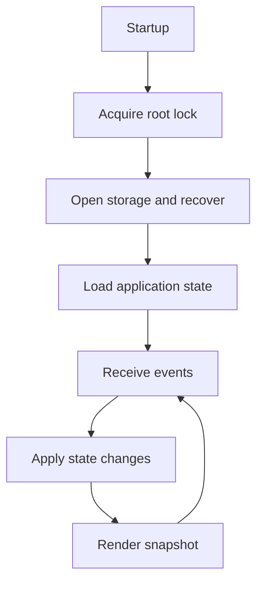
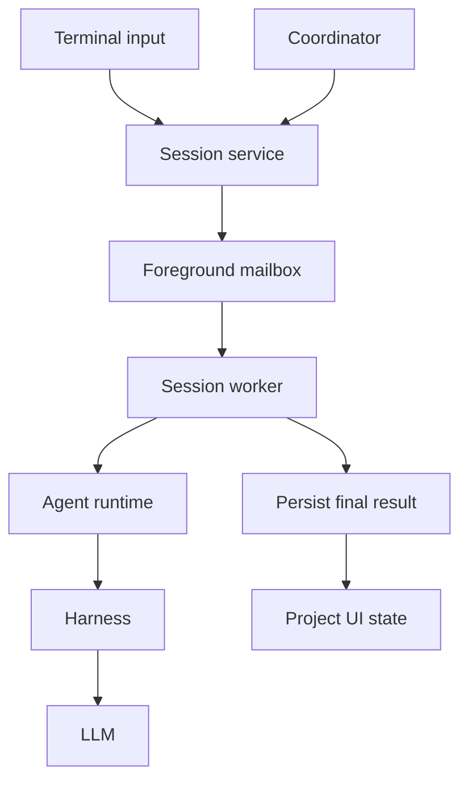

+++
title = "Runtime Flow"
description = "Event handling, session execution, background work, and recovery."
weight = 2
+++

 Agentty keeps terminal interaction
separate from session execution and external work. This page explains their
coordination; source module documentation holds implementation details.

<!-- more -->

## Architecture Goals

- Keep domain logic independent of infrastructure and rendering.
- Run external work asynchronously behind testable boundaries.
- Isolate session changes in Git worktrees.
- Route all model work through workers and runtime contracts.

## Workspace Map

See [Module Map](@/docs/architecture/module-map.md) for crate and layer ownership, and
[Execution](@/docs/core-components/execution.md) for the model execution contract.

## Main Runtime Flow

 Startup acquires exclusive ownership of the
Agentty root before opening storage and recovering operations. The OS lock remains held
for the application lifetime, preventing another instance from recovering live work.

Session creation reserves an identity and captures project settings before opening the
composer. Background setup prepares the worktree without changing navigation or input.
Saved prompts remain recoverable until execution start, transcript persistence, and
prompt acknowledgment commit together. Failed setup or handoff remains retryable;
operations that began executing are not automatically replayed.

Question answers likewise claim the persisted question set before enqueueing a
continuation. A rejected enqueue restores the claim. Cancellation coordinates setup and
resource cleanup so a late preparation result cannot revive canceled work.

 The foreground loop drains bounded batches
of application and terminal events, renders an immutable snapshot, and waits for more
work. It owns presentation state and shared render caches. Event-driven refresh is
primary; periodic polling provides recovery from missed updates.

## Session Channel Composition

Composition injects `SessionRunFactory`, which returns a worker-owned
`SessionRunClient`. The worker obtains its adapter from `ag-runtime`; application
workflows do not retain raw adapters. `SessionWorkerHandle` owns the mailbox, task,
ordering, and wakeups. Hosts supply command policy and ordered effects.

Model changes pause scheduling, wait for active work, and atomically save selection and
conversation reset. Failed saves preserve pending work. Successful switches retire the
old runtime and discard pending work before a new channel is composed.

## Data Channels

| Channel                 | Carries                                     |
| ----------------------- | ------------------------------------------- |
| Terminal events         | Keyboard and terminal input                 |
| `AppEvent` bus          | Background results for the reducer          |
| Session runtime mailbox | Programmatic lifecycle requests and replies |
| `TurnEvent` stream      | Transient progress and process identity     |
| Shared session handles  | Live transcript, status, and queued work    |

Workers and handles survive project switches; project reloads replace display snapshots,
not execution ownership.

## App Event Reducer

 `App::apply_app_events()` is the
single application path for background state changes. It batches updates and orders
effects around snapshot mutation. Expensive reloads and Git reads stay off the input
path.

Results carry session, operation, or request generations. The reducer rejects stale
completions after navigation, cancellation, or replacement. Review claims and
changed-diff identity persist together, so restart can resume pending review without
reviewing an unchanged diff again. Accepted rebases invalidate review evidence before
Git mutation; failed admission preserves it.

Terminal session states release workers. Forge updates may mark a session `Merged`, but
only a successful manual target sync archives it as `Done`.

## Session Chat Rendering

 Durable transcript rows contain user
prompts, final answers, and workflow notices. Typed transient slots hold progress,
queued actions, and review output with explicit placement and lifetime. Chat messages
and workflow actions share one submission sequence for both display and execution.

Completion replaces matching progress with its result in one reducer update. Stale
results cannot persist notices. Rendering reads snapshots; it does not perform workflow
side effects. Runtime-owned caches share derived layout between scrolling and painting.

Resource sampling runs behind `ResourceClient`. Process creation identities guard
against PID reuse. Temperature sampling runs independently and expires stale readings,
so sensor I/O cannot block accounting or terminal input. Accounting PIDs never authorize
cancellation.

## Session Turn Data Flow

 `ag-session::SessionService` provides the
frontend-neutral lifecycle API. Agentty's bounded session-runtime mailbox executes its
requests against the foreground session manager without sharing `App` behind a mutex.
User and coordinator handles have distinct managed-session permissions.

`ag-worker::RuntimeConfig` captures each harness's subagent, tool, and MCP policy.
Workers resolve that policy for session turns and utilities before runtime dispatch;
adapters preserve it across retries and repairs, reject unsupported explicit controls,
and restart retained processes when their startup policy differs. Per-turn filesystem
permissions remain independent. See
[Execution Policy](@/docs/core-components/execution.md#execution-policy) for controls,
defaults, and adapter support.

1. Runtime converts composer state into a typed application request.
1. The application persists an operation before sending it to the session worker.
1. The worker checks cancellation, preparation, and isolation, then executes in shared
   submission order. Active branch actions reuse the existing worker.
1. Turn preparation resolves current permission, reasoning, style, speed, and
   personality settings and submits a `TurnRequest` through `SessionRunClient`.
1. Progress remains transient. Post-turn handling persists the answer, questions, usage,
   and provider continuation state before projecting them into the UI.
1. Ordered post-processing commits changes, coordinates publishing and stacked children,
   refreshes diff metadata, and enters `Review` or `Question`.

Controllers skip branch mutation; researchers retain diff evidence but skip commits and
integration. [Orchestrator Design](@/docs/architecture/orchestrator.md) owns campaign
planning, remediation, verification, and integration details.

### Operation Lifecycle and Recovery

 Operations move from `queued` to
`running`, then `done`, `failed`, or `canceled`. Stable coordinator operation IDs
prevent duplicate delivery. Persisted cancellation takes precedence at terminal
settlement.

Startup updates retired model selections and reconciles unfinished operations before
admitting sessions. Interrupted rebases are cleaned up, affected sessions return to
`Review`, and abandoned operations fail with an interruption reason. Missing worktrees
do not prevent reconciliation; storage or Git failures stop startup for retry.
Previously executed mutating requests are never blindly replayed.

### Status Transition Rules

 `Status::can_transition_to()` and workflow
eligibility policies govern lifecycle changes. See
[Session Lifecycle](@/docs/usage/workflow.md#session-lifecycle) for visible states.
Stack operations evaluate one shared snapshot of parent, child, and sibling activity
before starting branch work.

## Agent Channel Architecture

 External adapters implement transport-neutral
contracts. Composition selects the adapter; workers own its execution and cleanup.

 Types from `ag-contracts`:

| Type               | Purpose                                     |
| ------------------ | ------------------------------------------- |
| `TurnRequest`      | Inputs, permissions, settings, personality  |
| `TurnContinuation` | Fresh, replay, or native-resume context     |
| `TurnEvent`        | Progress, completion, failure, PID updates  |
| `TurnResult`       | Answer, usage, provider identity            |
| `AgentRequestKind` | Start, resume, account-read, utility intent |

 Successful turns persist
provider conversation identity and the applied instruction fingerprint. Matching
continuations can use compact reminders; changed policy or lost context requires
bootstrap or replay. Personality changes follow the same successful-persistence
boundary.

Codex and Antigravity retain resident runtimes between turns. Gemini shuts down after
each turn and replays stored history. Managed runtime cleanup owns provider subprocesses
and their descendants.

 Every turn validates its worktree and
expected branch. Main-checkout status is compared before and after work, warning on new
tracked dirt. Base mutations require a clean target. Permissions travel with each
request, and runtime identity includes permission mode so writable processes cannot be
reused for read-only work. Provider-specific limits are described in
[Agents & Models](@/docs/agents/backends.md).

## Agent Interaction Protocol Flow

 `ag-protocol` defines shared
responses, schemas, diagnostics, prompt envelopes, and repair requests. Session turns
return `answer`, `questions`, `review_comment_outcomes`, `subtasks`, and
`verification_verdicts`; utilities and reviews use narrower request-specific schemas.

Policy is delivered separately from user input and evidence. Workspace paths, history,
malformed output, and diagnostics are encoded as data; quoted instructions never
suppress policy. Long-history replay uses bounded excerpts and a complete temporary
archive, without changing canonical history. Archive cleanup requires trusted ownership
evidence.

Adapters prefer native schema enforcement and fail closed when output cannot be
validated. Bounded repair attempts retain the request's schema and permission policy and
prohibit task execution. Invalid output exposes derived diagnostics rather than raw
payloads; nonzero CLI exits retain bounded output needed to explain launch failures.
Provider transport and parsing differences remain inside `ag-agent`.

## Clarification Question Loop

 Persist questions before entering
`Question`. Runtime collects answers and submits one continuation through the worker.
Ending question mode without answering restores `Review` and wakes queued branch work;
it does not submit an empty generated reply.

## Background Task Catalog

| Work                                | Trigger                                   |
| ----------------------------------- | ----------------------------------------- |
| Project status and forge refresh    | Startup, project switch, periodic refresh |
| Agentty update                      | Startup and hourly                        |
| Agent CLI discovery and update      | Startup                                   |
| Worktree preparation and cleanup    | Session lifecycle                         |
| File indexing and image capture     | Composer interaction                      |
| Full diff and Markdown preview      | Inspection request                        |
| Title and commit-message generation | Session input and changed turns           |
| Focused review                      | Eligible changed diff or manual request   |
| Publish, sync, merge                | User request or ordered workflow          |

All model-backed tasks use `RunClient` or `SessionRunClient`. Subprocesses have bounded
execution and cleanup, and background results retain their original session/project
identity.

Focused review batches original diffs, checks cross-file interactions, then reconciles
findings. Worker-owned runtime reuse preserves isolated conversation context. One
deadline and provider-call budget cover preparation, retries, and repair. Successful
calls persist for partial retries; generation checks reject stale evidence. Failed
coverage remains explicit rather than being presented as a completed review.

Commit-message generation summarizes large diffs and has a bounded fallback using
changed filenames, conversation, and the existing commit message. It never discards
worktree changes to fit a prompt.

## Sync, Merge, and Rebase Flows

 Git and forge effects stay behind
`GitClient` and `ReviewRequestClient`:

- **Project sync** serializes captured project requests, coalesces duplicates, and gives
  existing merges priority. Its base-checkout guard blocks conflicting mutations without
  blocking navigation or isolated session turns.
- **Local merge** rebases and squash-merges an unlinked session, preserving its commit
  message. Linked review requests are ineligible.
- **Session sync** rebases onto the local or remote base. Agent assistance resolves
  conflicts; Agentty owns staging, hook checks, continuation, and bounded repair.
- **Publishing** shares branch ownership with sync and auto-push. Force-with-lease
  protects remote changes. Existing review descriptions are preserved, with best-effort
  concurrent-edit checks before metadata updates.
- **Remote merge** marks `Merged`. Successful manual target sync persists archival and
  child-restack intent before cleanup; failed persistence leaves work retryable.

Review-comment turns validate a complete allowlisted outcome batch before forge effects.
Outcomes persist with the answer and bind to the successful fix commit. Replies and
resolutions run only after that exact tip is pushed. Durable posting markers permit
recovery without duplicate replies; later commits invalidate the batch. Only `fixed`
threads resolve, while `no_change_needed` receives a reply and remains open.

## Persistence and Recovery Boundaries

 SQLite is authoritative for restart
recovery; live handles and immutable snapshots serve rendering. Operation admission,
turn completion, review evidence, and cleanup intent must persist before their dependent
side effects. Recoverable failures remain visible instead of claiming terminal success.

The standalone harness has separate store, lease, and effect-settlement contracts. See
[`ag-harness` Design](@/docs/architecture/ag-harness-design.md); it is not yet wired
into Agentty's runtime.

## Headless execution ownership

`ag-worker` owns shared ordering, execution, heartbeats, cancellation, and operation
settlement. Hosts supply question policy and ordered Git/forge effects. Closing or
retiring a mailbox settles or cancels outstanding work and notifies callers, including
those using retained handle clones.

Channel owners clean up provider processes after cancellation. Operation completion
includes post-processing, not just model completion. Heartbeat failures are reported
without abandoning live work; startup recovery requires exclusive application ownership.

## Utility run supervision

Utility runs carry purpose, session/project ownership, and inherited cancellation.
Nested utilities execute directly under worker supervision rather than waiting behind
the session command that needs them. Caller drop, parent cancellation, and shutdown stop
owned execution.

Session deletion waits for utilities before removing resources. Durable admission
closure rejects late submissions. Application shutdown gives workers, setup, and cleanup
one shared five-second grace period, then forces remaining runtime resources to drop.
Unfinished records remain available for startup recovery.

See [Execution](@/docs/core-components/execution.md) for the shared contract.
