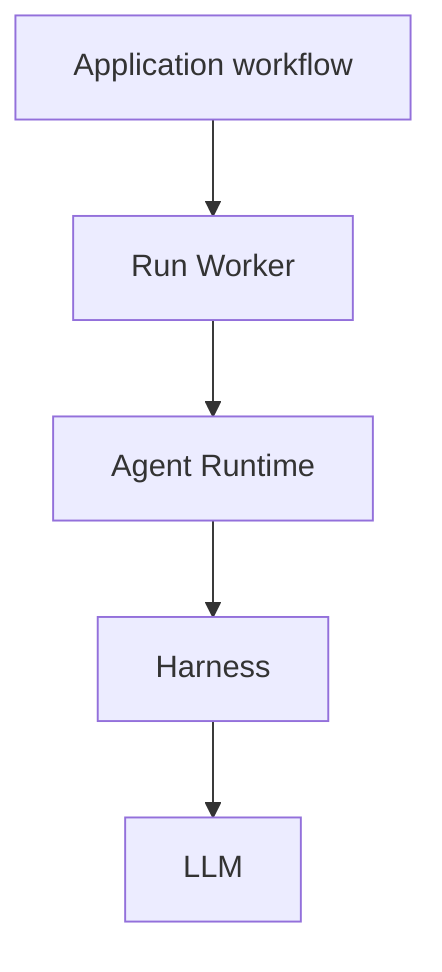

+++
title = "Execution"
description = "How run workers, runtime contracts, harnesses, and LLMs fit together."
weight = 1
+++

Every Agentty request for model reasoning or generation goes through a worker-owned
execution boundary: **Run Worker → Agent Runtime → Harness → LLM**. This includes
session turns, titles, focused reviews, summaries, commit messages, review-request
metadata, and conflict assistance.

## Run Worker

`ag-worker` schedules runs and coordinates heartbeats, cancellation, completion, and
restart recovery. Hosts supply workflow policy and persistence; the worker has no TUI,
Git, or database implementation dependency.

One boundary does not mean one global queue. Session commands remain ordered through
post-processing; isolated utility runs execute concurrently with a bounded capacity. A
session workflow can await a utility child directly without placing that child behind
itself in the session queue.

Application composition configures worker clients, which obtain their adapters through
`ag-runtime`. Session workflows submit turns through `SessionRunClient`; utility
workflows use `RunClient`. Both keep runtime execution and cancellation inside
`ag-worker`. `SessionWorkerHandle` owns the session mailbox, task spawning, wakeups, and
shared submission ordering. The application host supplies pause policy, durable command
admission, and ordered workflow effects. Utility admission is persisted before harness
execution. Records retain the repository, purpose, optional session/project ownership,
and optional parent operation. Draft title generation can belong to a session before any
parent operation exists. Provider retries and protocol repairs remain attempts inside
that supervised run. Per-turn filesystem permissions and provider-call budgets pass
through unchanged.

Dropping a utility caller, canceling its parent, or shutting down the application stops
the owned execution. Nested scopes retain every enclosing cancellation source, including
when a child adds its own token. The worker waits for adapter cleanup before recording
terminal state; provider-turn panics still trigger session shutdown before returning
failure. Session deletion waits for its utilities before removing resources. Terminal
cancellation remains responsive while background resource cleanup waits for those
utilities. Settled session trackers are reclaimed; durable admission closures reject
late submissions even after session deletion. If closure persistence fails, the worker
retains its in-memory cancellation marker. A session rebase shares one cancellation
token across native assistance and utility child calls. Application shutdown closes
admission and gives workers, creation, and cleanup tasks one shared five-second grace
period. At expiry it drops unfinished worker execution and forces detached runtime tasks
to stop, releasing their owned processes. Forced shutdown can leave unfinished records
for startup recovery. Heartbeats track running work; startup recovery fails abandoned
runs under exclusive application ownership rather than automatically replaying
potentially mutating requests.

### Execution Policy

`ag-worker::RuntimeConfig` owns the configured subagent, built-in tool, and MCP policy
for each harness. Hosts use `with_execution_policy` when composing workers. Each worker
captures its configuration and replaces the request's `ExecutionPolicy` before runtime
dispatch; changing configuration affects newly constructed workers. Session turns and
utility runs use the same policy path, including retries and protocol repairs.

The controls are distinct:

- Worker capacity bounds concurrent utility runs; it does not count provider children.
- `max_concurrent_subagents` requests a positive limit on provider-native children,
  excluding the parent. Provider exceptions still apply; this is not a global process
  limit or the orchestration session cap.
- `ToolPolicy` selects inherited behavior, unattended approvals, or a built-in tool
  allowlist. An empty allowlist disables built-ins. Tool names are provider-native;
  read-only permissions remain an independent restriction.
- `McpPolicy` selects inherited MCP configuration or disables configured MCP servers.
  Restricting built-ins alone does not restrict MCP tools.

Defaults preserve existing behavior: Codex and Claude request two concurrent children;
Claude preapproves the existing edit and web tools and disables inherited MCP servers.
Other controls inherit the harness configuration. The current adapters support subagent
limits for Codex and Claude, and tool and MCP overrides for Claude. Explicit unsupported
controls fail before model execution. Codex declining interactive MCP elicitation is
separate from disabling MCP access.

Shared policy types live in `ag-contracts`; `ag-runtime` carries the resolved policy,
and harness adapters translate and enforce it. Provider flags stay in `ag-agent`.
Retained processes must match the requested policy before reuse. The standalone
`ag-harness` tool-call budget remains separate until its runtime adapter is integrated.

## Agent Runtime

`ag-runtime` composes harness adapters, dispatches worker-admitted requests, and
coordinates provider lifecycle. Shared requests, events, settings, and errors live in
`ag-contracts`. `ag-agent` implements the adapter contracts for external CLI and
app-server harnesses, owning transport details and provider resource cleanup.

## Harness

A harness runs the agent loop: it combines context, calls models, executes tools, and
decides when to continue or finish. External agent tools provide this loop today.
`ag-harness` provides a standalone Rust implementation; connecting it through
`ag-runtime` remains separate work.

## LLM

The LLM is the model invoked by the harness for reasoning and generation. It does not
schedule Agentty runs or execute tools itself. `ag-harness` separates model access
behind its `ModelClient` contract; external harnesses manage their own model
integrations.

## Supporting Boundaries

`ag-session` owns session models and the built-in agent/model catalog. `ag-store`
provides SQLite persistence, including the worker's operation records. Agentty wires
these components together and supplies application workflows. Only `ag-worker` depends
on `ag-runtime`, and only `ag-runtime` depends on `ag-agent`. Adapter construction
belongs in `ag-runtime`; applications receive worker handles and configuration. Import
shared execution types from `ag-contracts` and selections from `ag-session`. Worker test
facilities provide scripted adapter injection. Automated source and Cargo metadata
checks reject execution bypasses and forbidden dependencies, including aliases, optional
dependencies, and test dependencies.

See [Module Map](@/docs/architecture/module-map.md) for ownership details and
[Runtime Flow](@/docs/architecture/runtime-flow.md) for orchestration.
