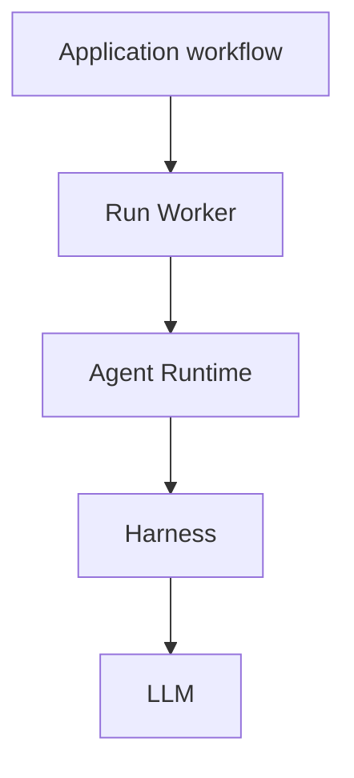

+++
title = "Execution"
description = "How run workers, runtime contracts, harnesses, and LLMs fit together."
weight = 1
+++

Every Agentty request for model reasoning or generation goes through a worker-owned
execution boundary: **Run Worker → Agent Runtime → Harness → LLM**. This includes
session turns, titles, focused reviews, summaries, commit messages, review-request
metadata, and conflict assistance.

## Run Worker

`ag-worker` schedules runs and coordinates heartbeats, cancellation, completion, and
restart recovery. Hosts supply workflow policy and persistence; the worker has no TUI,
Git, or database implementation dependency.

One boundary does not mean one global queue. Session commands remain ordered through
post-processing; isolated utility runs execute concurrently with a bounded capacity. A
session workflow can await a utility child directly without placing that child behind
itself in the session queue.

Workflows receive a worker `RunClient`, not a raw runtime client. Utility admission is
persisted before harness execution. Records retain the repository, purpose, optional
session/project ownership, and optional parent operation. Draft title generation can
belong to a session before any parent operation exists. Provider retries and protocol
repairs remain attempts inside that supervised run. Permissions and provider-call
budgets pass through unchanged.

Dropping a utility caller, canceling its parent, or shutting down the application stops
the owned execution. Nested scopes retain every enclosing cancellation source, including
when a child adds its own token. The worker waits for adapter cleanup before recording
terminal state; provider-turn panics still trigger session shutdown before returning
failure. Session deletion waits for its utilities before removing resources. Terminal
cancellation remains responsive while background resource cleanup waits for those
utilities. Settled session trackers are reclaimed; durable admission closures reject
late submissions even after session deletion. If closure persistence fails, the worker
retains its in-memory cancellation marker. A session rebase shares one cancellation
token across native assistance and utility child calls. Application shutdown closes
admission and gives workers, creation, and cleanup tasks one shared five-second grace
period. At expiry it drops unfinished worker execution and forces detached runtime tasks
to stop, releasing their owned processes. Forced shutdown can leave unfinished records
for startup recovery. Heartbeats track running work; startup recovery fails abandoned
runs under exclusive application ownership rather than automatically replaying
potentially mutating requests.

## Agent Runtime

`ag-runtime` defines the shared contract for submitting turns and receiving events,
results, and errors. `ag-agent` implements that contract for external CLI and app-server
harnesses, owning transport details and provider resource cleanup.

## Harness

A harness runs the agent loop: it combines context, calls models, executes tools, and
decides when to continue or finish. External agent tools provide this loop today.
`ag-harness` provides a standalone Rust implementation; connecting it through
`ag-runtime` remains separate work.

## LLM

The LLM is the model invoked by the harness for reasoning and generation. It does not
schedule Agentty runs or execute tools itself. `ag-harness` separates model access
behind its `ModelClient` contract; external harnesses manage their own model
integrations.

## Supporting Boundaries

`ag-session` owns session models and the built-in agent/model catalog. `ag-store`
provides SQLite persistence, including the worker's operation records. Agentty wires
these components together and supplies application workflows. Adapter construction is
confined to application composition. An automated source-boundary test rejects direct
runtime clients or turn execution elsewhere in Agentty.

See [Module Map](@/docs/architecture/module-map.md) for ownership details and
[Runtime Flow](@/docs/architecture/runtime-flow.md) for orchestration.
