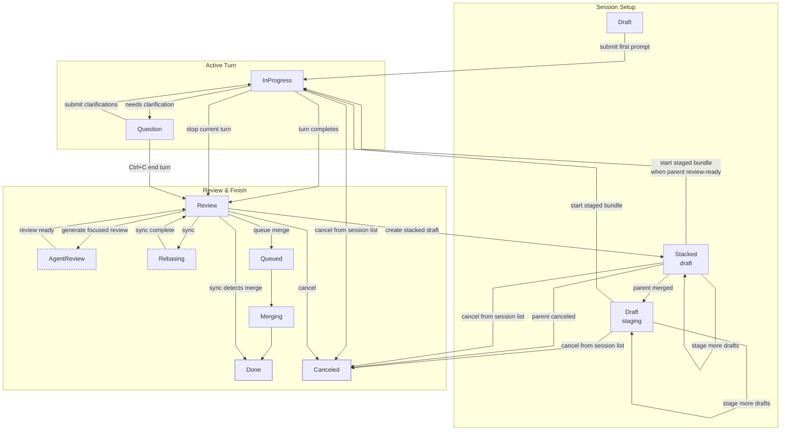

+++
title = "Workflow"
description = "Interface layout, session lifecycle, slash commands, and data location."
weight = 1
+++

<a id="usage-workflow-introduction"></a> This page covers the Agentty interface layout,
session lifecycle, session sizes, slash commands, and data location.

For keyboard shortcuts by view, see [Keybindings](@/docs/usage/keybindings.md).

<!-- more -->

## Interface Layout

<a id="usage-interface-layout"></a> Agentty organizes its interface into five primary
tabs, all accessible with `Tab`:

| Tab | Purpose | |-----|---------| | **Projects** | Select between projects (git
repositories) in a dashboard view: equal-width activity heatmap and `Work Pace` panels
on top, with recent session pace, active-project metrics, and total input/output token
usage beside the heatmap; the project table below shows project names, branches, session
counts, last-opened dates, and paths. Agentty skips stale entries whose project
directories no longer exist or no longer contain git metadata. | | **Sessions** | List,
create, and manage agent sessions. When a project is active, this tab appears as
`Sessions (<project-name>)`. | | **Review** | List open GitHub pull requests or GitLab
merge requests in the active project that request the current forge user's review,
including drafts marked with a `Draft` status. GitHub rows are split between requests
sent directly to the user and requests sent to a team the user belongs to. The tab is a
read-only forge list; press `s` to refresh, use `j` / `k` to select a request, and press
`Enter` to open a read-only detail page with the title, author, rendered description,
review-request-wide comments, and inline comment threads. The detail page opens
immediately while comments load in the background; if comment loading fails, it keeps
the title, author, and description visible and shows the comment-load failure in the
comments section. If the list reaches the provider cap, the footer shows that Agentty is
displaying the first matching requests. | | **Settings** | Configure the color theme,
default reasoning level, smart/fast/review model defaults, the optional
`Last used model as default` smart-model mode, the session commit coauthor trailer, and
`Open Commands` for the active project. | | **Logs** | Inspect process-local system log
events such as startup, manual project sync, requested-review refreshes, background
review-request status refreshes, and session status transitions. Logs are not persisted;
Agentty keeps the newest `1000` entries in memory and purges the oldest entries after
the limit is reached. |

In session chat view, the status-colored session title renders in a dedicated header row
above the output panel. A second metadata row shows the persisted size bucket, current
`+added` / `-deleted` line totals, the cumulative active-work timer, the current model,
the effective reasoning level, and token usage. When a session has a linked pull request
or merge request, the linked review-request URL appears at the right edge of the
metadata row when it fits, or on the next header row on narrow terminals. When a session
already tracks a published upstream branch, the output panel also shows a short
branch-sync status row while Agentty is auto-pushing the latest completed turn or when
the most recent automatic push failed. The timer keeps ticking only while the session is
actively working and freezes between turns.

The grouped **Sessions** tab prefixes each row title with the current session-size
marker, for example `[XL]`, without writing that marker into the persisted title. It
also shows the current model with its effective reasoning level in the `Model` column,
using `model-name [level]` formatting with the level label color-coded by reasoning
effort. The same list shows the cumulative active-work timer in its own `Timer` column,
so in-progress rows keep ticking live there while completed sessions retain their frozen
total.

The top status bar keeps the current version and update status visible, and it also
rotates short page-scoped `FYI:` messages once per minute while you are in the
**Sessions** list or a session chat view. These messages highlight workflow details that
are easy to miss, such as branch freshness, queued replies, review-request sync, and
focused-review behavior.

The **Logs** tab starts tailed to the newest entries, with severity and source labels
highlighted for scanning. Use `k` to move toward older entries, `j` to move back toward
newer entries, `g` for the oldest retained entries, and `G` for the newest entries.

The footer hides workspace context on the **Projects** tab. In other top-level tabs it
shows the active directory. When the current branch tracks an upstream, the footer
branch badge renders `local -> remote`, for example `main -> origin/main`. When you open
an active session, the footer switches to that session directory and shows the session
branch's ahead/behind counts relative to its base branch (for example `main`). If the
session branch already tracks a remote, the footer also shows a second ahead/behind
segment using the compact form `[stats] main | [stats] local -> remote`. Before first
publish, the same second segment still renders for the local branch as `[stats] local`.

New session worktrees start from the local active base branch. If local `main` is behind
`origin/main`, the session branch still starts from local `main`; run list-mode sync
first when you want a new session to include commits that exist only in the remote
tracking branch.

## Session Lifecycle

<a id="usage-session-lifecycle"></a> Session statuses and what you can do in each state:

| Status | Description | Available actions |
|--------|-------------|-------------------| | **Draft** | Session created but not yet
started. Regular sessions submit their first prompt immediately; draft sessions can
stage multiple prompts locally first and only create their worktree when the staged
bundle starts. Stacked drafts remain linked to a parent session branch while that parent
is active, and only show `s` after the parent is review-ready and the stack has no other
active branch work. | `Enter` compose first prompt or add draft, `/` open slash-command
composer, `s` start staged draft session, `m` add to merge queue, `r` sync, `o` open
worktree after the session has started; unstarted stacked drafts hide `m` and `r` until
launch, scroll, help | | **InProgress** | Agent is actively working. | `Enter` open the
chat composer to queue the next message, `Ctrl+c` retracts the most recently queued chat
message (LIFO) one press at a time without interrupting the running turn, then stops the
current turn once the queue is empty, `c` from the session list stops and cancels the
session after confirmation, scroll, help | | **Review** | Agent finished; changes are
ready for review. Linked pull requests / merge requests refresh in the background;
merged requests move the session to `Done` and save the synced session branch `HEAD`
hash for `c` continuation, and closed requests move it to `Canceled`. A parent with a
materialized stacked child can still accept `Enter` replies when the stack is idle, but
hides branch workflow actions until that child is terminal or restacked. | `Enter`
reply, `/` open slash-command composer, `m` add to merge queue, `r` sync, `o` open
worktree, `p` create or refresh forge review request, `d` diff, `f` focused review,
scroll, help | | **AgentReview** | Agentty is generating the focused review output in
the background. Linked pull requests / merge requests continue refreshing in the
background. | `Enter` reply, `/` open slash-command composer, `m` add to merge queue,
`o` open worktree, `p` create or refresh forge review request, `d` diff, `f` focused
review, scroll, help | | **Question** | Agent requested clarification before continuing.
| question input mode (`Enter` submit, `Tab` toggle chat scroll, `Ctrl+C` end turn, `q`
back to sessions list) | | **Queued** | Session is waiting in the merge queue. |
read-only view (`q`, scroll, help) | | **Rebasing** | Worktree branch is rebasing onto
the base branch. | read-only view (`q`, scroll, help) | | **Merging** | Changes are
being merged into the base branch. | read-only view (`q`, scroll, help) | | **Done** |
Session completed, merged, and its worktree checkout was removed. | `c` confirm
continuation into a new draft, scroll, help | | **Canceled** | Session was canceled by
the user and its worktree checkout was removed. | read-only view (`q`, scroll, help) |

Settings values for models, reasoning, commit trailers, and open commands are stored per
active project. Switching projects reloads that project's `Default Reasoning Level`,
`Default Smart Model` mode (explicit model or `Last used model as default`),
`Default Fast Model`, `Default Review Model`, `Coauthored by Agentty` toggle, and
`Open Commands`. Explicit model values display as `agent/model`. The global `Theme`
setting switches between `Agentty Default`, `Agentty Green`, and `Dark Horizon`, with
`Agentty Default` used by default. The Settings tab renders these scopes separately as
`Global settings` and `'<project>' settings`. New projects default the coauthor toggle
to disabled until you enable it.

When a session enters **Review**, Agentty starts generating the focused review in the
background. While that review-assist job is running, the session temporarily shows
**AgentReview** and keeps the review-oriented shortcuts available, except `r`, which
stays hidden until the session returns to **Review**. When `Ctrl+c` finally cancels an
active turn (after the queued chat messages, if any, have been retracted by earlier
presses), Agentty returns the session to **Review** without completing the turn and does
not automatically start focused review for that stopped turn; press `f` if you still
want a manual focused review. Confirming `c` from the session list on an **InProgress**
session requests operation cancellation, stops the active turn, and moves the session
directly to **Canceled**. Pressing `f` appends the cached review directly into the
normal session output panel when it is ready, or shows a loading message there while
generation is still running. That appended review remains visible when you leave and
reopen the session, including after round-tripping through `d` diff mode or entering
**Question** mode for clarifications, and it is cleared when you submit the next prompt.
Pressing `/` from an editable session view opens the same composer with a prefilled `/`
so you can pick a slash command without typing the leading character first. Pressing `c`
from a **Done** session first opens a confirmation dialog. Confirming creates a
brand-new draft session and focuses its composer immediately so you can add more notes
before starting it. Agentty stores the merged base-branch commit hash and stages the
first draft message as
`Summarize changes from <full-hash> to use it as an initial context for this session`.
When that hash is unavailable, Agentty stages the saved summary or transcript context
instead. **Canceled** sessions remain terminal and read-only. The original terminal
session stays closed while the new draft session carries the follow-on work.

After each successful turn with file changes, Agentty keeps the session branch at one
evolving commit. It regenerates that commit message from the cumulative session diff
using the active project's `Default Fast Model`, applies the active project's
`Coauthored by Agentty` setting to the final commit trailer, amends `HEAD`, and
refreshes the session title from the same commit text before merge begins. If the
session already has a linked open review request, Agentty also checks the remote title
and description after the updated branch is pushed, then updates them from the latest
commit message only when they differ. Successful commit and no-change notices appear as
transient session-output status rows rather than persisted transcript messages. If a
later turn reverts every file change from the session commit, Agentty drops the
now-empty session commit and reports the same no-change notice instead of sending Git's
empty-amend diagnostic through commit assistance. If the auto-commit needs agent
assistance to recover from a git failure, that recovery prompt also uses the
`Default Fast Model`. Once the session reaches **Done**, Agentty rewrites the persisted
summary into markdown with a `# Summary` section sourced from the final agent
`summary.session` value and a `# Commit` section sourced from the canonical squash-merge
commit message.

When a session enters **Merging**, Agentty reuses the session branch `HEAD` commit
message for the final squash commit on the base branch. Merge first requires the main
checkout to be clean, then stops and returns the session to **Review** if the
preparatory rebase or squash-merge git steps fail. It no longer runs a separate
merge-only commit-message prompt. Successful merge notices use the same transient
session-output status row as commit notices, so the persisted transcript remains focused
on agent output.

When a session enters **Rebasing** from the view-mode `r` sync action, Agentty runs the
assisted sync workflow, implemented as a rebase of the session branch. Published
sessions fetch before syncing and use the remote base ref from the same remote as the
published session branch. Unpublished sessions sync against the stored local base
branch. If `git rebase` stops on conflicts, Agentty lists the exact conflicted files in
the session transcript, asks the existing agent session to resolve only those files,
then stages the edits and runs `git rebase --continue` itself.

When `Open Commands` in Settings contains multiple entries (one command per line),
pressing `o` opens a selector popup (`j`/`k` to move, `Enter` to open, `Esc` to cancel).

In prompt input, `Ctrl+V`, `Ctrl+Shift+V`, and `Alt+V` paste one clipboard image into
the current draft or reply. Agentty stores the image under
`AGENTTY_ROOT/tmp/<session-id>/images/`, inserts a highlighted inline token such as
`[Image #1]`, and submits the ordered local attachments with the prompt. The clipboard
source can be a copied PNG file, raw image data, or PNG path text from X11 or Wayland
data-control clipboard backends. Text paste remains unchanged on the normal terminal
paste event path. Codex turns serialize the local image items directly through the
app-server, and Antigravity and Claude turns rewrite the inline placeholders to local
image paths before the prompt is streamed to `agy` or `claude`. Draft image files are
removed when you cancel the composer, after a submitted turn finishes using them, and
when a session is deleted or canceled.

When you use `@` file lookups in prompt or clarification input, Agentty keeps the raw
`@path/to/file` text visible in the composer and transcript. The agent-facing transport
rewrites those lookups to quoted `path/to/file` tokens before the prompt is sent to the
model.

If an agent command exits with an error, Agentty prints a short failure header followed
by captured `stdout` and `stderr` sections. Provider event lines that arrive as JSONL
are summarized into readable event, message, error, and request-id lines, while
plain-text warning lines stay intact so session output remains useful without exposing a
wall of raw JSON payloads.

## Branch Publish Flow

<a id="usage-review-request-flow"></a> Session view exposes one publish shortcut:

- In **Review** and **AgentReview**, `p` opens a publish popup for the linked forge
  review request.
- Leave the field empty to keep the default branch target for that session, or type a
  custom remote branch name before pressing `Enter`.
- After the session branch already tracks a remote branch, Agentty locks the popup to
  that same remote branch instead of allowing renames.
- Agentty publishes with `git push --force-with-lease` so rebased or amended session
  branches can update safely without overwriting unseen remote changes.
- After the push succeeds, Agentty creates or refreshes the linked review request and
  shows the resulting pull request or merge request URL.
- GitHub projects publish pull requests, while GitLab projects publish merge requests.
- Stacked child review requests target the parent review branch while the parent link is
  active. Agentty prefers the parent's linked pull request or merge request source
  branch, then the parent's pushed upstream branch, then the child's stored parent
  branch.
- When the session already tracks a review request, Agentty refreshes that same review
  request instead of creating a duplicate.
- When no review request is linked yet, Agentty only reuses an open pull request or
  merge request for the published branch. Merged or closed requests with a reused branch
  name are left alone so the publish flow can create a new review request.
- After a session branch has been published once, later completed turns automatically
  push that same remote branch in the background so linked review requests stay current
  without reopening the publish popup. If inline chat messages are queued behind the
  running turn, Agentty waits for the queue to drain and pushes after the last queued
  turn completes. The session output shows when that post-turn auto-push starts and when
  it completes or fails.
- Completed turns with file changes also compare the linked open review request's
  current title and body/description with the latest session commit message, then update
  the review request metadata after the post-turn auto-push succeeds.
- Automatic pushes reuse the locked upstream branch name from the first publish. If a
  background push fails, Agentty keeps the stored upstream reference, adds the failure
  details to the session output, leaves the linked review request metadata untouched,
  and leaves the manual `p` publish flow available for retry.

Review-request publishing stays inside session view by using a publish input popup on
`p`, followed by informational popups for loading, success, and blocked states.

<a id="usage-review-request-prerequisites"></a> Review-request publishing on `p` uses
regular Git authentication first:

- HTTPS remotes need a working credential helper or PAT.
- SSH remotes need a working SSH key.

Review-request publishing on `p` also requires the forge CLI for the repository remote:
authenticated `gh` access for GitHub projects and authenticated `glab` access for GitLab
projects. For the GitHub and GitLab CLI setup steps, see
[Forge Authentication](@/docs/usage/forge-authentication.md).

## Review Request Sync

<a id="usage-review-request-sync"></a> After a branch has been published, Agentty
refreshes review-request status in the background for **Review** and **AgentReview**
sessions that have either a published branch or a linked review request. Linked requests
are refreshed by display id; sessions that only know their published branch are matched
by source branch. The session-view `s` shortcut is reserved for starting staged draft
sessions, while list-mode `s` syncs the active project branch.

The session list shows forge indicators next to the status label:

| Indicator | Meaning | |-----------|---------| | `↑` | Branch published, no review
request found yet. | | `⊙ <id>` | Review request `<id>` is open, such as GitHub `#42` or
GitLab `!42`. | | `✓ <id>` | Review request `<id>` was merged. | | `✗ <id>` | Review
request `<id>` was closed. |

When a sync detects that the review request was merged, Agentty transitions the session
straight to **Done**. Any stacked draft linked to that parent is restacked onto the
parent's base branch so it can be started as a normal draft.

<a id="usage-review-comments-preview"></a> While in **Review** or **AgentReview**, press
`d` to open the diff page. Its right panel starts on the git diff and renders cached
pull-request or merge-request line comments directly below matching diff lines. Press
`c` inside the diff page to toggle the right panel between the annotated git diff and
the cached review-request comments overview so you can flip between code and feedback
without leaving the view. The comments panel includes inline threads grouped by file
(pre-sorted by line number and diff side) and pull-request-level or merge-request-level
"General discussion" comments at the top. Resolved inline threads are hidden from both
the annotated diff and comments overview. Threads are fetched by the same background
sync that refreshes review-request status. The panel is read-only — replies still happen
on the forge web UI.

From the **Sessions** tab, press `a` to choose between `Regular`, `Draft`, and `Stacked`
session creation. `Regular` sessions keep the fast path: type the first prompt and press
`Enter` to start the agent immediately. `Draft` sessions stage each `Enter` as one
ordered draft message, immediately show a `Draft Session` guidance block in session
view, keep the `o` shortcut hidden until a worktree exists, and start only after you
press `s`. Once drafts are staged, the same panel previews the staged bundle before
launch. The draft worktree is created at that start step so the branch is based on the
local base branch at launch time, instead of the moment the draft session was first
created. Until that deferred worktree exists, prompt `@` lookup suggestions index the
active project root so file search still works while you stage the draft bundle.

`Stacked` creates a draft below the selected parent session and records the parent link
in the session table. The stacked draft's future branch is based on the parent session
branch. Only one stacking level is available in this version, so a stacked child cannot
itself create another stacked draft. While the child is still an unstarted draft, it can
keep staging local prompts, hides `m` merge queue and `r` sync, and only shows `s` start
when the parent is in **Review** or **AgentReview** and no stack member is already
running, queued, syncing, merging, or waiting on a question. After a stacked child has
materialized, the parent keeps `Enter` reply available whenever the stack is otherwise
idle, but hides branch workflow actions such as slash commands, merge queue, and sync
until the child is terminal or no longer linked. When a later parent turn finishes back
in **Review**, Agentty automatically moves each review-ready materialized child through
**Rebasing** so the child branch is replayed onto the latest parent branch state. When
the parent merges, Agentty clears the child parent link and retargets the child to the
parent's base branch. When the parent is canceled, its stacked child is canceled too. If
you decide not to start a staged bundle, return to the **Sessions** list and press `c`
to cancel the still-unstarted draft session directly.

### Typical Transitions

The lifecycle below groups session setup, active execution, and completion states into
separate lanes so the main path is easier to scan.



While a session is **InProgress**, Agentty keeps an animated loader row in the session
output panel and may update its transient loader text from provider thought or
tool-status events until the turn completes. The chat transcript itself is updated only
after the final turn result is parsed and persisted. All active loading indicators use
the same animated `▌▌▌` Tachyon loader so session rows, popups, and follow-on sync
messages read consistently.

While the running turn is still active, pressing `Enter` opens the chat composer (the
`/` slash-command composer remains gated to **Review** and **AgentReview**). Submitting
a non-slash message during **InProgress** stages the prompt onto an in-memory queue
rendered inline beneath the running turn with a `queued ›` prefix. Once the running turn
finishes, Agentty dispatches queued messages one-by-one as new turns without bouncing
the session through **Review** between them. Post-turn auto-push for an already
published session branch waits until those queued turns have drained, so the remote
branch is updated after the latest queued follow-up rather than between queued turns.
Drainage pauses while the session sits in **Question** state and resumes only after the
clarification flow returns to a runnable state. While the queue is non-empty, each
`Ctrl+c` press retracts the most recently queued chat message (LIFO) without
interrupting the running turn so you can undo queue entries one-by-one in the reverse
order they were added. Once the queue is empty, the next `Ctrl+c` cancels the running
turn and returns the session to **Review** as usual. The queue is session-local and
lives only for the active app session, so queued messages are discarded if `agentty`
restarts before they dispatch.

The session-chat timer measures only cumulative **active work** across `InProgress`
intervals. That differs from `/stats`, whose `Session Time` reflects the overall session
lifetime between creation and the latest update.

<a id="usage-title-refinement"></a> When the first prompt is submitted for a new
session, Agentty stores that prompt as the initial title and starts one background
title-generation task using the configured **Default Fast Model**. Draft sessions follow
the same pattern for staged bundles: the first staged draft seeds the fallback title,
and each later staged draft keeps the current visible title in place while Agentty
cancels any superseded in-flight draft-title task and queues one fresh background
title-generation pass for the full updated bundle.

## Clarification Interaction Loop

<a id="usage-clarification-loop"></a> If an agent emits structured clarification
questions in the `questions` array, the session moves to **Question** status. You answer
each question in sequence, and Agentty sends one consolidated follow-up message back to
the same session before returning it to normal execution. Submitting a blank free-text
answer stores `no answer` for that question. Pressing `Ctrl+C` ends the clarification
turn immediately, restores the session to **Review**, and does not send the follow-up
message. Pressing `q` while reading the chat transcript or navigating the predefined
option list returns to the sessions list without ending the turn, so the session keeps
its **Question** status and the clarification can be resumed by reopening it later.

<a id="usage-question-options"></a> Questions may include predefined answer options.
Agentty displays them as an optional numbered list under an "Options:" header with the
first option pre-selected when options exist. Use `j`/`k` or `Up`/`Down` to navigate
options and `Enter` to submit the highlighted choice. Moving above the first option or
below the last option switches into the free-text answer input shown below the list.
Questions without predefined options open directly in that free-text input. Submitting a
blank free-text answer stores `no answer` for that question. Press `Ctrl+C` at any point
to end the clarification turn immediately and return the session to **Review** without
sending a reply.

## Session Sizes

<a id="usage-session-size"></a> Agentty classifies sessions by the number of changed
lines in their diff:

| Size | Changed Lines | |------|---------------| | **XS** | 0-10 | | **S** | 11-30 | |
**M** | 31-80 | | **L** | 81-200 | | **XL** | 201-500 | | **XXL** | 501+ |

Session size is recalculated after each completed agent turn, persisted to the session
record, and rendered as a title prefix in the **Sessions** list.

## Slash Commands

<a id="usage-slash-commands"></a> Type these in the prompt input to access special
actions. From an editable session view, press `/` to open the composer with the leading
slash already inserted:

| Command | Description | |---------|-------------| | `/apply` | Ask the agent to verify
focused-review suggestions against the current code, then apply only the ones that are
still correct and relevant. Requires a completed focused review (`f` key). | | `/model`
| Switch the model for the current session using only locally available backend CLIs. |
| `/qe:check` | Send a predefined quality-enforcement audit prompt that asks the agent
to inspect repository readiness rules and report recommendations without changing files.
| | `/reasoning` | Override the reasoning level for the current session, with the
current effective level preselected from settings or any existing session override. | |
`/stats` | Show token usage statistics for the session. |

Agentty requires at least one supported backend CLI (`agy`, `codex`, or `claude`) on
`PATH` at startup. Once launched, `/model` only offers runnable backends, and stored
default-model settings still fall back to the first available backend default when the
saved backend is missing locally. Retired stored model ids such as `claude-opus-4-6` and
`claude-opus-4-7` are upgraded to the current supported replacement when projects and
sessions load.

The Projects tab summarizes the runnable agent CLI executables detected at startup,
shows their versions as loading while background `--version` checks run, and then
replaces the loaders with reported versions when checks succeed.

## Auto-Update

<a id="usage-auto-update"></a> When Agentty launches, it checks npmjs for a newer
version in the background. If a newer version is detected, it automatically runs
`npm i -g agentty@latest` without blocking the UI:

| Status bar text | Meaning | |-----------------|---------| | **Updating to vX.Y.Z...**
| Background npm install is running. | | **Updated to vX.Y.Z — restart to use new
version** | Install succeeded; relaunch to use the new version. | | **vX.Y.Z version
available update with npm i -g agentty@latest** | Install failed; manual update hint
shown as fallback. |

To disable automatic updates, launch with `--no-update`:

```bash
agentty --no-update
```

When `--no-update` is set, Agentty still checks for newer versions and shows the manual
update hint, but does not run `npm i -g agentty@latest` automatically.

## Data Location

<a id="usage-data-location"></a> Agentty stores its data in `~/.agentty/` by default.
This includes the SQLite database, session logs, and worktree checkouts (under
`~/.agentty/wt/`).

Per-session worktree folders are removed automatically after a session reaches `Done` or
`Canceled`, and when a session record is deleted.

You can override this location by setting the `AGENTTY_ROOT` environment variable:

```bash
# Run agentty with a custom root directory
AGENTTY_ROOT=/tmp/agentty-test agentty
```
