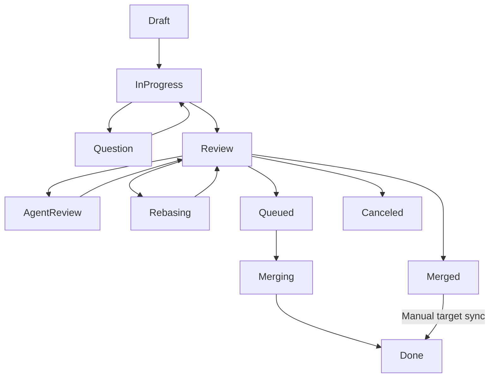

+++
title = "Workflow"
description = "Interface layout, session lifecycle, slash commands, and data location."
weight = 1
+++

<a id="usage-workflow-introduction"></a> Create a session, review its changes, then
merge locally or publish a review request. See
[Keybindings](@/docs/usage/keybindings.md) for shortcuts by view.

<!-- more -->

## Interface Layout

<a id="usage-interface-layout"></a> Use `Tab` and `Shift+Tab` to move between tabs:

- **Projects**: Choose a repository; view activity, usage, and installed agent CLIs.
- **Sessions**: Create and manage work in merge-queue, active, and archive groups. Press
  `p` to switch projects without leaving this tab.
- **Settings**: Configure appearance, orchestration, model defaults, and launch
  commands.

Agentty restores your last list tab on startup. Session chat shows the current model,
reasoning, changed-line totals, active-work timer, token usage, and linked review
request. The footer shows the active directory, branch, and ahead/behind counts.

### Resource Usage

`Processes`, `CPU`, and `Memory` cover the tracked agent and its descendants, refreshed
about every two seconds. CPU can exceed `100%`; resident memory may count shared pages
more than once. Detached processes and Agentty itself are excluded. `--` means no
current measurement is available.

`Host CPU temp` measures the whole host, including other workloads. Sensor support
varies by hardware and OS. Readings refresh at most every ten seconds and expire after
twenty seconds if a sensor stalls.

### Project Sync

New worktrees start from the local active base branch. Press `s` from a list tab first
if you need remote changes. Sync runs in the background; you can navigate and continue
existing isolated work. Creating or starting sessions, merging, and rebasing against
that project's base checkout require a retry after sync finishes. Existing merge work
has priority. Repeated sync requests for one project are combined; other projects wait
in order.

Progress and completion appear in the top status bar. A red `[merge conflict]` label on
a session means its committed branch conflicts with its base. A failed conflict check
leaves the result unknown.

## Session Lifecycle

<a id="usage-session-lifecycle"></a>

| Status          | Meaning                                                  |
| --------------- | -------------------------------------------------------- |
| **Draft**       | Prompt staging or workspace setup; work has not started. |
| **InProgress**  | Agent is working.                                        |
| **Review**      | Changes are ready to inspect.                            |
| **AgentReview** | Focused review is running.                               |
| **Question**    | Agent is waiting for clarification.                      |
| **Queued**      | Waiting to merge.                                        |
| **Rebasing**    | Session branch is syncing.                               |
| **Merging**     | Changes are merging into the base branch.                |
| **Merged**      | Merged remotely; waiting for manual local target sync.   |
| **Done**        | Completed; worktree removed.                             |
| **Canceled**    | Canceled; worktree removed.                              |

New sessions open the composer while their workspace is prepared. Submit immediately;
the prompt waits for setup. If setup fails, press `s` from session view to retry.
Prompts and images whose turns never began survive restart. Review the transcript before
retrying a turn interrupted during dispatch.

Startup restores interrupted rebases to **Review**. Storage or Git cleanup failures must
be resolved before startup can finish; a missing worktree alone does not block recovery.

### Typical Transitions


```mermaid
flowchart TD
  Draft --> InProgress
  InProgress --> Question
  Question --> InProgress
  InProgress --> Review
  Review --> AgentReview
  AgentReview --> Review
  Review --> Rebasing
  Rebasing --> Review
  Review --> Queued
  Queued --> Merging
  Merging --> Done
  Review --> Merged
  Merged -->|Manual target sync| Done
  Review --> Canceled
```

### Active Turns and the Message Queue

Press `Enter` during **InProgress** or **Rebasing** to queue a message. Messages,
session sync (`r`), and publishing (`p`) run in submission order after the active work.
Repeated `r` presses queue only one sync. Publishing is also available during rebase.

During **InProgress**, `Ctrl+C` removes the newest queued message. With no messages
left, it stops the active turn and cancels queued branch actions. Rebase cannot be
interrupted this way. Queued chat survives project switching, but not an Agentty
restart.

Changing provider or model waits for current work, saves the selection, then discards
pending messages and actions. Resubmit them after switching. A failed save keeps the old
selection and queue.

While composing, press `Tab` to focus and scroll chat; press it again to return. From
chat focus, `d` previews changes and `q` returns to the list, preserving the draft.
These controls also work while answering questions. `Shift+Tab` cycles permission modes
without changing your draft.

In Diff mode, add file, line, or range comments and press `s` to submit them together
with the existing draft and images. Finished comments survive leaving Diff mode and
clear when the next turn starts. Read-only sessions cannot submit comments. See
[Diff Mode](@/docs/usage/keybindings.md#diff-mode) for editing and preview controls.

### Focused Review

Agentty automatically reviews a changed diff when an eligible session enters **Review**.
Unchanged diffs, stopped turns, and orchestrator controllers skip automatic review.
Press `f` to show the review or request one manually. Pressing `r` cancels a pending
review before syncing.

Reviews use the diff and saved conversation, respecting accepted decisions. They inspect
files and history and may browse, but recommend checks rather than run them. Progress
shows the review profile and completed stages. Results remain visible across navigation
until the next prompt.

Large reviews run in batches. Each attempt has a 64-call budget and a 15-minute
deadline. A `Partial` result preserves findings and identifies unfinished checks; an
empty suggestions list does not mean the review completed. Press `f` and confirm
regeneration to resume completed calls for unchanged inputs, including after restart.
Completed reviews regenerate from scratch; changed inputs or an accepted sync require
fresh evidence. Summarized history is disclosed.

Use `/apply` to have the agent verify suggestions and apply those that remain valid.
[Permission modes](@/docs/usage/workflow.md#slash-commands) can automate this for up to
three iterations.

### Session Output Markdown

Chat supports headings, lists, quotes, code blocks, and tables. Pasted indentation is
preserved; tabs use four-column stops.

<a id="usage-session-mermaid"></a> Mermaid code blocks render simple flowcharts, entity
relationships, and sequence diagrams. Flowcharts support `TD`, `TB`, and `LR`; labels
over 32 characters are truncated. Complex styling and grouping are simplified;
unsupported, too large, or too wide diagrams remain readable as code. Markdown file
previews use the same renderer.

### Forking a Review Session

Press `F` in a root **Review** or **AgentReview** session to confirm a fork. It receives
a new worktree from the source commit and a copy of the saved conversation. Uncommitted
changes are not copied. Publishing, review state, usage, and timing start independently.
Stacked children cannot be forked.

### Commit and Merge Behavior

After a successful file-changing turn, Agentty creates or updates one evolving commit
with a message generated from the cumulative changes. The project's Fast model and
coauthor setting apply. Reverting all changes removes the empty session commit.

Large diffs are summarized within an eight-call budget. If that budget or the agent's
input limit is reached, commit generation falls back to changed filenames, chat history,
and the existing commit message. If the fallback also fails, auto-commit stops and
leaves the worktree intact.

An index lock is retried for up to five seconds. A persistent lock produces
`[Commit Error]`; Agentty does not remove it. Wait for active Git operations to finish.
Only the repository owner should remove a confirmed stale lock.

If pre-commit configuration exists but its hook is missing, session creation warns you.
Continue with `Enter` or cancel with `Esc` / `q`; install the hook with `prek install`
or `pre-commit install`. Commits without the configured hook show `[Commit Warning]`.
Installed hook failures stop commits.

For an unlinked session, `m` queues a local squash merge using the session commit
message. The target checkout must be clean. A failed rebase or merge returns the session
to **Review**. Linked pull requests and merge requests must merge through their forge;
see [Review Request Sync](@/docs/usage/workflow.md#review-request-sync).

Session sync (`r`) rebases onto the stored local base for unpublished sessions or the
remote base after fetching for published sessions. Conflict assistance uses the existing
agent conversation. Agentty stages repairs, runs the installed pre-commit hook, and
continues the rebase. Hook failures allow up to three repair attempts before aborting
with `[Sync Error]` and suppressing the push.

`[Main Checkout Warning]` means tracked changes in the main checkout changed during a
turn and remain dirty. Inspect them before continuing. Unchanged pre-existing changes
and clean branch movement do not trigger it. Bare-repository projects have no main
checkout to inspect.

### Continuing a Terminal Session

Press `c` on **Done** or **Canceled** to confirm a new continuation draft. It uses the
merged commit or saved conversation as context and leaves the original session
unchanged.

## Session Types

<a id="usage-draft-stacked"></a> Press `a` on **Sessions**:

- **Regular**: The first `Enter` submits work.
- **Draft**: Each `Enter` stages a message; `s` starts the bundle and creates its
  worktree from the base branch at that time.
- **Orchestrator** `[Preview]`: A controller plans, coordinates, and verifies managed
  research or implementation sessions.
- **Stacked**: Create a draft based on a parent session, up to five levels below a root.
- **Append to stack** `[Preview]`: Move an independent review-ready session below an
  eligible parent and sync it onto that branch. Sessions with children or linked review
  requests cannot be moved.

Start stacked drafts from parent to child. Each needs a review-ready parent and an idle
stack. Parents can receive replies and sync while materialized children are idle.
Completing a parent turn or syncing it automatically rebases review-ready descendants. A
parent merge retargets children to its base and keeps their own changes; failed child
syncs show `[Sync Error]`. Canceling a parent also cancels all nonterminal descendants.

### Parallel Orchestration

Use orchestration for discovery or at least two independent implementation tasks:

1. Create an **Orchestrator** session and describe the goal.
1. Review its tasks and acceptance criteria on the campaign monitor. Implementation
   plans contain two to eight tasks; research waves contain one to eight and run
   separately. Touched areas guide planning but do not restrict worker edits.
1. Press `a` to approve. Research waves start automatically when **Auto-approve
   Research** is enabled. **Orchestrator Parallelism** controls simultaneous children.
1. Follow progress and answer relayed worker questions in the controller. Blocking
   questions arrive one at a time. Infrastructure failures retry twice.
1. Implementation workers receive up to three review-and-repair passes. The controller
   verifies results against the criteria; only explicit passes can integrate. Partial or
   failed reviews remain visible evidence.
1. At **AwaitingIntegration**, press `a` and choose **Local merges** or **Review
   requests**. Integration follows plan order. Published tasks wait for remote merge;
   closed requests become integration failures. Research-only work completes without
   integration.

Managed workers allow transcript and diff inspection. `D` permanently detaches an
implementation worker into an ordinary session. In `tmux`, `o` can open a review-ready
worker's worktree; edits there can invalidate verification. Other direct mutations are
unavailable while managed.

Researchers run read-only in temporary worktrees. Their reports and any unexpected diff
are archived, then the worktree is discarded. They cannot be detached or integrated. The
controller is instructed not to edit, but its read-only role is currently enforced only
by its prompt; see [Orchestrator Design](@/docs/architecture/orchestrator.md).

Continue feedback in controller chat. Reusing an implementation task continues its
worker and branch; research corrections start a fresh temporary researcher. New scope
requires approval. After the controller is **Done**, start a new campaign.

To cancel, press `c` on the controller in the session list. Cancellation includes its
active children. If a child cannot stop, the campaign remains **Canceling** so you can
retry. The preview's flat task list and verification limits are documented in
[Current Limits](@/docs/architecture/orchestrator.md#current-limits).

## Branch Publish Flow

<a id="usage-review-request-flow"></a> Press `p` to publish a GitHub pull request or
GitLab merge request. During a turn or rebase, publishing waits in the session queue.

1. Keep the default branch name or enter a custom one. A custom name must not already
   exist remotely. After publishing, the remote branch name is fixed.
1. Agentty pushes with a force-with-lease check, then creates or refreshes an open
   review request. Stacked children target their parent's review branch.
1. The forge URL appears in chat. Later completed turns automatically push to the same
   branch when no chat or sync is queued. Failed pushes remain retryable with `p`.

Review-request titles stay stable unless the primary objective changes. Description
updates preserve existing content and append new details. Agentty checks for concurrent
remote edits before updating, but an edit after that check can still race.

### Addressing Review Comments

Open linked comments with `c`. Select actionable threads with `Space`, then press
`Enter` to have the agent evaluate them in one turn. Resolved threads and standalone
comments are read-only; outdated unresolved threads remain actionable without current
line context.

After a successful commit and push, Agentty replies to each selected thread and resolves
only those reported as fixed. Threads needing no change receive an explanation and stay
open. An `addressed` thread becomes actionable again when a reviewer follows up.

`[Review Comments Warning]` reports failures. After a commit failure, reopen comments
and retry. A push failure retains the batch for retry only while its fix commit remains
the branch tip; later changes require a fresh review batch. Interrupted replies can
resume without duplicating a reply already posted.

<a id="usage-review-request-prerequisites"></a> Publishing requires both Git credentials
and an authenticated forge CLI: `gh` for GitHub or `glab` for GitLab. See
[Forge Authentication](@/docs/usage/forge-authentication.md).

## Review Request Sync

<a id="usage-review-request-sync"></a> Published review-ready sessions refresh forge
status in the background:

| Indicator | Meaning                             |
| --------- | ----------------------------------- |
| `↑`       | Branch published; no request found. |
| `⊙ <id>`  | Request is open.                    |
| `✓ <id>`  | Request was merged.                 |
| `✗ <id>`  | Request was closed.                 |

A remote merge moves the session to read-only **Merged**, keeping its transcript and
diff in Active. Manually sync its local target branch with list-mode `s` to move it to
**Done**, clean up the worktree, and retarget stacked children. Failed syncs or syncing
another branch leave it unchanged. Follow workflow warnings and retry if archival or
child restacking fails.

If parent and child requests have both merged, syncing the parent's local target also
completes the child. Closing an unmerged request cancels its editable session.

## Clarification Interaction Loop

<a id="usage-clarification-loop"></a> In **Question**, answer each question; Agentty
sends the answers together as a follow-up turn.

<a id="usage-question-options"></a> Use `j` / `k` or arrow keys to choose an option,
then `Enter`. Move beyond the options to type a free-text answer; a blank answer means
`no answer`. Type `@` to insert a repository path.

`Ctrl+C` from the answer input ends the turn without replying. `q` outside free-text
input returns to the list and preserves progress. Reopening resumes the unanswered
questions. See [Question Input](@/docs/usage/keybindings.md#question-input-free-text)
for editing controls.

## Prompt Input Extras

<a id="usage-prompt-extras"></a> Paste a clipboard image with `Ctrl+V`, `Ctrl+Shift+V`,
or `Alt+V`. From a draft session, these also open the composer. Each attached image
appears as `[Image #n]`; typing that text manually does not attach a file. Unsupported
clipboard backends show an inline error; Wayland image reads use `wl-paste` when
available.

Use `Ctrl+Z` to undo and `Ctrl+Y` or `Ctrl+Shift+Z` to redo. On macOS, use `Ctrl+Z`;
your terminal may consume `Cmd+Z`. Prompt-history navigation preserves attached images.

Type `@` to look up repository files. Unstarted stacked drafts use the nearest available
ancestor worktree. See [Prompt Input](@/docs/usage/keybindings.md#prompt-input) for
completion and multiline editing.

Provider failures show a short error and captured output where available.

## Session Sizes

<a id="usage-session-size"></a> Sizes reflect changed lines and refresh after each turn:

| Size    | Changed lines |
| ------- | ------------- |
| **XS**  | 0–10          |
| **S**   | 11–30         |
| **M**   | 31–80         |
| **L**   | 81–200        |
| **XL**  | 201–500       |
| **XXL** | 501+          |

## Slash Commands

<a id="usage-slash-commands"></a> Type `/` in the composer. From session view, `/` opens
a fresh composer, replacing any saved draft. The picker supports fuzzy matching.

| Command        | Action                                               |
| -------------- | ---------------------------------------------------- |
| `/apply`       | Verify and apply valid focused-review suggestions.   |
| `/mode`        | Choose permissions and review automation.            |
| `/model`       | Choose a locally available backend and model.        |
| `/personality` | Choose a workspace agent personality.                |
| `/reasoning`   | Set reasoning effort for this session.               |
| `/style`       | Choose concise, balanced, or detailed answers.       |
| `/speed`       | Choose normal or fast responses for Claude or Codex. |

`/apply` requires a completed focused review. `/mode` selects:

- **Auto Edit**: Standard editing permissions. Codex has full command access; Claude can
  retry commands outside its sandbox. Commands are not necessarily confined to the
  worktree.
- **Auto Edit + Auto Address Comments**: The same permissions, plus automatic
  verification and application of focused-review suggestions. Stops when none remain or
  after three application turns. A new prompt or mode selection resets that limit.
- **Read Only**: Prevents filesystem writes during chat turns. Switch modes when edits
  are needed.

`Shift+Tab` cycles these modes while composing. See
[Agents & Models](@/docs/agents/backends.md#switching-models) for speed costs and
automatic model compatibility changes.

`/style` affects following user turns: **Concise** retains essential results, caveats,
and verification; **Balanced** adds useful context; **Detailed** explains decisions and
trade-offs thoroughly. Explicit prompt instructions take precedence. Style never changes
permissions, safety requirements, or required output fields.

`/personality` reads `.agents/agents/*/agent.md` from the session worktree, excluding
global definitions. Choose `None (default)` to clear it. File edits apply on the next
turn; missing or invalid definitions fall back without stopping work and show a notice.

<a id="usage-title-refinement"></a> Agentty refines session titles from the overall goal
using the Fast model. Draft titles update as messages are staged; committed work uses
the commit title. Failed refinement leaves the provisional title in place.

## Settings Scope

<a id="usage-settings-scope"></a> **Global settings** include theme, orchestrator
parallelism (one to eight workers, default three), and research auto-approval. Project
settings include model, reasoning, speed and style defaults, commit trailers, and launch
configurations. Defaults affect new sessions; use slash commands to change an existing
one. See [Backend Defaults](@/docs/agents/backends.md#selecting-a-backend) for Smart,
Fast, and Review roles.

`Launch Configurations` is a command list: add with `a`, edit with `e` or `Enter`,
delete with `d`, and reorder with `J` / `K`. `Enter` saves an edit; `Esc` cancels it.
When Agentty runs in `tmux`, session-view `o` runs a configured command in the worktree
or opens a selector if several commands exist.

## Auto-Update

<a id="usage-auto-update"></a> Agentty checks npm at startup and hourly, then installs
new versions in the background. The status bar reports installation progress, a request
to restart after success, or a manual update command after failure.

```bash
agentty --no-update
```

This disables automatic Agentty installation while retaining update checks and hints.
See [Backend Selection](@/docs/agents/backends.md#selecting-a-backend) for agent CLI
refresh. Use `agentty --help` for launch options and `agentty --version` for the
installed version.

## Data Location

<a id="usage-data-location"></a> Agentty keeps its database, logs, and worktrees in its
data root, normally `~/.agentty/`. Worktrees are removed when sessions finish, are
canceled, or are deleted. Set `AGENTTY_ROOT` to use another root; each root allows one
running Agentty instance.

### Continuing long sessions

Follow-ups preserve the active goal and accepted decisions unless you cancel or replace
them. A status question does not cancel work. Long sessions use opening and recent
context with access to full history; the saved conversation remains intact.

Agents reuse successful checks while their inputs remain unchanged and still run
repository-required checks.
