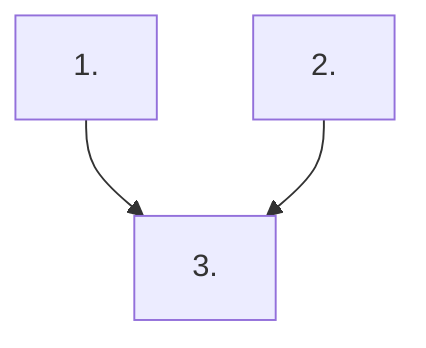

# Implementation Plan Workflow

Use this skill when producing or updating implementation plans in `docs/plan/`.

This skill is the source of truth for plan structure and execution-planning requirements.

## Workflow

1. **Clarify the plan request first**

   - Confirm the goal, intended outcome, scope boundaries, exclusions, and delivery constraints.
   - Ask focused follow-up questions only when missing information would change the plan structure or sequencing.

1. **Collect planning context**

   - Read `docs/plan/AGENTS.md`, related source files, and any overlapping plan documents before writing.
   - Capture only the constraints that materially affect scope, sequencing, validation, or exclusions.

1. **Sync existing plans when the skill changes**

   - When updating this `SKILL.md`, review the active files in `docs/plan/` in the same turn and sync any plan that no longer matches the updated rules.
   - Respect explicit user exclusions when deciding which existing plan files to leave untouched.

1. **Draft a concise, current-state plan**

   - Use the plan skeleton below and keep each section focused on repository-observable facts.
   - Keep cross-plan notes short and include only active overlaps, ownership decisions, or unresolved conflicts.
   - Keep snapshot rows scannable: one short current-state sentence plus a status, without long file lists in the table cells.
   - Keep the `## Steps` section near the top of the plan, immediately after the title and scope/context line.
   - In each step, render `Why now`, `Usable outcome`, `Substeps`, `Tests`, and `Docs` as their own subtopics on separate lines instead of inline bold labels.
   - Use size budgeting during plan creation, not after the fact. Before finalizing the plan, estimate the changed-line scope for each step, split oversized work into additional steps, and keep those size estimates in planning notes or reviewer reasoning rather than rendering a `### Size` block in `docs/plan/` files.
   - Treat each step as one mergeable planned slice. Keep every planned step at `XL` or smaller, and split any step that would be `XXL` before handing off the plan.
   - Define `atomic` as one mergeable acceptance story: the step can land, be tested, documented, and reverted independently without needing a follow-up step just to become coherent or usable.
   - Prefer one primary usable outcome per step. If the `### Usable outcome` sentence describes two sibling capabilities, split the step.
   - Target `2..=5` checklist items under `### Substeps`. If a step needs more than `5` implementation items, split it into additional steps instead of hiding multiple deliverables in one slice.
   - Split by executable outcome, not by architecture layer. Prefer steps such as `persist X`, `render X`, `edit X`, or `reconcile X` when they each form their own usable slice, rather than bundling multiple outcomes into one cross-layer bucket.
   - Use step titles that name one outcome. If a title needs `and`, `plus`, or multiple verbs to describe separate deliverables, split the work unless those words only clarify one tightly coupled result.
   - Use this size table when labeling a planned step:

     | Size | Changed lines |
     |------|---------------|
     | `XS` | `0..=10` |
     | `S` | `11..=30` |
     | `M` | `31..=80` |
     | `L` | `81..=200` |
     | `XL` | `201..=500` |
     | `XXL` | `501+` |
   - Write each checklist item under `### Substeps` as a short human-readable title followed by the detailed implementation guidance for that item, preserving the concrete file and constraint details instead of collapsing them into the title alone.
   - Structure steps as evolving usable slices. Each step must include the implementation work plus the tests and documentation needed for that slice before it can be considered complete.
   - Keep implementation checklist items under `### Substeps`, then extract validation work into `### Tests` and documentation work into `### Docs` immediately after `### Substeps`.
   - Mention every required file directly in the checklist text for the relevant substep instead of adding a trailing `Primary files` block.

1. **Define execution sequence and guardrails**

   - Make the first step the smallest usable iteration instead of standalone groundwork.
   - Ensure later steps extend that working baseline and keep tests/docs in the same step as the behavior change.
   - Do not reserve testing or documentation for a final catch-all step; if a step changes behavior, it owns the validation and docs updates for that change.
   - State which steps can run in parallel and keep the dependency graph aligned with the execution notes.

1. **Quality check before handing off**

   - Remove duplicated or contradictory checklist items and trim stale completed detail when it no longer helps active execution.
   - Verify every step can be executed, validated, and merged independently.
   - Verify every step answers `What becomes newly possible after only this step lands?` in one sentence.
   - Verify every step was split using the size table below before handoff, even though the resulting plan should not render a `### Size` section.
   - Verify no planned step is larger than `XL`; split oversized work before handoff.
   - Verify no step has more than `5` implementation checklist items under `### Substeps`; split crowded steps before handoff.
   - Verify every step has explicit `### Tests` and `### Docs` sections when they are required by that slice.
   - Verify every `### Substeps` checklist item starts with a human-readable title while keeping the detailed implementation guidance in the same item.
   - Reject steps that bundle multiple acceptance stories behind one title, one `### Usable outcome`, or one combined validation block.
   - Reject plans that save most tests/docs for the last step instead of keeping them attached to the relevant behavior changes.
   - When this skill changed, verify the active plan files in `docs/plan/` were reviewed and updated to match the new rules unless the user explicitly excluded them.
   - Verify overlapping plans are aligned or clearly marked for user resolution.
   - Verify the final plan reflects the clarified requirements the user provided.

1. **Close out implemented plans**

   - When a plan is fully implemented and no further tracked work remains, delete the completed file from `docs/plan/` instead of keeping it as permanent inventory.
   - If follow-up work is still needed after a plan is otherwise complete, create a new follow-up plan file with its own scope and checklist instead of extending the completed plan indefinitely.

## Plan Skeleton

Use this skeleton when creating a new file in `docs/plan/`:

```markdown
# <Plan Title>

<One-sentence scope/context line tied to the relevant code area.>

## Steps

## 1) <Step Title>

### Why now

<rationale>

### Usable outcome

<what the user can do after this iteration lands>

### Substeps

- [ ] **<Human-readable substep title>.** <Detailed implementation task within this step, including files and constraints>

### Tests

- [ ] <tests/validation needed for this step>

### Docs

- [ ] <documentation updates needed for this step>

## Cross-Plan Notes

- List only active overlaps, ownership decisions, or unresolved conflicts with other files in `docs/plan/`.
- If another active plan conflicts with this plan and the correct resolution is not explicit, stop and ask the user which plan should control the work.

## Status Maintenance Rule

- After implementing any step in this plan, immediately update its status in this document.
- When a step changes behavior, complete its `### Tests` and `### Docs` work in that same step before marking it complete.
- When the full plan is complete, remove the implemented plan file; if more work remains, move that work into a new follow-up plan file before deleting the completed one.

## Current State Snapshot

| Area | Current state in codebase | Status |
|------|---------------------------|--------|
| <area> | <short observable state> | <status> |

## Implementation Approach

- Start with the smallest working slice that a user can already exercise end to end.
- Make the first iteration intentionally basic if needed, but it must still be usable and demonstrable.
- Add later iterations only as extensions of the working slice so feedback can arrive before the full feature set is built.
- Keep `### Tests` and `### Docs` inside the same step that changes the behavior; do not reserve them for a separate large-scale cleanup iteration.

## Suggested Execution Order



1. Start with `<Step 1>`; it is a prerequisite for `<Step 3>`.
1. Run `<Step 2>` in parallel with `<Step 1>` because they touch independent files and validation paths.
1. Start `<Step 3>` only after `<Step 1>` and `<Step 2>` are merged.

## Out of Scope for This Pass

- <non-goal>
- <non-goal>
```
